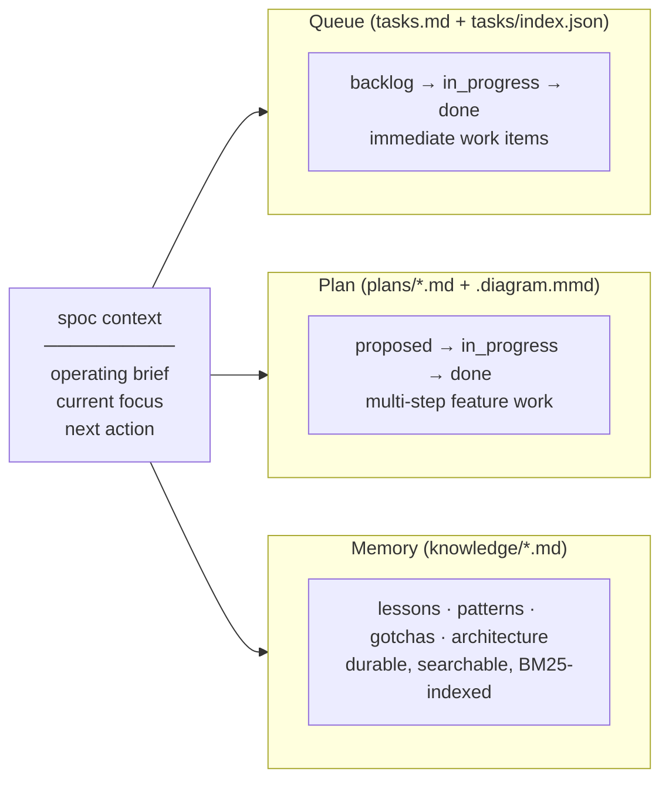

# SPOC

> Give AI agents durable memory — so they start from context, not a blank slate.

SPOC tracks projects, tasks, plans, and knowledge as a directed acyclic graph (DAG) stored in `~/.spoc/`. AI agents call `spoc <command>` to read structured project context instead of scanning codebases from scratch each session.

---

## What Is SPOC

Every AI coding session starts fresh. SPOC fixes that by maintaining three persistent surfaces per project:



An agent calls `spoc context` at session start and receives an **operating brief** — current focus, recommended next action, relevant knowledge — without reading a single source file.

---

## How It Works

### Orchestrator → Workflow → DAG


### Write-Gate Protocol (All Mutations)

Every DAG write goes through a two-step confirmation to prevent accidents:

```
spoc write propose "summary" --ops=<op> --slug=<slug>
           │
           └─► returns { token }
                           │
           confirmed? ──── └─► spoc <mutating-command> --token=<token>
```

Token is single-use, scoped to the project + operation, and expires after **10 minutes**.

---

## Prerequisites

| Requirement | Version | Notes |
|---|---|---|
| [Node.js](https://nodejs.org/) | v18+ | Required |
| [OpenCode](https://opencode.ai/) | latest | Required for agent integration |
| [graphify](https://github.com/safishamsi/graphify) | any | Optional — AST code-graph analysis |

---

## Quick Start

> SPOC is not yet published to npm — install from source.

**1. Clone and install**

```bash
git clone https://github.com/your-org/spoc.git
cd spoc
npm install
# postinstall automatically builds TypeScript and registers the `spoc` CLI
# at ~/.local/bin/spoc
```

**2. Add `~/.local/bin` to your PATH** (if not already)

```bash
export PATH="$HOME/.local/bin:$PATH"
# Add the above line to ~/.zshrc or ~/.bashrc to persist across sessions
```

**3. Run the setup wizard from your project**

```bash
cd /path/to/your-project
spoc init
```

The wizard:
1. Creates `~/.spoc/` (project data store)
2. Registers the current directory as the workspace path
3. Deploys bundled agents + skills into `~/.config/opencode/`

**4. Start OpenCode**

Open OpenCode in your project directory — you'll see the **SPOC Orchestrator** listed as a selectable agent. From that point, every session starts with an operating brief instead of a blank slate:

```bash
spoc context
# → project overview, current focus, active plans, relevant knowledge
```

---

## Agents

### Primary Agents

These are registered as selectable agents in OpenCode. You interact with them directly.

| Agent | Token Mode | Description |
|---|---|---|
| **SPOC Orchestrator** | Full prose | Classifies intent, routes to workflows, delegates to sub-agents, writes DAG |
| **SPOC Caveman** | ~65% fewer tokens | Identical capabilities; caveman-speak for chat narration only |

The orchestrator follows three phases on every request:
1. **Classify** — detect intent (INIT / BRAINSTORM / EXECUTE / SYNC / EXPLORE / MULTI)
2. **Route** — delegate to the right workflow and specialist sub-agents
3. **Complete** — summarize what was done, current state, and next steps

SPOC Caveman supports three intensity levels: `lite`, `full` (default), `ultra`. Code, tool arguments, DAG content, and commit messages are always full prose regardless of mode.

### Sub-Agents

Dispatched automatically by the orchestrator. You do not interact with them directly.

| Sub-Agent | Role | Model Tier |
|---|---|---|
| **software-engineer** | Implements code, runs tests, ships features | Sonnet |
| **tech-architect** | Design decisions, architecture analysis, refactor guidance | Opus |
| **qa-analyst** | Proactive audits, convention enforcement, quality verification | Sonnet |
| **oncall-ops** | Systematic debugging, incident triage, root cause analysis | Sonnet |
| **spoc-docs** | Manages DAG — plans, knowledge entries, diagrams, tasks | Sonnet |
| **system-architect** | Module boundaries, dependency graphs, migration strategies | Opus |
| **code-reviewer** | Code review for correctness, maintainability, testing | Haiku |
| **docs-researcher** | Documentation writing, research synthesis, document analysis | Opus |

---

## Skills

Skills are instruction sets loaded on demand. The orchestrator auto-layers them based on context; sub-agents load them at dispatch time.

### Work Mode (select exactly one per code-change dispatch)

| Skill | Load When |
|---|---|
| `quick-dev` | Fully bounded — rename, refactor, config nudge, trivial bugfix |
| `code-agent` | 50–90% clear, 1–2 open decisions resolvable from the repo |
| `test-driven-development` | New feature or bugfix — test-first discipline adds value |
| `brainstorming` | Design open, product direction genuinely unclear |

### Lifecycle Support (layer on top of work mode)

| Skill | Load When |
|---|---|
| `verification-before-completion` | Before claiming "done" on any non-trivial change |
| `requesting-code-review` | Major feature complete, before merging |
| `receiving-code-review` | Acting on review feedback (verify before blindly implementing) |
| `finishing-a-development-branch` | Implementation done, deciding how to integrate |

### SPOC Orchestration

| Skill | Load When |
|---|---|
| `writing-plans` | Have requirements, about to create a structured plan |
| `executing-plans` | Have a plan, executing it in a separate session with checkpoints |
| `subagent-driven-development` | Multi-task plan with independent leaf nodes |
| `dispatching-parallel-agents` | 2+ independent sub-problems detected at routing time |
| `loop` | Self-referential dev loop that continues until task completion |
| `using-superpowers` | Session start orientation |

### Diagnosis & Quality

| Skill | Load When |
|---|---|
| `systematic-debugging` | Any bug, test failure, or unexpected behavior |
| `performance-diagnosis` | Profiling data, benchmarks, optimization guidance |
| `architecture-review` | Evaluating module boundaries, coupling, API surface |
| `auditing-a-feature` | Pre-refactor or pre-merge quality guard |

### SPOC Tooling

| Skill | Load When |
|---|---|
| `to-diagram` | Creating or updating a Mermaid plan diagram |
| `knowledge-curation` | Auditing knowledge entries for staleness or drift |
| `spoc-dashboard` | Browsing multi-plan status across projects |
| `writing-skills` | Creating, editing, or testing SPOC skills |
| `customize-opencode` | Editing `opencode.json` or SPOC bundle config |

### Communication

| Skill | Load When |
|---|---|
| `caveman-commit` | Writing git commit messages in SPOC Caveman mode |
| `caveman-review` | Writing code review comments in SPOC Caveman mode |
| `aesthetic` | Any frontend/UI work — components, styles, animations |

---

## Data Model

```
~/.spoc/
├── meta.json                    # Global registry — all project slugs
├── tokens/                      # Write-gate token files (10 min TTL)
└── projects/
    └── {slug}/
        ├── meta.json            # name · description · status · workspacePaths · lastSyncedAt
        ├── overview.md          # 2-3 sentence summary + goals     ← summary docs
        ├── tasks.md             # Execution queue (auto-rendered from structured tasks)
        ├── dependencies.md      # Upstream / downstream project edges
        ├── knowledge.md         # Pointer page → knowledge/ entries
        ├── AGENTS.md            # Auto-generated guardrail doc (symlinked into workspace)
        ├── tasks/
        │   └── index.json       # Structured task records (status, priority, planId)
        ├── plans/
        │   ├── {planId}.meta.json
        │   ├── {planId}.md      # Plan body (prose)       ← structured stores
        │   └── {planId}.diagram.mmd  # Mermaid execution map (agents read this first)
        └── knowledge/
            ├── index.json
            ├── {entryId}.meta.json
            └── {entryId}.md     # Knowledge entry body
```

### Summary Docs vs Structured Stores

| Layer | Files | Purpose |
|---|---|---|
| **Summary docs** | `overview.md`, `tasks.md`, `dependencies.md`, `knowledge.md` | Quick-orientation landing pages — short, scannable, always current |
| **Structured stores** | `plans/*.md`, `knowledge/*.md`, `tasks/index.json` | Full documents with indexed metadata — durable, searchable, detailed |

### Project Lifecycle

```
draft → active → completed → archived
```

### Plan Diagrams

Each plan has an associated `.diagram.mmd` file — a Mermaid flowchart that serves as the **agent execution map**. Agents read the diagram first for task selection before loading plan prose.

Node status is encoded via `classDef`:

| Class | Meaning |
|---|---|
| `:::backlog` | Not started |
| `:::in_progress` | Active |
| `:::done` | Complete |
| `:::blocked` | Waiting on dependency |

---

## Write-Gate Token Model

| Property | Value |
|---|---|
| Default TTL | 10 minutes |
| Scope | Single project + operation |
| Single-use | Yes — replays rejected |
| Storage | `$SPOC_DATA_DIR/tokens/` |

### Which commands require a token

| Category | Gated Commands |
|---|---|
| **Project** | `doc update`, `project status`, `project delete`, `dependency add/remove` |
| **Tasks** | `task create`, `task update`, `task delete`, `task transition` |
| **Plans** | `plan create`, `plan update-meta`, `plan update-body`, `plan delete` |
| **Knowledge** | `knowledge create`, `knowledge update-meta`, `knowledge update-body`, `knowledge delete` |
| **Bundle** | `deploy-superpowers`, `sync-agents-md` |

Override TTL at proposal time: `spoc write propose "..." --ttl=<ms>`

---

## Workspace Integration

Registering a workspace path enables two features:

**1. Context resolution** — `spoc context --path=/path/to/repo` matches the directory to its SPOC project and returns the operating brief, current focus, active plans, and relevant knowledge.

**2. AGENTS.md generation** — `spoc sync-agents-md <slug>` assembles a coding guardrail document from three sources and symlinks it into each workspace:

| Source | Content |
|---|---|
| Coding discipline | Non-negotiable rules (DRY, single responsibility, etc.) |
| Codebase analysis | LLM-provided scan of tech stack, patterns, file structure |
| Project context | SPOC overview, current focus, dependencies, active plans |

---

## Development

### Setup

```bash
npm install
npm run build
```

### Commands

| Command | Description |
|---|---|
| `npm run build` | Compile TypeScript → `dist/` |
| `npm run dev` | Watch mode (rebuild on change) |
| `npm test` | Run Vitest test suite |
| `npm run typecheck` | Type check without emit |
| `npm run lint` | Biome lint + format check |
| `npm run lint:fix` | Auto-fix lint and format issues |
| `npm run format` | Format only |

Full quality gate before committing:
```bash
npm test && npm run typecheck && npm run lint
```

### Testing Patterns

| Pattern | Detail |
|---|---|
| Framework | Vitest |
| DAG isolation | `withTempDataDir()` — each test gets a fresh `~/.spoc/` |
| Write-gate | Bypassed globally via `enableWriteGateBypass()` in test setup |
| No mocks | Core DAG I/O tests operate on real (temp) filesystem |
| Test location | All tests in `test/` (not co-located with source) |

### Environment

```bash
# Override data directory (default: ~/.spoc/)
SPOC_DATA_DIR=/path/to/custom/dir spoc context
```

---

## Bundle Release Playbook

> **Rule:** repo → config only. Never overwrite repo files from config.

| Step | Command | Notes |
|---|---|---|
| 1. Edit | Modify `opencode/spoc/skills/` or `opencode/spoc/prompts/` | Source of truth is the repo |
| 2. Build | `npm run build:bundle` | Produces hashes, runtime JSON |
| 3. Lint | `spoc lint-bundle` | Must pass with zero errors |
| 4. Dry-run | `spoc deploy-superpowers` | Review `filesAdded / filesChanged / filesRemoved` |
| 5. Deploy | `spoc deploy-superpowers --no-dry-run` | Writes to `~/.config/opencode/` |
| 6. Restart | Restart OpenCode / IDE | Skills load at startup |

---

## Graphify Integration (Optional)

Graphify performs AST-based static analysis of your codebase and ingests the results as SPOC knowledge entries — without any LLM API calls.

See installation instructions at **https://github.com/safishamsi/graphify**.

### What gets extracted

| Category | Cap | Description |
|---|---|---|
| God nodes | 8 | Highest-connectivity modules — likely architectural hubs |
| Architecture clusters | 8 | Directory-based groupings revealing module boundaries |
| Cross-module couplings | 5 | Links between high-degree nodes across top-level directories |

### When it runs

| Trigger | Action |
|---|---|
| `spoc init` | Full extraction → up to 20 knowledge proposals → creates DAG entries |
| SYNC workflow | Re-extracts, compares against existing entries, surfaces stale / new / drifted |
| Ad-hoc | `queryGraph()`, `pathBetween()` answer structural questions from cached graph |

Output: `graphify-out/graph.json` in workspace (auto-added to `.gitignore`).

If graphify is not installed, SPOC operates normally — all graphify features are gated behind availability checks.

---

## Project Structure

```
spoc/
├── src/
│   ├── index.ts                    # CLI entry point
│   ├── cli/
│   │   ├── dag-commands.ts         # All CLI command implementations (~3800 lines)
│   │   ├── bundle-installer.ts     # OpenCode bundle installer
│   │   ├── setup.ts                # Interactive setup wizard
│   │   ├── lean-output.ts          # --lean flag for token-efficient output
│   │   └── spoc-orchestrate.ts     # Orchestrator prompt content
│   ├── retrieval/
│   │   ├── bm25.ts                 # BM25 full-text scoring
│   │   ├── graph-retrieval.ts      # Graph-based related-entity retrieval
│   │   └── graph-cache.ts          # Graph index caching + invalidation
│   └── utils/
│       ├── dag.ts                  # Core DAG I/O
│       ├── project-memory.ts       # CRUD for plans, knowledge, tasks
│       ├── write-gate.ts           # Write-gate token enforcement
│       ├── workflow-policy.ts      # Operating brief derivation
│       ├── graphify.ts             # Graphify integration
│       └── schemas.ts              # Zod schemas
├── opencode/spoc/
│   ├── skills/                     # Agent skill markdown guides (25 skills)
│   ├── prompts/                    # Sub-agent prompt definitions (8 agents)
│   ├── manifest.json               # Bundle install manifest
│   └── bundle-runtime.json         # Curated runtime payload
├── scripts/
│   ├── spoc-cli.mjs                # CLI entry wrapper (bin)
│   └── build-opencode-bundle.mjs   # Build bundle
└── test/                           # Vitest test suite
    └── helpers/
        ├── temp-data-dir.ts        # withTempDataDir() — isolated DAG state
        └── setup-write-gate-bypass.ts
```
