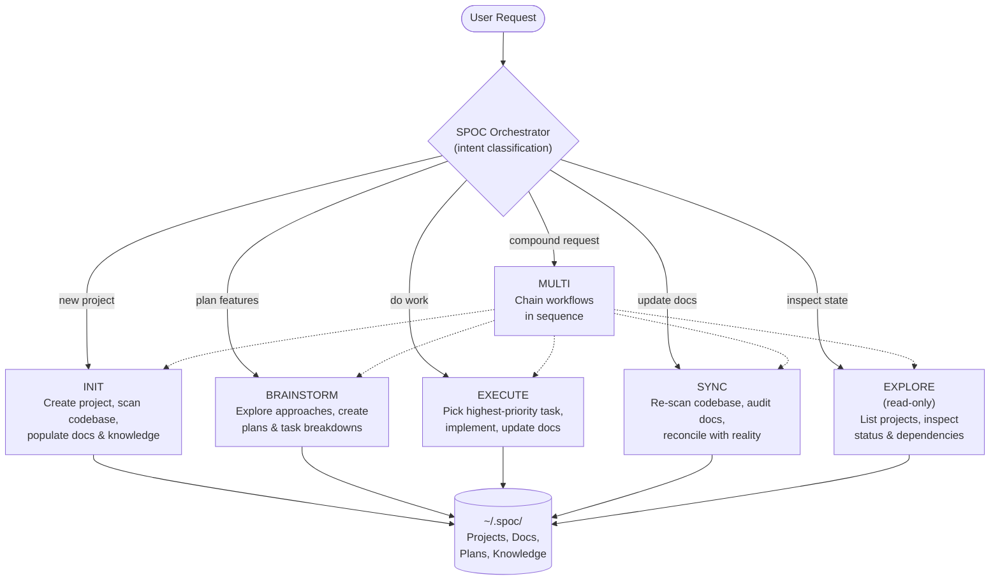

# SPOC

CLI-based DAG for agentic project management. Tracks projects, documentation, tasks, plans, and knowledge as a directed acyclic graph — designed for AI agents to read structured context instead of scanning codebases from scratch each session.

## Quick Start

```bash
npm install
npm run build

# Interactive setup wizard — configures OpenCode agents and deploys the SPOC bundle
spoc init
```

On first run, SPOC creates `~/.spoc/` to store project data and `~/.config/opencode/` for agent configuration.

### OpenCode Managed SPOC Bundle

Running `spoc init` installs the SPOC-customized bundle distribution for OpenCode — selecting OpenCode in `spoc init` installs the curated OpenCode runtime bundle. SPOC becomes the manager of the active SPOC bundle for OpenCode.

- Registers **SPOC Orchestrator** and **SPOC Caveman** as primary agents
- Deploys bundled skills, agent prompts, and plugins to `~/.config/opencode/`
- Existing generic SPOC Bundle installs may be replaced after confirmation
- `spoc config` re-syncs SPOC-owned files automatically
- Bundled install is skipped when the SPOC orchestrator agent is disabled or not registered
- All SPOC Bundle skills remain available in OpenCode
- All shipped SPOC agent definitions are bundled
- Non-runtime support files are intentionally excluded to keep the package lean
- `opencode/spoc/bundle-runtime.json` defines the curated runtime payload

## CLI Commands

SPOC is CLI-only. All operations are available through the `spoc` binary:

### Setup

| Command | Description |
|---|---|
| `spoc init` | Interactive setup wizard — configure agents, deploy bundle |
| `spoc config` | Reconfigure an existing installation |

### DAG Operations

| Command | Description |
|---|---|
| `spoc context [--path=<dir>]` | Resolve project context from workspace directory |
| `spoc project list` | List all projects and dependency edges |
| `spoc project get <slug>` | Get project metadata or a specific doc (`--doc=overview`) |
| `spoc project init <name>` | Create a new project in the DAG |
| `spoc project delete <slug>` | Remove a project from the DAG |
| `spoc project status <slug> <status>` | Change project lifecycle status |
| `spoc doc update <slug> <docType>` | Update a project document |
| `spoc dependency add <slug> <target>` | Add a dependency edge |
| `spoc dependency remove <slug> <target>` | Remove a dependency edge |
| `spoc paths update <slug>` | Manage workspace directory paths |

### Tasks

| Command | Description |
|---|---|
| `spoc task list <slug>` | List tasks (filterable by status/priority) |
| `spoc task get <slug> <taskId>` | Get task metadata |
| `spoc task create <slug> <title>` | Create a structured task |
| `spoc task update <slug> <taskId>` | Update task fields |
| `spoc task transition <slug> <taskId> <status>` | Transition task status with guard-rails |
| `spoc task delete <slug> <taskId>` | Remove a task |

### Plans

| Command | Description |
|---|---|
| `spoc plan list <slug>` | List plans with status and metadata |
| `spoc plan get <slug> <planId> [--body]` | Get plan metadata/body |
| `spoc plan create <slug> <title>` | Create a structured plan |
| `spoc plan update-meta <slug> <planId>` | Update plan metadata |
| `spoc plan update-body <slug> <planId>` | Replace plan body |
| `spoc plan delete <slug> <planId>` | Delete a plan |

### Knowledge

| Command | Description |
|---|---|
| `spoc knowledge list <slug>` | List knowledge entries |
| `spoc knowledge get <slug> <entryId> [--body]` | Get entry metadata/body |
| `spoc knowledge create <slug> <title>` | Create a knowledge entry |
| `spoc knowledge update-meta <slug> <entryId>` | Update entry metadata |
| `spoc knowledge update-body <slug> <entryId>` | Replace entry body |
| `spoc knowledge search <slug> "<query>"` | BM25 search over knowledge |
| `spoc knowledge delete <slug> <entryId>` | Delete a knowledge entry |

### Search & Diagnostics

| Command | Description |
|---|---|
| `spoc search <slug> "<query>"` | Cross-type search (plans + knowledge + tasks) |
| `spoc validate <slug>` | Structural health check |
| `spoc diagram ready <slug> <planId>` | Show next executable diagram nodes |
| `spoc audit <slug>` | Project state audit |
| `spoc diff <slug>` | Show DAG changes |
| `spoc git-log <slug>` | Query git history for a project |

### Bundle & Deployment

| Command | Description |
|---|---|
| `spoc lint-bundle` | Validate bundle manifest integrity |
| `spoc deploy-superpowers` | Deploy validated bundle to OpenCode config |
| `spoc sync-agents-md <slug>` | Generate AGENTS.md for workspace directories |

### Write-Gate

| Command | Description |
|---|---|
| `spoc write propose "<summary>" --ops=<op> --slug=<slug>` | Propose a DAG mutation, get a token |
| `spoc write apply <token>` | Execute a proposed write |

All mutating commands require `--token=<token>` from a prior `spoc write propose`.

All commands support `--json` for structured agent-consumable output.

## Data Directory

All project data is stored in `~/.spoc/` by default.

Override with the `SPOC_DATA_DIR` environment variable:

```bash
SPOC_DATA_DIR=/path/to/custom/dir spoc context
```

## Write-Gate Token Model

Mutating DAG operations use a two-step confirmation protocol to prevent accidental state changes:

1. **`spoc write propose`** — Describe intended mutation. Returns a single-use `token` scoped to the specific project + operation. Accepts optional `--ttl` to override the default expiry.
2. **`spoc write apply`** — Consume the token to authorize the write. Token is consumed on use; replays are rejected.
3. **Pass `--token` to write commands** — The consumed token authorizes the mutation.

### TTL Semantics

- Default TTL is **120 seconds** from proposal creation.
- Override with `--ttl` parameter at proposal time.
- Expired tokens require a fresh `spoc write propose` call.
- Tokens persist to `$SPOC_DATA_DIR/tokens/` as JSON files for cross-process CLI usage.

### Gated Mutating Commands

All of the following require a valid `--token` (from `spoc write propose` → `spoc write apply`):

| Command | Category |
|---|---|
| `spoc doc update` | Project |
| `spoc project status` | Project |
| `spoc project delete` | Project |
| `spoc dependency add/remove` | Project |
| `spoc plan create/update-meta/update-body/delete` | Plans |
| `spoc knowledge create/update-meta/update-body/delete` | Knowledge |
| `spoc task create/update/delete/transition` | Tasks |

## Development

### Prerequisites

- [Node.js](https://nodejs.org/) v18+

### Setup

```bash
npm install
```

### Build & Run

```bash
# Build TypeScript
npm run build

# Run CLI directly
node dist/index.js <command>

# Or via npm link / npx
spoc <command>

# Watch mode during development
npm run dev

# Run tests
npm run test
```

### Code Quality

```bash
# Lint and format check (Biome)
npm run lint

# Auto-fix lint and format issues
npm run lint:fix

# Format only
npm run format

# Type check (no emit)
npm run typecheck

# Full quality gate (tests + types + lint)
npm test && npm run typecheck && npm run lint
```

SPOC uses [Biome](https://biomejs.dev/) for linting and formatting (not ESLint/Prettier). Configuration is in `biome.json`.

## Concepts

### Projects and the DAG

A **project** is the top-level unit in SPOC. Each project has a unique slug, a lifecycle status, and four summary documents. Projects can declare **dependency edges** to other projects, forming a directed acyclic graph (DAG) with automatic cycle detection.

```
Project A ──depends on──▶ Project B ──depends on──▶ Project C
```

Project lifecycle: `draft` → `active` → `completed` → `archived`

### Summary Docs vs Structured Stores

Each project has two layers of documentation:

| Layer | What | Purpose |
|---|---|---|
| **Summary docs** | `overview.md`, `tasks.md`, `dependencies.md`, `knowledge.md` | Quick-orientation landing pages. Short, scannable, always current. |
| **Structured stores** | `plans/{planId}.md`, `knowledge/{entryId}.md` | Full-length documents with indexed metadata. Durable, searchable, detailed. |

`tasks.md` is the **execution queue** — a flat checklist of actionable items. Complex multi-step feature work goes in `plans/`.

`knowledge.md` is a **pointer page** — a summary that links to detailed knowledge entries in `knowledge/`.

### Task Status

Tasks in `tasks.md` use checkbox syntax:

| Syntax | Meaning |
|---|---|
| `- [ ] Task` | Backlog (not started) |
| `- [/] Task` | In progress |
| `- [x] Task` | Done |

### Structured Tasks

For programmatic task management, SPOC provides a structured task API alongside the markdown `tasks.md` surface. Structured tasks are stored in `tasks/index.json` and provide typed status and priority fields.

**Task statuses:** `backlog` → `in_progress` → `done` → `cancelled`

**Task priorities:** `high`, `medium`, `low`

When structured tasks exist, `tasks.md` is auto-rendered from the structured data as a backward-compatible view.

### Knowledge Entry Kinds

Each knowledge entry is tagged with a `kind` that describes what type of information it captures:

| Kind | Use For |
|---|---|
| `architecture` | System design, tech stack, high-level structure |
| `pattern` | Recurring code patterns, conventions, idioms |
| `module` | Module or service documentation |
| `feature` | Feature descriptions and behavior |
| `reference` | Key files, dependencies, external links |
| `lesson` | Insights learned during development |
| `gotcha` | Pitfalls, surprises, things that break unexpectedly |

### Plan Statuses

Plans track the lifecycle of feature work:

`proposed` → `planned` → `in_progress` → `done` → `archived`

### Plan Diagrams

Each plan can have an associated `.diagram.mmd` file (Mermaid) that serves as an **agentic execution map**. Agents read the diagram first for task selection and sub-agent dispatch before loading plan prose. Diagrams encode task status via `classDef` and include rich per-node metadata for automated execution.

### Concurrency

SPOC uses advisory file locking to prevent data corruption when multiple CLI processes write simultaneously. Lock files are created alongside protected resources (e.g., `meta.json.lock`) and automatically expire after 10 seconds if the holding process crashes.

---

## How It Works

### Workflow Diagram



### Orchestrator Flow

The SPOC Orchestrator is the recommended entry point (registered as a primary agent in OpenCode). Every request goes through three phases:

1. **Classify** — detect intent as one of six types (INIT, BRAINSTORM, EXECUTE, SYNC, EXPLORE, MULTI)
2. **Route** — delegate to the appropriate specialist workflow with sub-agents
3. **Complete** — summarize what was done, current project state, and recommended next steps

If intent is ambiguous, the orchestrator asks exactly one clarifying question before proceeding.

## Agent Operating Model

SPOC presents three main surfaces to agents: **Queue / Plan / Memory**.

- **Queue** — immediate execution state in `tasks.md`
- **Plan** — multi-step work tracked in structured plans
- **Memory** — durable reusable knowledge tracked in structured knowledge entries

`spoc context` returns an **operating brief** with:
- current focus
- recommended surface
- why
- next action

### Specialist Workflows

The orchestrator routes to these workflows internally:

| Workflow | What It Does |
|---|---|
| INIT | Creates a new project, performs codebase scan, populates docs and knowledge entries |
| BRAINSTORM | Reviews existing state, explores approaches, creates plans and task breakdowns |
| EXECUTE | Selects highest-priority unblocked task, implements it, updates docs and knowledge |
| SYNC | Re-scans codebase, audits all docs against reality, reconciles differences |
| EXPLORE | Lists projects, inspects status and dependencies (read-only) |
| MULTI | Chains multiple workflows in sequence for compound requests |

### Workspace Integration

Workspace paths connect local directories to SPOC projects, enabling two features:

**Context resolution** — When an agent starts a session in a directory, `spoc context` matches it against registered workspace paths and returns the project's overview, operating brief, current focus, recent knowledge, and active plans.

**AGENTS.md generation** — `spoc sync-agents-md` assembles a guardrail document from three sources and symlinks it into each workspace directory:

1. **Coding discipline rules** — 7 non-negotiable principles (DRY, Single Responsibility, etc.)
2. **Codebase analysis** — provided by the calling LLM after scanning the project
3. **Project context** — pulled from SPOC (overview, current focus, dependencies, active plans)

### SPOC Caveman

SPOC ships a second primary agent, **SPOC Caveman**, that layers [caveman-speak](https://github.com/JuliusBrussee/caveman) (MIT) on top of the standard orchestrator for ~65% fewer tokens on chat-facing narration. Tab in the OpenCode agent switcher to cycle between `SPOC Orchestrator` (default) and `SPOC Caveman`.

- **Same capabilities** — identical workflow routing, tool access, and sub-agent delegation
- **Intensity levels** — `lite`, `full` (default), `ultra`
- **Strict carve-outs** — caveman-speak applies only to chat narration. Tool arguments, DAG content, code, commit messages, and structured output stay in full prose.
- **Companion skills** — `caveman-commit` and `caveman-review` are bundled with the SPOC bundle

## Project Structure

```
├── src/
│   ├── index.ts          # CLI entrypoint
│   ├── cli/              # CLI commands, TUI setup wizard, bundle installer
│   └── utils/            # DAG logic, paths, templates, errors, workspace matching
├── opencode/spoc/        # SPOC bundle source (skills, prompts, plugins, manifests)
│   ├── skills/           # Agent skill markdown guides
│   ├── prompts/          # Agent prompt text files
│   ├── manifest.json     # Bundle install manifest
│   └── bundle-runtime.json  # Curated runtime payload definition
├── scripts/              # Build, lint, deploy helpers, spoc-cli.mjs entry point
├── templates/            # Doc templates rendered on project init
├── test/                 # Vitest test suite
└── ~/.spoc/              # Runtime data (created on first run)
    ├── config.json       # Agent/IDE configuration
    ├── tokens/           # Write-gate token persistence
    └── projects/         # Per-project directories
        └── {slug}/
            ├── meta.json       # Project metadata (name, description, workspace paths)
            ├── overview.md
            ├── tasks.md
            ├── dependencies.md
            ├── knowledge.md
            ├── AGENTS.md       # Generated guardrail doc (via sync-agents-md)
            ├── tasks/          # Structured task queue
            │   └── index.json
            ├── plans/          # Structured plans + diagrams
            │   ├── {planId}.md
            │   └── {planId}.diagram.mmd
            └── knowledge/      # Structured knowledge entries
                └── {entryId}.md
```

## Bundle Release Playbook

The SPOC bundle flows **repo → config only**. Never overwrite repo files from config.

### Workflow

1. **Edit** skills/agents/plugins in `opencode/spoc/` (repo source of truth).
2. **Build bundle** — `npm run build:bundle` (produces `bundle-runtime.json`, hashes, etc.).
3. **Lint** — `spoc lint-bundle`. Must pass with zero errors before deploying.
4. **Deploy dry-run** — `spoc deploy-superpowers` (default: dry-run). Review `filesAdded`/`filesChanged`/`filesRemoved`.
5. **Deploy actual** — `spoc deploy-superpowers --no-dry-run`.
6. **Restart** IDE/agent host — deployed skills are loaded at startup; changes require a process restart.

### Key rules

- **No config → repo**: deployed config is ephemeral output. Manual config edits are overwritten on next deploy.
- **Lint before deploy**: bundle integrity is binary. Skipping lint for "small changes" risks manifest/file mismatch.
- **Write-gate**: all DAG mutations require a `spoc write propose` token consumed via `spoc write apply` before the write proceeds. Expired tokens require fresh re-proposal.
