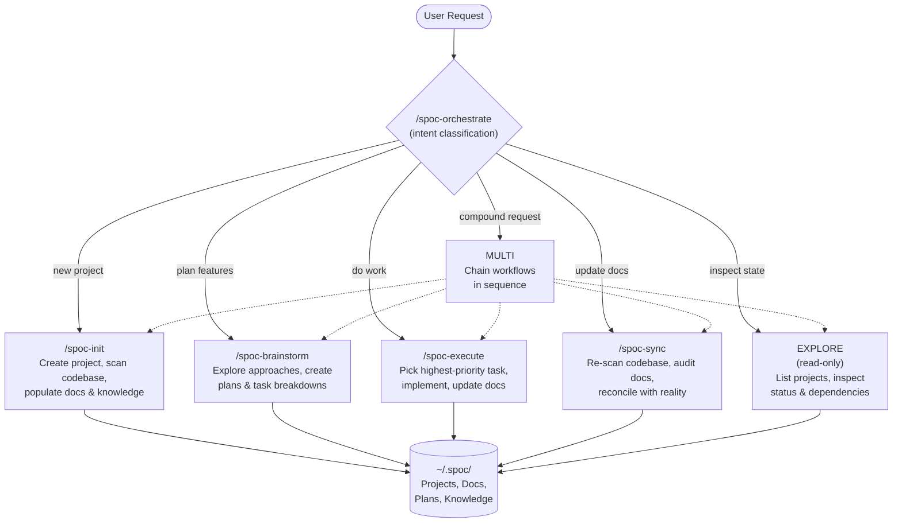

# SPOC

MCP server for agentic DAG-based project management. Tracks projects, their documentation, statuses, and inter-project dependencies as a directed acyclic graph.

## Quick Start

```bash
npm install
npm run build

# Interactive setup wizard — configures IDEs and agents
node dist/index.js init
```

The setup wizard writes the MCP server entry to your chosen IDE/platform, which will start the server automatically. On first run, SPOC creates `~/.spoc/` to store project data and configuration.

### MCP Client Configuration

The `node dist/index.js init` wizard can automatically write the MCP entry for supported IDEs (VS Code/Copilot, GitHub Copilot CLI, Claude Code, OpenCode). You can also configure it manually:

```json
{
  "mcpServers": {
    "spoc": {
      "command": "node",
      "args": ["/absolute/path/to/spoc/dist/index.js"]
    }
  }
}
```

### OpenCode Managed Superpowers

selecting OpenCode in `spoc init` installs the SPOC-customized Superpowers distribution.

- SPOC becomes the manager of the active `superpowers` set for OpenCode.
- existing generic Superpowers installs may be replaced after confirmation.
- `spoc config` re-syncs SPOC-owned OpenCode Superpowers files automatically.
- bundled install is skipped when the SPOC orchestrator agent is disabled or not registered.

SPOC ships a curated OpenCode runtime bundle.

- all Superpowers skills remain available in OpenCode.
- all shipped Superpowers agent definitions are bundled.
- non-runtime support files are intentionally excluded to keep the package lean.
- `opencode/superpowers/bundle-runtime.json` defines the curated runtime payload.

## CLI Commands

| Command | Description |
|---|---|
| `node dist/index.js init` | Interactive setup wizard — select IDEs, enable/disable agents, write MCP configs |
| `node dist/index.js config` | Reconfigure an existing installation (same wizard, preserves existing choices) |

## Data Directory

By default, all project data is stored in `~/.spoc/`.

Override with the `SPOC_DATA_DIR` environment variable:

```bash
SPOC_DATA_DIR=/path/to/custom/dir node dist/index.js
```

Or in your MCP client config:

```json
{
  "mcpServers": {
    "spoc": {
      "command": "node",
      "args": ["/absolute/path/to/spoc/dist/index.js"],
      "env": {
        "SPOC_DATA_DIR": "/path/to/custom/dir"
      }
    }
  }
}
```

## Development

### Prerequisites

- [Node.js](https://nodejs.org/) v18+

### Setup

```bash
npm install
```

### Build & Run

```bash
# Build TypeScript
npm run build

# Run the MCP server (stdio transport)
npm run start

# Watch mode during development
npm run dev

# Run tests
npm run test
```

### Code Quality

```bash
# Lint and format check (Biome)
npm run lint

# Auto-fix lint and format issues
npm run lint:fix

# Format only
npm run format

# Type check (no emit)
npm run typecheck

# Full quality gate (tests + types + lint)
npm test && npm run typecheck && npm run lint
```

SPOC uses [Biome](https://biomejs.dev/) for linting and formatting (not ESLint/Prettier). Configuration is in `biome.json`.

## Concepts

### Projects and the DAG

A **project** is the top-level unit in SPOC. Each project has a unique slug, a lifecycle status, and four summary documents. Projects can declare **dependency edges** to other projects, forming a directed acyclic graph (DAG) with automatic cycle detection.

```
Project A ──depends on──▶ Project B ──depends on──▶ Project C
```

Project lifecycle: `draft` → `active` → `completed` → `archived`

### Summary Docs vs Structured Stores

Each project has two layers of documentation:

| Layer | What | Purpose |
|---|---|---|
| **Summary docs** | `overview.md`, `tasks.md`, `dependencies.md`, `knowledge.md` | Quick-orientation landing pages. Short, scannable, always current. |
| **Structured stores** | `plans/{planId}.md`, `knowledge/{entryId}.md` | Full-length documents with indexed metadata. Durable, searchable, detailed. |

`tasks.md` is the **execution queue** — a flat checklist of actionable items. Complex multi-step feature work goes in `plans/`.

`knowledge.md` is a **pointer page** — a summary that links to detailed knowledge entries in `knowledge/`.

### Task Status

Tasks in `tasks.md` use checkbox syntax:

| Syntax | Meaning |
|---|---|
| `- [ ] Task` | Backlog (not started) |
| `- [/] Task` | In progress |
| `- [x] Task` | Done |

### Structured Tasks

For programmatic task management, SPOC provides a structured task API alongside the markdown `tasks.md` surface. Structured tasks are stored in `tasks/index.json` and provide typed status and priority fields.

**Task statuses:** `backlog` → `in_progress` → `done` → `cancelled`

**Task priorities:** `high`, `medium`, `low`

When structured tasks exist, `tasks.md` is auto-rendered from the structured data as a backward-compatible view. The two surfaces coexist — `update_project_doc(tasks)` writes directly to `tasks.md`, while the task tools manage `tasks/index.json`.

### Knowledge Entry Kinds

Each knowledge entry is tagged with a `kind` that describes what type of information it captures:

| Kind | Use For |
|---|---|
| `architecture` | System design, tech stack, high-level structure |
| `pattern` | Recurring code patterns, conventions, idioms |
| `module` | Module or service documentation |
| `feature` | Feature descriptions and behavior |
| `reference` | Key files, dependencies, external links |
| `lesson` | Insights learned during development |
| `gotcha` | Pitfalls, surprises, things that break unexpectedly |

### Plan Statuses

Plans track the lifecycle of feature work:

`proposed` → `planned` → `in_progress` → `done` → `archived`

### Concurrency

SPOC uses advisory file locking to prevent data corruption when multiple MCP clients write simultaneously. Lock files are created alongside protected resources (e.g., `meta.json.lock`) and automatically expire after 10 seconds if the holding process crashes.

All server-side file I/O uses `node:fs/promises` for non-blocking operation within the MCP event loop. CLI commands (`src/cli/`) remain synchronous as they run in their own process.

---

## How It Works

### Workflow Diagram



### Orchestrator Flow

The orchestrator (`/spoc-orchestrate`) is the recommended entry point. Every request goes through three phases:

1. **Classify** — detect intent as one of six types (INIT, BRAINSTORM, EXECUTE, SYNC, EXPLORE, MULTI)
2. **Route** — delegate to the appropriate specialist workflow with the right tool set
3. **Complete** — summarize what was done, current project state, and recommended next steps

If intent is ambiguous, the orchestrator asks exactly one clarifying question before proceeding.

## Agent Operating Model

SPOC presents three main surfaces to agents: **Queue / Plan / Memory**.

- **Queue** — immediate execution state in `tasks.md`
- **Plan** — multi-step work tracked in structured plans
- **Memory** — durable reusable knowledge tracked in structured knowledge entries

When available, `resolve_project_context` returns an **operating brief** with:
- current focus
- recommended surface
- why
- next action

### Specialist Workflows

Each specialist prompt can also be invoked directly:

| Prompt | Argument | What It Does |
|---|---|---|
| `/spoc-orchestrate` | _(none)_ | Classifies intent and routes to the right workflow |
| `/spoc-init` | _(none)_ | Creates a new project, performs a full codebase scan, populates docs and knowledge entries |
| `/spoc-brainstorm` | `project` (slug) | Reviews existing state, collaboratively explores approaches, creates plans and tasks |
| `/spoc-execute` | `project` (slug) | Selects highest-priority unblocked task, implements it, updates docs and knowledge |
| `/spoc-sync` | `project` (slug) | Re-scans codebase, audits all docs against reality, reconciles differences |

### Workspace Integration

Workspace paths connect local directories to SPOC projects, enabling two features:

**Context resolution** — When an agent starts a session in a directory, `resolve_project_context` matches it against registered workspace paths and returns the project's overview, operating brief, current focus, recent knowledge, and active plans. This gives the agent immediate project awareness without manual lookup.

**AGENTS.md generation** — `sync_agents_md` assembles a guardrail document from three sources and symlinks it into each workspace directory:

1. **Coding discipline rules** — 7 non-negotiable principles (DRY, Single Responsibility, etc.)
2. **Codebase analysis** — provided by the calling LLM after scanning the project (tech stack, directory structure, naming conventions, code patterns)
3. **Project context** — pulled from SPOC (overview, current focus, dependencies, active plans)

Register workspace paths with `update_project_paths`. A project can have multiple paths (e.g., monorepo subdirectories).

### Supported IDEs

The `init` wizard can auto-configure these IDEs/tools:

| IDE / Tool | Config Path |
|---|---|
| VS Code (Copilot) | `~/.vscode/mcp.json` |
| GitHub Copilot CLI | `~/.config/github-copilot/mcp.json` |
| Claude Code | `~/.claude/claude_desktop_config.json` |
| OpenCode | `~/.config/opencode/opencode.json` |

When OpenCode agent registration is enabled, SPOC appears in the agent switcher as `SPOC - (Orchestrator)`.

### SPOC Caveman

SPOC ships a second OpenCode primary agent, **SPOC Caveman**, that layers [caveman-speak](https://github.com/JuliusBrussee/caveman) (MIT) on top of the standard orchestrator for ~65% fewer tokens on chat-facing narration. Tab in the OpenCode agent switcher to cycle between `SPOC Orchestrator` (default) and `SPOC Caveman`.

- **Same capabilities** — identical workflow routing (INIT / BRAINSTORM / EXECUTE / SYNC / EXPLORE / MULTI), tool access, and sub-agent delegation as the standard orchestrator.
- **Intensity levels** — `lite`, `full` (default), `ultra`. Caveman auto-escalates to full prose when the user asks a clarifying question or signals confusion.
- **Strict carve-outs** — caveman-speak applies only to chat narration. Tool arguments, DAG document content (overview/tasks/plans/knowledge), code, commit messages, and structured output stay in full prose.
- **Sub-agent propagation** — when SPOC Caveman dispatches a sub-agent, it prepends an inheritance block so the sub-agent narrates in caveman-speak too, while respecting the same carve-outs.
- **Companion skills** — `caveman-commit` (terse Conventional Commits) and `caveman-review` (one-line PR findings with severity prefix) are bundled with the OpenCode superpowers install.

---

## MCP Tools

### Project Management

| Tool | Description |
|---|---|
| `init_project` | Initialize a new project in the DAG with templates for overview, tasks, dependencies, and knowledge docs |
| `update_project_doc` | Update a project document (`overview`, `tasks`, `dependencies`, `knowledge`) |
| `update_project_status` | Change a project's status (`draft` / `active` / `completed` / `archived`) |
| `manage_dependency` | Add or remove dependency edges between projects with cycle detection |
| `list_projects` | List all projects in the DAG with their status and dependency edges |
| `get_project` | Get a project's metadata or a specific document (overview, tasks, dependencies, knowledge) |

### Plans

| Tool | Description |
|---|---|
| `create_project_plan` | Create a structured plan for feature work within a project |
| `list_project_plans` | List all plans for a project with their status and metadata |
| `get_project_plan` | Get a plan's metadata and body content |
| `update_project_plan_meta` | Update a plan's title, status, or other metadata |
| `update_project_plan_body` | Replace a plan's body content |

### Tasks

| Tool | Description |
|---|---|
| `create_project_task` | Create a structured task in a project's task queue |
| `list_project_tasks` | List tasks for a project, optionally filtered by status and/or priority |
| `get_project_task` | Get a task's full metadata (title, status, priority) |
| `update_project_task` | Update a task's title, status, or priority |
| `delete_project_task` | Remove a task from the project's task queue |

### Knowledge

| Tool | Description |
|---|---|
| `create_project_knowledge_entry` | Create a structured knowledge entry for durable project memory |
| `list_project_knowledge_entries` | List all knowledge entries for a project with their metadata |
| `get_project_knowledge_entry` | Get a knowledge entry's metadata and body content |
| `update_project_knowledge_meta` | Update a knowledge entry's title, kind, or other metadata |
| `update_project_knowledge_body` | Replace a knowledge entry's body content |

### Workspace Integration

| Tool | Description |
|---|---|
| `update_project_paths` | Add, remove, or set workspace directory paths for a project (maps local directories to SPOC projects) |
| `resolve_project_context` | Resolve project context from a workspace directory path — returns assembled overview, active tasks, knowledge, and plans |
| `sync_agents_md` | Generate and write an `AGENTS.md` file to a project's workspace directories (coding discipline rules + codebase analysis + project context) |

### Delete / Cleanup

| Tool | Description |
|---|---|
| `delete_project` | Remove a project and all its data from the DAG |
| `delete_project_plan` | Delete a structured plan from a project |
| `delete_project_knowledge_entry` | Delete a knowledge entry from a project |

## MCP Resources

| Resource | Description |
|---|---|
| `spoc://projects` | List all tracked projects |
| `spoc://projects/{slug}` | Get details for a specific project |
| `spoc://projects/{slug}/plans` | List all plans for a project |
| `spoc://projects/{slug}/plans/{planId}` | Get a plan's body content |
| `spoc://projects/{slug}/plans/{planId}/meta` | Get a plan's metadata |
| `spoc://projects/{slug}/knowledge` | List all knowledge entries for a project |
| `spoc://projects/{slug}/knowledge/{entryId}` | Get a knowledge entry's body content |
| `spoc://projects/{slug}/knowledge/{entryId}/meta` | Get a knowledge entry's metadata |
| `spoc://skills/*` | Agent skill guides (init-project, update-docs, explore-dag, orchestrate) |

## MCP Prompts (Slash Commands)

Prompts are registered as slash commands and can be individually enabled/disabled via `node dist/index.js config`. See [Specialist Workflows](#specialist-workflows) above for details on each prompt.

## Project Structure

```
├── src/
│   ├── index.ts          # Server entrypoint (shebang + bootstrap)
│   ├── cli/              # CLI subcommands (init, config) with interactive TUI
│   ├── agents/           # Agent definitions (names, hints for prompt registration)
│   ├── prompts/          # MCP prompt (slash command) handlers
│   ├── tools/            # MCP tool handlers
│   ├── resources/        # MCP resource handlers
│   └── utils/            # DAG logic, paths, templates, errors, workspace matching
├── templates/            # Mustache-style templates for new projects
├── skills/               # Agent skill markdown guides
├── test/                 # Vitest test suite
└── ~/.spoc/              # Runtime data (created on first run)
    ├── config.json       # Agent/IDE configuration
    ├── meta.json         # Root DAG graph
    └── projects/         # Per-project directories
        └── {slug}/
            ├── meta.json       # Project metadata (name, description, workspace paths)
            ├── overview.md
            ├── tasks.md
            ├── dependencies.md
            ├── knowledge.md
            ├── AGENTS.md       # Generated guardrail doc (via sync_agents_md)
            ├── tasks/          # Structured task queue
            │   └── index.json
            ├── plans/          # Structured plans for feature work
            │   └── {planId}.md
            └── knowledge/      # Structured knowledge entries
                └── {entryId}.md
```
