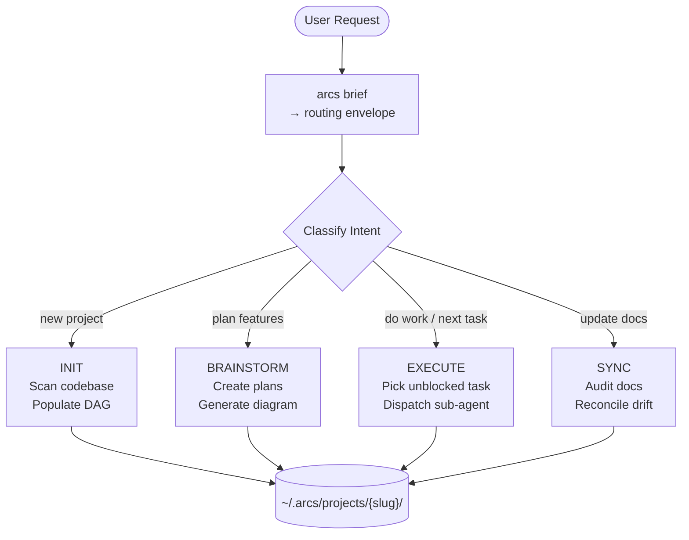
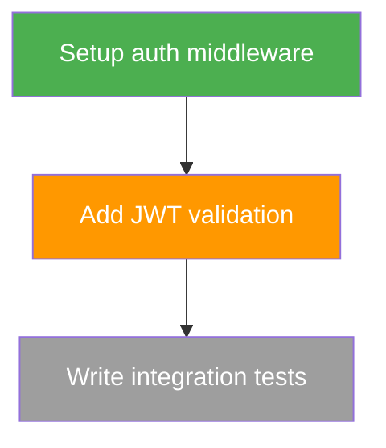

<div align="center">

# ARCS

**Agent Routing & Context System**

[](https://www.npmjs.com/package/@rryando/arcs)
[](https://nodejs.org/)
[](https://www.typescriptlang.org/)
[](LICENSE)

*Persistent workflow continuity for AI agents — start from context, not a blank slate.*

</div>

---

ARCS gives AI coding agents a queryable project DAG so they never start cold. Instead of scanning a codebase from scratch, an agent calls `arcs brief` and gets back: what to work on, what was decided, and what went wrong last time — in a single ~1 KB JSON envelope.

> **arcs** `/ɑːrks/` — Directed edges in graph theory. Also: **A**gent **R**outing & **C**ontext **S**ystem.

---

## The Problem

Every AI coding session starts fresh. The agent doesn't know:
- What task to pick up next
- What was already tried and failed
- What architectural decisions were made
- What the current plan looks like

ARCS solves this with three persistent surfaces:

| Surface | Storage | Purpose |
|---------|---------|---------|
| **Queue** | `tasks/index.json` | Immediate work items: `backlog → in_progress → done` |
| **Plan** | `plans/*.md` + `.diagram.mmd` | Multi-step feature work with Mermaid execution maps |
| **Memory** | `knowledge/*.md` | Durable discoveries: lessons, patterns, gotchas, architecture |

---

## How It Works

### The Agent Loop

```
┌─────────────────────────────────────────────────────┐
│  Session Start                                       │
│                                                      │
│  1. arcs brief          → routing envelope (~1 KB)   │
│  2. arcs next           → next task + related knowledge │
│  3. [agent does work]                                │
│  4. arcs done <id>      → mark complete, learn       │
│  5. arcs remember "..." → capture durable discovery  │
│                                                      │
│  Repeat 2–5 until session ends                       │
└─────────────────────────────────────────────────────┘
```

The core loop is three commands: `arcs next` → work → `arcs done`. Everything else is orchestration.

### The Orchestrator

When used with [OpenCode](https://opencode.ai/), ARCS ships a full orchestrator agent that automates the loop:



The orchestrator:
1. **Orients** — calls `arcs brief` for the T0 routing envelope
2. **Classifies** — detects intent from the user's message
3. **Routes** — delegates to the right workflow + specialist sub-agents
4. **Writes** — commits changes to the DAG
5. **Reports** — summarizes what was done, current state, next steps

### T0 Routing Envelope

```bash
$ arcs brief --lean --json
```

```json
{
  "slug": "my-project",
  "name": "My Project",
  "operatingBrief": {
    "currentFocus": "Add user authentication",
    "recommendedSurface": "QUEUE",
    "why": "3 backlog tasks ready for implementation",
    "nextAction": "Pick up task auth-middleware"
  },
  "openTasksCount": 5,
  "topOpenTasks": [...]
}
```

~1 KB. No source files read. The orchestrator uses `recommendedSurface` to pick the workflow branch.

---

## CLI Reference

All commands: `arcs <command> [args] --json`. Structured output: `{ok, data}` on success, `{ok, code, message}` on error.

### Core Agent Loop

| Command | Purpose |
|---------|---------|
| `arcs brief` | T0 routing envelope — what to focus on |
| `arcs next` | Get next task + related knowledge context |
| `arcs done <taskId>` | Mark task complete (optional `--learn` flag) |
| `arcs remember "<text>"` | Capture knowledge (auto-classifies kind) |
| `arcs status` | Progress overview across all surfaces |

### Project Management

| Command | Purpose |
|---------|---------|
| `arcs project init` | Register current directory as a project |
| `arcs project list` | List all tracked projects |
| `arcs context [slug]` | Full context assembly (audience-targeted) |
| `arcs search <slug> "<query>"` | BM25 + graph-scored search across DAG |
| `arcs validate <slug>` | Health check — status drift, orphans, staleness |
| `arcs cross-invoke <slug> "<prompt>"` | *(planned)* Create a task in another project and invoke opencode there |

### Tasks, Plans, Knowledge

| Command | Purpose |
|---------|---------|
| `arcs task create <slug> <title>` | Create a task |
| `arcs task transition <slug> <id> <status>` | Move task through lifecycle |
| `arcs plan create <slug> <title>` | Create a plan |
| `arcs diagram ready <slug> <planId>` | Get unblocked diagram nodes |
| `arcs knowledge create <slug> <title>` | Create knowledge entry |

### Flags

| Flag | Effect |
|------|--------|
| `--json` | Structured JSON output (always use for agents) |
| `--lean` | Strip timestamps (saves tokens) |
| `--dry-run` | Validate without mutation |
| `--help` | Per-command usage |

Full command discovery: `arcs --commands --json` (61 commands).

---

## Multi-Project Orchestration *(planned)*

When working across multiple ARCS-tracked projects, `arcs cross-invoke` eliminates the context-switch. Instead of manually opening a second terminal, switching directories, and re-prompting — one command queues the work and triggers execution:

```bash
# Working in frontend, need a backend change
arcs cross-invoke loqua "Add POST /api/auth/register endpoint"
```

What happens:
1. **Task created** in `loqua`'s DAG — tracked immediately, survives session failure
2. **T0 context fetched** — `arcs brief loqua` provides operating brief for the target project
3. **opencode invoked** — `opencode run --dir /path/to/loqua --agent orchestrator "<enriched prompt>"`

The enriched prompt includes the target project's current focus, the task ID, and the agent loop hint (`arcs next → work → arcs done <taskId>`), so the target orchestrator wakes up in context.

**Graceful degradation:** if the target project's workspace path isn't configured, the task is still created and a hint is printed — no silent failures.

```bash
arcs cross-invoke loqua "Add auth endpoint" --dry-run   # preview the opencode command
arcs cross-invoke loqua "Add auth endpoint" --agent implementer  # target a specific agent
```

---

## Sub-Agents

The orchestrator dispatches specialist sub-agents. Each gets a scoped prompt with explicit boundaries:

| Sub-Agent | Role | Dispatched When |
|-----------|------|-----------------|
| **software-engineer** | Writes code, runs tests, ships features | EXECUTE — bounded implementation tasks |
| **system-architect** | Module boundaries, migration design, plan creation | BRAINSTORM — design-open problems |
| **tech-architect** | Deep analysis, trade-off evaluation, root cause | Analysis without edits |
| **oncall-ops** | Systematic debugging, log triage, bisect | Bugs, test failures, incidents |
| **code-reviewer** | Pre-merge review, convention enforcement | PR review, phase completion |
| **qa-analyst** | Read-only audits, compliance checks | Convention verification |
| **arcs-docs** | DAG health, knowledge curation, diagram drift | SYNC workflow |
| **docs-researcher** | External research, documentation writing | INIT tech-stack scan |
| **devil-advocate** | Adversarial phase-gate, KISS/YAGNI/DRY checks | Phase boundaries |

### Skills (loaded per-dispatch)

Skills are instruction bundles that sub-agents load based on task shape:

| Category | Skills |
|----------|--------|
| **Work mode** (pick one) | `quick-dev`, `code-agent`, `test-driven-development`, `brainstorming` |
| **Lifecycle** (layer on) | `writing-plans`, `executing-plans`, `subagent-driven-development` |
| **Quality** (auto-triggered) | `verification-before-completion`, `requesting-code-review`, `deep-pr-review` |
| **Diagnosis** | `systematic-debugging`, `confidence-gate` |
| **Tooling** | `to-diagram`, `init-project`, `caveman-commit` |

---

## Data Model

```
~/.arcs/
├── meta.json                         # Global registry of project slugs
└── projects/{slug}/
    ├── meta.json                     # Project metadata + workspace paths
    ├── overview.md                   # Summary + goals (2-3 sentences)
    ├── tasks.md                      # Rendered task queue
    ├── dependencies.md               # Upstream / downstream edges
    ├── knowledge.md                  # Index → knowledge entries
    ├── AGENTS.md                     # Auto-generated coding guardrails
    ├── tasks/index.json              # Structured task records
    ├── plans/
    │   ├── {id}.meta.json            # Plan status + metadata
    │   ├── {id}.md                   # Plan body (prose)
    │   └── {id}.diagram.mmd          # Mermaid execution map
    └── knowledge/
        ├── index.json                # Knowledge index
        ├── {id}.meta.json            # Entry metadata (kind, sourceFiles)
        └── {id}.md                   # Entry body
```

### Plan Diagrams

Each plan has a `.diagram.mmd` — a Mermaid flowchart that agents read first for task selection. Node status is encoded via `classDef`:



Agents call `arcs diagram ready` to discover unblocked nodes, then `arcs task transition` to advance state.

### Knowledge Kinds

8 structured categories: `lesson`, `gotcha`, `pattern`, `architecture`, `module`, `feature`, `reference`, `decision`.

---

## Quick Start

**1. Install**

```bash
npm install -g @rryando/arcs
```

Registers `arcs` CLI, creates `~/.arcs/`, deploys agents + skills to `~/.config/opencode/`.

**2. Track a project**

```bash
cd your-project
arcs init
```

**3. Use it**

Select **ARCS Orchestrator** in OpenCode. Or use the CLI directly:

```bash
arcs brief              # What should I work on?
arcs next               # Give me the next task
arcs done <taskId>      # I finished it
arcs remember "..."     # Capture what I learned
```

---

## Prerequisites

| Tool | Required | Notes |
|------|----------|-------|
| [Node.js](https://nodejs.org/) v18+ | Yes | Runtime |
| [OpenCode](https://opencode.ai/) | Yes | Agent host (orchestrator + sub-agents) |
| [gh](https://cli.github.com/) | Yes | Used by `deep-pr-review` skill |
| [graphify](https://github.com/safishamsi/graphify) | No | Optional AST-based codebase knowledge extraction |

---

## Graphify (Optional)

When [graphify](https://github.com/safishamsi/graphify) is on PATH, ARCS auto-extracts structural knowledge during INIT and SYNC — no LLM calls required:

| Category | Cap | What |
|----------|-----|------|
| God nodes | 8 | Highest-connectivity modules (architectural hubs) |
| Clusters | 8 | Directory-based module boundaries |
| Couplings | 5 | Cross-module links between high-degree nodes |

Trigger manually: `arcs graphify-sync <slug>`. Output: `graphify-out/graph.json` (auto-gitignored).

---

## Development

```bash
git clone https://github.com/rryando/arcs.git
cd arcs && npm install && npm run init
```

| Command | Description |
|---------|-------------|
| `npm run build` | Compile TypeScript → `dist/` |
| `npm test` | Vitest suite (62 files, 686 tests) |
| `npm run typecheck` | Type check without emit |
| `npm run lint` | Biome lint + format |

Quality gate: `npm test && npm run typecheck && npm run lint`

### Bundle Workflow

```bash
# Edit opencode/arcs/skills/ or prompts/
npm run build:opencode-bundle    # Build
arcs lint-bundle                 # Validate
arcs deploy-superpowers          # Deploy to ~/.config/opencode/
```

### Environment

```bash
ARCS_DATA_DIR=/custom/path arcs brief    # Override data directory (default: ~/.arcs/)
```

---

## License

MIT
