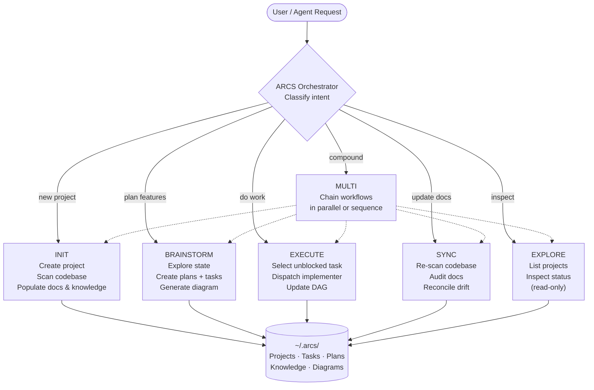

<div align="center">

# ARCS

**Agent Routing & Context System**

[](https://www.npmjs.com/package/@rryando/arcs)
[](https://nodejs.org/)
[](https://www.typescriptlang.org/)
[](LICENSE)

*Give AI agents durable memory — so they start from context, not a blank slate.*

</div>

---

ARCS tracks projects, tasks, plans, and knowledge as a directed acyclic graph (DAG) stored in `~/.arcs/`. AI agents call `arcs <command>` to read structured project context instead of scanning codebases from scratch each session.

> **arcs** `/ɑːrks/` — In graph theory, directed edges connecting nodes. Also: **A**gent **R**outing & **C**ontext **S**ystem.

---

## What Is ARCS

Every AI coding session starts fresh. ARCS fixes that by maintaining three persistent surfaces per project:


An agent calls `arcs brief` at session start and receives an **operating brief** (~890-byte routing envelope with `currentFocus`, `recommendedSurface`, and `nextAction`) — without reading a single source file.

---

## How It Works

### Orchestrator → Workflow → DAG



### T0 Orientation

```bash
arcs brief --lean --json
# → currentFocus, recommendedSurface, nextAction (~890-byte routing envelope)
```

The orchestrator calls `arcs brief` at the start of every session to orient without loading any source files. `--lean` strips timestamps for token efficiency.

### Confidence Gate

Before any irreversible action (DAG write, code edit, plan creation), the orchestrator self-scores 0–100% confidence with cited evidence. Threshold: 80% (85% for cross-cutting changes). Reads and exploration are never gated. Self-report without citations is invalid.

### Mutations

Mutating commands run directly — no token, no proposal. Reads and writes share the same `arcs <command> [args] --json` shape.

---

## Prerequisites

| Requirement | Version | Notes |
|---|---|---|
| [Node.js](https://nodejs.org/) | v18+ | Required |
| [OpenCode](https://opencode.ai/) | latest | Required for agent integration |
| [gh (GitHub CLI)](https://cli.github.com/) | any | Required — used by skills like `deep-pr-review` |
| [graphify](https://github.com/safishamsi/graphify) | any | Optional — AST code-graph analysis |
| [rtk](https://github.com/rtk-ai/rtk) | any | Optional — improves AI command usage tracking |

**Install RTK:**
```bash
rtk init -g                 # Install hook + RTK.md (recommended)
rtk init -g --opencode      # OpenCode plugin (instead of Claude Code)
```

---

## Quick Start

**1. Install globally**

```bash
npm install -g @rryando/arcs
```

This automatically:
- Registers the `arcs` CLI at `~/.local/bin/arcs`
- Creates `~/.arcs/` (project data store)
- Deploys bundled agents + skills into `~/.config/opencode/`

**2. Track a project**

Open OpenCode in your desired project folder, then call `arcs init` to register it with ARCS:

```bash
arcs init
```

This creates the DAG structure for the project and registers the current directory as a workspace path.

**3. Start using ARCS**

You'll see the **ARCS Orchestrator** listed as a selectable agent in OpenCode. Every session starts with an operating brief instead of a blank slate:

```bash
arcs context
# → project overview, current focus, active plans, relevant knowledge
```

---

## Agents

### Primary Agents

These are registered as selectable agents in OpenCode. You interact with them directly.

| Agent | Token Mode | Description |
|---|---|---|
| **ARCS Orchestrator** | Full prose | Classifies intent, routes to workflows, delegates to sub-agents, writes DAG |
| **ARCS Caveman** | ~65% fewer tokens | Identical capabilities; caveman-speak for chat narration only |

The orchestrator follows three phases on every request:
1. **Classify** — detect intent (INIT / BRAINSTORM / EXECUTE / SYNC / EXPLORE / MULTI)
2. **Route** — delegate to the right workflow and specialist sub-agents
3. **Complete** — summarize what was done, current state, and next steps

ARCS Caveman supports three intensity levels: `lite`, `full` (default), `ultra`. Code, tool arguments, DAG content, and commit messages are always full prose regardless of mode.

### Sub-Agents

Dispatched automatically by the orchestrator. You do not interact with them directly.

| Sub-Agent | Role | Model |
|---|---|---|
| **software-engineer** | Implementation specialist. Writes code, runs tests, ships features. Loads quick-dev, code-agent, TDD, executing-plans skills as needed. | Opus |
| **tech-architect** | Architecture and analysis specialist. Deep structural reasoning, refactor guidance, trade-off evaluation, and root cause analysis without making hasty edits. | Haiku |
| **qa-analyst** | Quality enforcement specialist. Proactive code audits, convention compliance, and verification gate enforcement. | Haiku |
| **oncall-ops** | Debugging and diagnosis specialist. Finds root causes through systematic investigation, log triage, bisect, and performance profiling. | Opus |
| **arcs-docs** | ARCS documentation specialist. Manages plans, knowledge entries, diagrams, and DAG health. | Opus |
| **system-architect** | Architecture and design specialist. Module boundaries, dependency graphs, migration strategies, and cross-project design decisions. | Opus |
| **code-reviewer** | Reviews code changes for production readiness. Catches correctness, maintainability, and testing issues. | Haiku |
| **docs-researcher** | Handles documentation writing, research synthesis, and document-heavy analysis tasks. | Opus |

---

## Skills

Skills are instruction sets loaded on demand. The orchestrator auto-layers them based on context; sub-agents load them at dispatch time.

### Work Mode (select exactly one per code-change dispatch)

| Skill | Load When |
|---|---|
| `quick-dev` | Fully bounded — rename, refactor, config nudge, trivial bugfix |
| `code-agent` | 50–90% clear, 1–2 open decisions resolvable from the repo |
| `test-driven-development` | New feature or bugfix — test-first discipline adds value |
| `brainstorming` | Design open, product direction genuinely unclear |

### Lifecycle & Planning (layer on top of work mode)

| Skill | Load When |
|---|---|
| `writing-plans` | Have requirements, about to create a structured plan |
| `executing-plans` | Have a plan, executing it in a separate session with checkpoints |
| `subagent-driven-development` | Multi-task plan with independent leaf nodes |
| `verification-before-completion` | Before claiming "done" on any non-trivial change |
| `requesting-code-review` | Self-review gate at phase/feature completion |
| `deep-pr-review` | Deep PR review triggered from a GitHub PR link |

### Diagnosis & Tooling

| Skill | Load When |
|---|---|
| `systematic-debugging` | Any bug, test failure, or unexpected behavior |
| `confidence-gate` | Before irreversible actions — self-score with citations |
| `to-diagram` | Creating or updating a Mermaid plan diagram |
| `init-project` | Initializing a new ARCS project into the DAG |
| `caveman-commit` | Writing git commit messages in ARCS Caveman mode |

---

## Data Model

```
~/.arcs/
├── meta.json                    # Global registry — all project slugs
└── projects/
    └── {slug}/
        ├── meta.json            # name · description · status · workspacePaths · lastSyncedAt
        ├── overview.md          # 2-3 sentence summary + goals     ← summary docs
        ├── tasks.md             # Execution queue (auto-rendered from structured tasks)
        ├── dependencies.md      # Upstream / downstream project edges
        ├── knowledge.md         # Pointer page → knowledge/ entries
        ├── AGENTS.md            # Auto-generated guardrail doc (symlinked into workspace)
        ├── tasks/
        │   └── index.json       # Structured task records (status, priority, planId)
        ├── plans/
        │   ├── {planId}.meta.json
        │   ├── {planId}.md      # Plan body (prose)       ← structured stores
        │   └── {planId}.diagram.mmd  # Mermaid execution map (agents read this first)
        └── knowledge/
            ├── index.json
            ├── {entryId}.meta.json
            └── {entryId}.md     # Knowledge entry body
```

### Summary Docs vs Structured Stores

| Layer | Files | Purpose |
|---|---|---|
| **Summary docs** | `overview.md`, `tasks.md`, `dependencies.md`, `knowledge.md` | Quick-orientation landing pages — short, scannable, always current |
| **Structured stores** | `plans/*.md`, `knowledge/*.md`, `tasks/index.json` | Full documents with indexed metadata — durable, searchable, detailed |

### Project Lifecycle

```
draft → active → completed → archived
```

### Plan Diagrams

Each plan has an associated `.diagram.mmd` file — a Mermaid flowchart that serves as the **agent execution map**. Agents read the diagram first for task selection before loading plan prose.

Node status is encoded via `classDef`:

| Class | Meaning |
|---|---|
| `:::backlog` | Not started |
| `:::in_progress` | Active |
| `:::done` | Complete |
| `:::blocked` | Waiting on dependency |

---

## Workspace Integration

Registering a workspace path enables two features:

**1. Context resolution** — `arcs context --path=/path/to/repo` matches the directory to its ARCS project and returns the operating brief, current focus, active plans, and relevant knowledge.

**2. AGENTS.md generation** — `arcs sync-agents-md <slug>` assembles a coding guardrail document from three sources and symlinks it into each workspace:

| Source | Content |
|---|---|
| Coding discipline | Non-negotiable rules (DRY, single responsibility, etc.) |
| Codebase analysis | LLM-provided scan of tech stack, patterns, file structure |
| Project context | ARCS overview, current focus, dependencies, active plans |

---

## Development

### Install from source

```bash
git clone https://github.com/rryando/arcs.git
cd arcs
npm install
npm run init
```

### Commands

| Command | Description |
|---|---|
| `npm run build` | Compile TypeScript → `dist/` |
| `npm run dev` | Watch mode (rebuild on change) |
| `npm test` | Run Vitest test suite (62 test files, 685 tests) |
| `npm run typecheck` | Type check without emit |
| `npm run lint` | Biome lint + format check |
| `npm run lint:fix` | Auto-fix lint and format issues |
| `npm run format` | Format only |

Full quality gate before committing:
```bash
npm test && npm run typecheck && npm run lint
```

### Testing Patterns

| Pattern | Detail |
|---|---|
| Framework | Vitest |
| DAG isolation | `withTempDataDir()` — each test gets a fresh `~/.arcs/` |
| No mocks | Core DAG I/O tests operate on real (temp) filesystem |
| Test location | All tests in `test/` (not co-located with source) |

### Environment

```bash
# Override data directory (default: ~/.arcs/)
ARCS_DATA_DIR=/path/to/custom/dir arcs context
```

---

## Bundle Release Playbook

> **Rule:** repo → config only. Never overwrite repo files from config.

| Step | Command | Notes |
|---|---|---|
| 1. Edit | Modify `opencode/arcs/skills/` or `opencode/arcs/prompts/` | Source of truth is the repo |
| 2. Build | `npm run build:opencode-bundle` | Produces hashes, runtime JSON |
| 3. Lint | `arcs lint-bundle` | Must pass with zero errors |
| 4. Dry-run | `arcs deploy-superpowers --dry-run` | Review `filesAdded / filesChanged / filesRemoved` |
| 5. Deploy | `arcs deploy-superpowers` | Writes to `~/.config/opencode/` |
| 6. Restart | Restart OpenCode / IDE | Skills load at startup |

---

## Graphify Integration (Optional)

Graphify performs AST-based static analysis of your codebase and ingests the results as ARCS knowledge entries — without any LLM API calls.

See installation instructions at **https://github.com/safishamsi/graphify**.

### What gets extracted

| Category | Cap | Description |
|---|---|---|
| God nodes | 8 | Highest-connectivity modules — likely architectural hubs |
| Architecture clusters | 8 | Directory-based groupings revealing module boundaries |
| Cross-module couplings | 5 | Links between high-degree nodes across top-level directories |

### When it runs

| Trigger | Action |
|---|---|
| `arcs init` | Full extraction → up to 20 knowledge proposals → creates DAG entries |
| SYNC workflow | Re-extracts, compares against existing entries, surfaces stale / new / drifted |
| Ad-hoc | `arcs graphify-sync <slug>` — re-extracts codebase graph on demand |

Output: `graphify-out/graph.json` in workspace (auto-added to `.gitignore`).

If graphify is not installed, ARCS operates normally — all graphify features are gated behind availability checks.

---

## Project Structure

```
arcs/
├── src/
│   ├── index.ts                          # Main entry point — dispatches to CLI
│   ├── cli/
│   │   ├── index.ts                      # Registry-first CLI router + fallback
│   │   ├── command-registry.ts           # Declarative command registration system
│   │   ├── arg-parser.ts                 # Schema-driven argument parser
│   │   ├── output-envelope.ts            # Structured JSON output ({ok, data} / {ok, code, message})
│   │   ├── help-generator.ts             # Auto-generated help text from registry
│   │   ├── dag-commands.ts               # LEGACY: thin delegation shell (backward-compat)
│   │   ├── brief-renderer.ts             # Renders brief output for arcs brief command
│   │   ├── md-renderer.ts                # Markdown rendering utilities
│   │   ├── bundle-installer.ts           # OpenCode bundle installer
│   │   ├── setup.ts                      # Interactive setup wizard
│   │   ├── lean-output.ts                # --lean flag support (strip timestamps)
│   │   ├── arcs-orchestrate.ts           # Orchestrator prompt content
│   │   ├── status-dashboard.ts           # TTY status overview
│   │   └── commands/                     # 17 focused command modules (≤400 lines each)
│   │       ├── index.ts                  # Trigger all command registrations (side-effects)
│   │       ├── brief.ts                  # T0 operating brief
│   │       ├── next.ts                   # arcs next — get next task + related knowledge
│   │       ├── done.ts                   # arcs done — mark task complete (--learn flag)
│   │       ├── remember.ts              # arcs remember — capture knowledge (auto-classify)
│   │       ├── status.ts                # arcs status — progress overview
│   │       ├── project.ts                # project list, get, init, validate
│   │       ├── project-updates.ts        # project update-doc, update-status, update-paths
│   │       ├── task.ts                   # task list, get, create, transition, update, delete
│   │       ├── plan.ts                   # plan list, get, create, update-meta, update-body, delete
│   │       ├── knowledge.ts              # knowledge CRUD
│   │       ├── knowledge-search.ts       # Dedicated knowledge search
│   │       ├── utility.ts                # context, search, agents-md, validate
│   │       ├── batch.ts                  # batch operations
│   │       ├── graph.ts                  # related, graph inspect
│   │       ├── diagnostics.ts            # audit, diff
│   │       ├── diagram.ts                # diagram ready/inspect/validate/status/show
│   │       ├── dependency.ts             # dependency add/remove
│   │       ├── maintenance.ts            # git-log, sync-agents-md
│   │       ├── bundle.ts                 # lint-bundle, deploy-superpowers
│   │       └── loop.ts                   # loop start, cancel, status
│   ├── retrieval/
│   │   ├── bm25.ts                       # BM25 full-text scoring
│   │   ├── graph-retrieval.ts            # Graph-based related-entity retrieval
│   │   ├── knowledge-selection.ts        # Graph+BM25 knowledge selection for context
│   │   └── graph-cache.ts                # Graph index caching + invalidation
│   └── utils/
│       ├── dag.ts                        # Core DAG I/O
│       ├── project-memory.ts             # Barrel re-exporting split modules below
│       ├── storage-utils.ts              # Shared enums, types, filesystem helpers
│       ├── plan-store.ts                 # Plan CRUD operations
│       ├── knowledge-store.ts            # Knowledge CRUD operations
│       ├── task-store.ts                 # Task CRUD operations
│       ├── paths.ts                      # Data dir and project path helpers
│       ├── workflow-policy.ts            # deriveOperatingBrief(), WorkflowSurface
│       ├── schemas.ts                    # Shared Zod schemas
│       ├── graphify.ts                   # Graphify integration (detect, extract, ingest)
│       ├── graphify-knowledge.ts         # Graphify→knowledge entry ingestion helpers
│       ├── diagram-generator.ts          # Generate Mermaid diagrams from task metadata
│       ├── errors.ts                     # Error factory functions
│       └── file-lock.ts                  # Advisory file locking for concurrent writes
├── opencode/arcs/
│   ├── skills/                           # Agent skill instruction sets (15 skills)
│   ├── prompts/                          # Sub-agent prompt definitions (8 agents)
│   ├── manifest.json                     # Bundle install manifest
│   └── bundle-runtime.json               # Curated runtime payload
├── scripts/
│   ├── arcs-cli.mjs                      # CLI entry wrapper (bin)
│   └── build-opencode-bundle.mjs         # Build bundle
└── test/                                 # Vitest test suite (62 files, 685 tests)
    └── helpers/
        ├── cli-runner.ts                 # runCommand() for registry-path invocation
        └── temp-data-dir.ts              # withTempDataDir() — isolated DAG state
```
