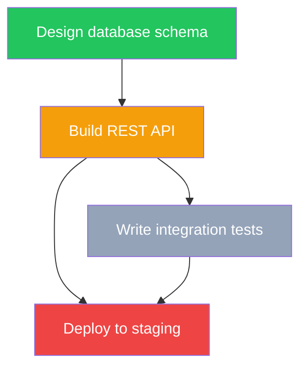
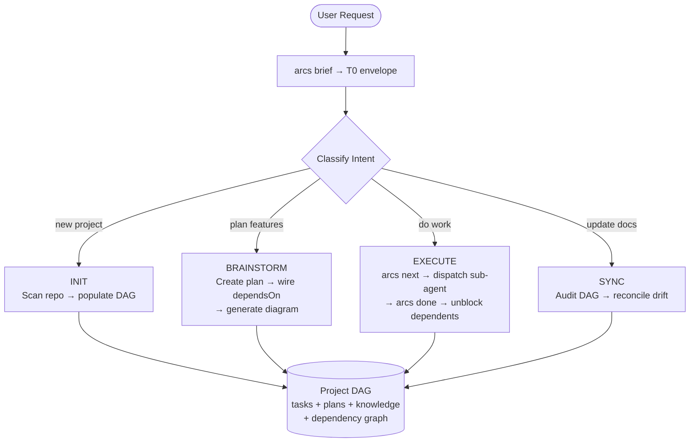

<div align="center">

# ARCS

**Agent Routing & Context System**

[](https://www.npmjs.com/package/@rryando/arcs)
[](https://nodejs.org/)
[](https://www.typescriptlang.org/)
[](LICENSE)

*Persistent workflow continuity for AI agents — start from context, not a blank slate.*

</div>

---

ARCS gives AI coding agents a queryable project DAG so they never start cold. Instead of scanning a codebase from scratch, an agent calls `arcs brief` and gets back: what to work on, what was decided, and what went wrong last time — in a single ~1 KB JSON envelope.

> **arcs** `/ɑːrks/` — Directed edges in graph theory. Also: **A**gent **R**outing & **C**ontext **S**ystem.

---


## The Problem

Every AI coding session starts fresh. The agent doesn't know:
- What task to pick up next (and which tasks are blocked by incomplete work)
- What was already tried and failed
- What architectural decisions were made
- What the current plan looks like

ARCS solves this with three persistent surfaces:

| Surface | Storage | Purpose |
|---------|---------|---------|
| **Queue** | `tasks/index.json` | Work items with dependency ordering via `dependsOn` |
| **Plan** | `plans/*.md` + `.diagram.mmd` | Multi-step feature work with Mermaid execution maps |
| **Memory** | `knowledge/*.md` | Durable discoveries: lessons, patterns, gotchas, architecture |

---


## Quick Start

**1. First Time Setup: Install / Update**

```bash
npm install -g @rryando/arcs

# setup models
arcs init
```

Registers `arcs` CLI, creates `~/.arcs/`, deploys agents + skills to `~/.config/opencode/`.

**2. Init Existing Project to arcs**

```bash
cd your-project

opencode

send `arch init` on ARCS Orchestrator subagent

and follow thru initiation process
```


**3. Use it**

```bash
arcs brief              # What should I work on?
arcs next               # Get next unblocked task
arcs done <taskId>      # Mark complete, unblock dependents
arcs remember "..."     # Capture what I learned
```

Or select **ARCS Orchestrator** in OpenCode for full automation.

---

## Prerequisites

| Tool | Required | Notes |
|------|----------|-------|
| [Node.js](https://nodejs.org/) v18+ | Yes | Runtime |
| [OpenCode](https://opencode.ai/) | Recommended | Agent host (orchestrator + sub-agents) |
| [graphify](https://github.com/safishamsi/graphify) | No | Optional AST-based codebase knowledge extraction |

---

## How It Works

### The Core Loop

```
arcs next  →  [agent works]  →  arcs done <id>  →  arcs remember "..."
     │                                │                      │
     │ returns first task             │ completes task,      │ captures durable
     │ whose dependencies             │ unblocks dependents  │ knowledge for
     │ are ALL satisfied              │                      │ future sessions
     ▼                                ▼                      ▼
┌─────────────────────────────────────────────────────────────────┐
│                    ~/.arcs/projects/{slug}/                      │
│                                                                  │
│  tasks/index.json ──dependsOn──→ topological sort → next task   │
│  knowledge/       ──BM25+graph──→ related context               │
│  plans/           ──diagram.mmd──→ execution map                │
└─────────────────────────────────────────────────────────────────┘
```

Three commands: `arcs next` → work → `arcs done`. The DAG handles ordering.

### Task Dependencies — The Actual DAG

Tasks declare dependencies. ARCS enforces acyclicity and uses topological sort to determine execution order:

```bash
arcs task create myapp "Design database schema" --priority=high
arcs task create myapp "Build REST API" --dependsOn=design-database-schema
arcs task create myapp "Write integration tests" --dependsOn=build-rest-api
arcs task create myapp "Deploy to staging" --dependsOn=build-rest-api,write-integration-tests
```



`arcs next` returns "Write integration tests" (T003) — it's the first task whose dependencies are all done. T004 is blocked because T003 isn't done yet. Priority is a tiebreaker within the same topological level, not the primary sort.

### The Orchestrator

When used with [OpenCode](https://opencode.ai/), ARCS ships a full orchestrator that automates the loop:



The orchestrator:
1. **Orients** — calls `arcs brief` for the T0 routing envelope (~1 KB)
2. **Classifies** — detects intent (INIT / BRAINSTORM / EXECUTE / SYNC)
3. **Routes** — delegates to specialist sub-agents with scoped prompts
4. **Executes** — `arcs next` picks dependency-safe tasks; sub-agents implement them
5. **Advances** — `arcs done` completes tasks, automatically unblocking dependents

### T0 Routing Envelope (the operating brief)

```bash
$ arcs brief --lean --json
```

```json
{
  "slug": "my-project",
  "name": "My Project",
  "operatingBrief": {
    "currentFocus": "Build REST API",
    "recommendedSurface": "QUEUE",
    "why": "Task in progress: Build REST API",
    "nextAction": "Continue task build-rest-api"
  },
  "openTasksCount": 3,
  "topOpenTasks": [
    { "id": "build-rest-api", "title": "Build REST API", "status": "in_progress" },
    { "id": "write-integration-tests", "title": "Write integration tests", "status": "backlog" }
  ]
}
```

~1 KB. No source files read. The orchestrator uses `recommendedSurface` to pick the workflow branch.

---

## CLI Reference

All commands: `arcs <command> [args] --json`. Output: `{ok, data}` on success, `{ok, code, message}` on error.

### Core Agent Loop

| Command | Purpose |
|---------|---------|
| `arcs brief` | T0 routing envelope — what to focus on |
| `arcs next` | Next dependency-safe task + related knowledge |
| `arcs done <taskId>` | Mark complete, unblock dependents |
| `arcs remember "<text>"` | Capture knowledge (auto-classifies kind) |
| `arcs status` | Progress overview across all surfaces |

### Tasks & Dependencies

| Command | Purpose |
|---------|---------|
| `arcs task create <slug> <title> --dependsOn=id1,id2` | Create task with dependency edges |
| `arcs task update <slug> <id> --dependsOn=id1` | Add/update dependencies |
| `arcs task transition <slug> <id> <status>` | Move through lifecycle |
| `arcs diagram ready <slug> <planId>` | Get unblocked diagram nodes |

### Project Management

| Command | Purpose |
|---------|---------|
| `arcs project init` | Register current directory as a project |
| `arcs project list` | List all tracked projects |
| `arcs context [slug]` | Full context assembly (audience-targeted) |
| `arcs search <slug> "<query>"` | BM25 + graph-scored search across DAG |
| `arcs validate <slug>` | Health check — status drift, orphans, staleness |

### Plans & Knowledge

| Command | Purpose |
|---------|---------|
| `arcs plan create <slug> <title>` | Create a plan |
| `arcs knowledge create <slug> <title>` | Create knowledge entry |

### Flags

| Flag | Effect |
|------|--------|
| `--json` | Structured JSON output (always use for agents) |
| `--lean` | Strip timestamps (saves tokens) |
| `--dry-run` | Validate without mutation |
| `--help` | Per-command usage |

Full command discovery: `arcs --commands --json`.

---

## Graph & Retrieval

ARCS builds a relationship graph across all project entities:

| Edge Type | Weight | Connects |
|-----------|--------|----------|
| `task_belongs_to_plan` | 1.0 | Task → Plan |
| `task_blocks_task` | 0.95 | Task → Task (from `dependsOn`) |
| `shares_source_file` | 0.9 | Any → Any (co-reference) |
| `knowledge_touches_file` | 0.85 | Knowledge → File |
| `plan_contains_task` | 0.8 | Plan → Task |
| `shares_keywords` | 0.5 | Knowledge → Knowledge |

Queries: `arcs search` uses BM25 for text + graph traversal (weighted BFS) for relationship scoring. `arcs next` enriches results with related knowledge from the graph.

---

## Sub-Agents

The orchestrator dispatches specialist sub-agents with scoped prompts:

| Sub-Agent | Role | When |
|-----------|------|------|
| **software-engineer** | Writes code, runs tests | EXECUTE — bounded tasks |
| **system-architect** | Module boundaries, plan creation | BRAINSTORM — design-open |
| **tech-architect** | Deep analysis, trade-offs | Analysis without edits |
| **oncall-ops** | Debugging, log triage, bisect | Bugs, test failures |
| **code-reviewer** | Pre-merge review | PR review, phase gates |
| **devil-advocate** | Adversarial KISS/YAGNI/DRY gate | Phase boundaries |
| **arcs-docs** | DAG health, knowledge curation | SYNC workflow |

### Skills (loaded per-dispatch)

| Category | Skills |
|----------|--------|
| **Work mode** (pick one) | `quick-dev`, `code-agent`, `test-driven-development`, `brainstorming` |
| **Lifecycle** | `writing-plans`, `executing-plans`, `subagent-driven-development` |
| **Quality** | `requesting-code-review`, `deep-pr-review`, `systematic-debugging` |
| **Tooling** | `to-diagram`, `init-project`, `caveman-commit` |

---

## Data Model

```
~/.arcs/
├── meta.json                         # Global registry
└── projects/{slug}/
    ├── meta.json                     # Project metadata + workspace paths
    ├── overview.md                   # Summary + goals
    ├── tasks.md                      # Rendered task queue (human-readable)
    ├── tasks/index.json              # Structured tasks + dependsOn edges
    ├── plans/
    │   ├── {id}.meta.json            # Plan status + keywords
    │   ├── {id}.md                   # Plan body
    │   └── {id}.diagram.mmd          # Mermaid execution map (auto-generated arrows)
    └── knowledge/
        ├── index.json                # Knowledge index
        ├── {id}.meta.json            # Metadata (kind, audience, sourceFiles)
        └── {id}.md                   # Entry body
```

### Knowledge Kinds

8 structured categories: `lesson`, `gotcha`, `pattern`, `architecture`, `module`, `feature`, `reference`, `decision`.

---

## Graphify (Optional)

When [graphify](https://github.com/safishamsi/graphify) is on PATH, ARCS auto-extracts structural knowledge during INIT and SYNC:

| Category | Cap | What |
|----------|-----|------|
| God nodes | 8 | Highest-connectivity modules |
| Clusters | 8 | Directory-based module boundaries |
| Couplings | 5 | Cross-module dependency links |

---

## Development

```bash
git clone https://github.com/rryando/arcs.git
cd arcs && npm install && npm run build
```

| Command | Description |
|---------|-------------|
| `npm run build` | Compile TypeScript to `dist/` |
| `npm test` | Vitest suite (67 files, 744 tests) |
| `npm run typecheck` | Type check without emit |
| `npm run lint` | Biome lint + format |

### Bundle Workflow

```bash
npm run build:opencode-bundle    # Build agent/skill bundle
arcs lint-bundle                 # Validate bundle integrity
arcs deploy-superpowers          # Deploy to ~/.config/opencode/
```

---

## License

MIT
