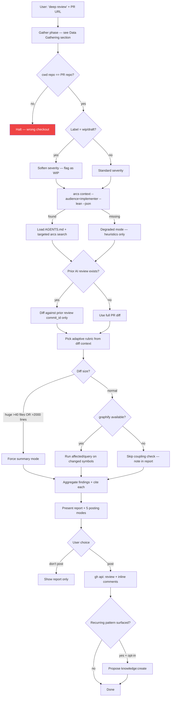

# Skill: deep-pr-review

## When

User gives a GitHub PR URL plus a "deep review" trigger inside the locally cloned repo of that PR. Reviewer-side workflow: read-only by default, posts to GitHub only after explicit user gate.

> CLI: `arcs --commands --json` for discovery. Posting is user-gated. ARCS writes (optional knowledge harvest) run directly via the CLI.

## Flow



## Data Gathering (ONE PASS — no repeat `gh` reads)

Run these three commands once at the start. Cache the results. All downstream steps read from cache — never call `gh repo view` or `gh pr view` again.

```
1. gh repo view --json name,owner                                                         → REPO
2. gh pr view <number> --json number,title,body,author,labels,reviews,state,files,headRefName,baseRefName  → PR_META
3. gh pr diff <number>                                                                    → DIFF
```

| Downstream need | Read from |
|-----------------|-----------|
| Repo-match check | `REPO.name`, `REPO.owner` |
| WIP / draft check | `PR_META.labels`, `PR_META.state` |
| Author context | `PR_META.author` |
| Prior review detection | `PR_META.reviews` |
| File list / LOC delta | `PR_META.files` |
| Diff text | `DIFF` |

## Adaptive Rubric

Agent picks dimensions from diff context. **Correctness is always evaluated.** Other dimensions activate when the diff signals them:

| Dimension | Activates when |
|-----------|----------------|
| **Correctness** | Always — bugs, off-by-one, error handling, null safety |
| **DRY** | New code resembles existing patterns; cross-module grep finds duplicates |
| **KISS** | New abstraction layers, deep nesting, premature generalization |
| **YAGNI** | Code written "for later" with no current caller; abstractions with one concrete use; configurable hooks with one known value; generic machinery built for hypothetical consumers |
| **SOLID** | Module gains responsibilities, dependency direction shifts, large classes touched |
| **Convention fit** | AGENTS.md or DAG `pattern`/`architecture` knowledge applies to changed files |
| **Architectural risk** → handoff `architecture-review` | Diff crosses module boundaries, touches god nodes, changes public API |
| **Performance risk** → handoff `performance-diagnosis` | Hot paths, loops over external IO, new queries, allocations in render |

Skipped dimensions are reported as `cleared (not applicable: <reason>)`. Never silently dropped.

## Severity Prefixes

Reuses `caveman-review` format for inline output:

| Prefix | Meaning | Posting default |
|--------|---------|-----------------|
| `🔴 bug:` | Broken behavior, will cause incident | Always post |
| `🟠 risk:` | Works but fragile, edge case unhandled | Always post |
| `🟡 suggestion:` | Concrete fix improving quality | Posted in modes 2/3 |
| `🔵 nit:` | Style / naming / minor consistency | Posted only in mode 3 |
| `❓ q:` | Genuine question for the author | Always post |

## Posting Modes

User picks one before any `gh` write:

| # | Mode | What posts |
|---|------|------------|
| 1 | **Critical-only** | 🔴 bug + 🟠 risk + ❓ q only |
| 2 | **Critical + actionable** | Above + 🟡 suggestion |
| 3 | **All findings** | Above + 🔵 nit |
| 4 | **Summary only** | Single top-level review body, no inline comments |
| 5 | **Don't post** | Show report only — no `gh` calls |

## Iron Law

**READ ONLY until user picks a posting mode.** No `gh` writes, no ARCS writes, no auto-approve. Approval is only ever produced via explicit user override (`approve it`, `lgtm post approve`) — never inferred from finding count.

## Citation Rule

Every finding cites a source. No uncited findings:

- `see knowledge/<id>: <title>` — ARCS knowledge entry
- `AGENTS.md §<section>` — project convention
- `graphify: <observation>` — coupling/affected result
- `principle: <KISS|DRY|YAGNI|SOLID|correctness>` — first-principles label

If only first-principles applies, that is sufficient — but it must be stated.

## Inline Suggestion Rule

GitHub `​```suggestion` blocks render an "Apply suggestion" button. Use **only** when the fix is a one-to-few-line replacement of existing lines on the diff. For larger fixes:

- Multi-line code restructure → inline review comment with a fenced code block (no `suggestion` tag)
- Missing block / new file content → top-level review body bullet
- Cross-file refactor → handoff finding with `architecture-review` recommendation

## Posting Protocol (ONE `gh api` call — never per-finding)

All findings are batched into a **single** GitHub review submission. Never loop through findings and post each one individually.

```
gh api POST /repos/{owner}/{repo}/pulls/{number}/reviews \
  --field commit_id="<PR head SHA from PR_META>" \
  --field event="COMMENT" \
  --field body="<top-level summary>" \
  --field 'comments=[{"path":"...","position":N,"body":"..."},...]'
```

| Rule | Detail |
|------|--------|
| One call per review session | Top-level body + all inline comments in the same `comments[]` array |
| Never mix `gh pr review` and `gh api` | Pick one entry point — use `gh api` for full control; `gh pr review` for body-only (mode 4) |
| Never call `gh pr comment` after `gh api reviews` | `gh pr comment` adds a stand-alone comment, not a review — it will duplicate the top-level body |
| Dry-run before sending | Print the full payload to the user for confirmation; only call `gh api` once user confirms |

### Mode → command mapping

| Mode | Command |
|------|---------|
| 1–3 (inline + summary) | `gh api POST .../reviews` with `body` + `comments[]` — **one call** |
| 4 (summary only) | `gh pr review <number> --comment --body "..."` — **one call, no `comments[]`** |
| 5 (don't post) | No `gh` writes |

## Report Structure

```
# Deep PR Review: <repo>#<number> — <title>
## Pre-flight (repo match, PR state, prior reviews)
## Scope (files touched, LOC delta, modules affected)
## Rubric Selection (which dimensions activated, why)
## Findings (grouped by severity)
## Cleared Dimensions (with evidence)
## Architectural / Performance Handoffs (if any)
## Posting Plan (mode chosen → exact comments to be posted)
## Confidence & Gaps
```

## Constraints

- **Never repeat `gh repo view` or `gh pr view` after the initial gather pass** — all data is cached upfront
- **ONE `gh api` call to post the review** — batch all inline comments into the `comments[]` array; never loop and post per-finding; never mix `gh pr review` + `gh api` + `gh pr comment` in the same session
- Never auto-approve; approval only on explicit user override
- Never post to GitHub before user picks a posting mode
- Cite every finding — no uncited claims
- ` ```suggestion ` blocks only for small line-replacement fixes
- Defer to `architecture-review` for full structural drift; surface as handoff flag, do not run inline
- Defer to `performance-diagnosis` for perf investigation; surface as risk flag
- Compose with `auditing-a-feature` rubric and `caveman-review` inline format — do not duplicate
- Re-review detection: if AI has reviewed before, scope to diff since last review's commit_id
- Tag each posted suggestion with `<!-- arcs:deep-review:<finding-id> -->` for re-review tracking
- See `review-template.md` for GitHub review body template
- See `graphify-diff.md` for the changed-symbols-to-affected algorithm
