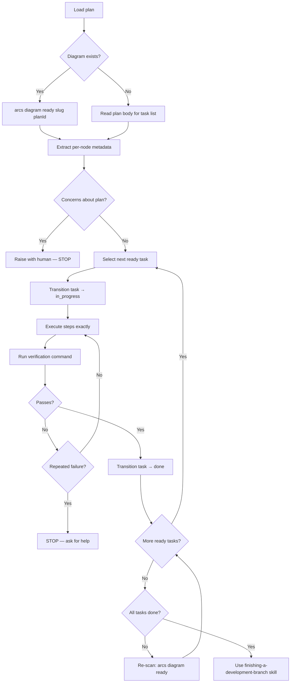

# Skill: executing-plans

## When

You have a written implementation plan to execute task-by-task with verification checkpoints.

**NOT for:**
- If subagents are available → use `subagent-driven-development` instead (parallel dispatch, two-stage review)
- If the task needs iterative self-correction without a structured plan → use `loop` instead

> CLI: `arcs --commands --json` for discovery. Mutating commands run directly — no token.

## Flow



## Diagram-First Task Selection

When plan has `.diagram.mmd`:
1. `arcs diagram ready <slug> <planId>` → executable nodes (deps all `:::done`)
2. Read per-node `%%` metadata: `node`, `skill`, `scope`, `files`, `acceptance`, `verify`
3. After each transition, re-scan for newly-unblocked nodes
4. If metadata incomplete → fall back to plan body for that task

**Transition requires both flags:** `arcs task transition <slug> <taskId> done --diagramNodeId=T001 --planId=<planId>`

## Sub-Agent Context

Include in sub-agent prompts:
```bash
arcs context <slug> --audience=implementer --lean --json
arcs search <slug> "<task-keywords>" --lean --json
```

Sub-agents MUST NOT edit `.mmd` files — orchestrator owns diagram updates.

## Review Checkpoint Criteria

**STOP executing immediately when:**
- Missing dependency or unclear instruction
- Verification fails repeatedly (2+ attempts)
- Plan has critical gaps preventing progress
- Fundamental approach needs rethinking

Ask for clarification rather than guessing. Don't force through blockers.

## Auto-Sync Triggers

Post-execution DAG sync fires automatically when:
- 3+ tasks transitioned this session
- New knowledge entries created from discoveries
- `lastSyncedAt` > 7 days ago
- Plan reached `done` status

## Constraints

- Review plan critically before starting — raise concerns first
- Follow plan steps exactly — don't improvise
- Never skip verifications
- Never start on main/master without explicit consent
- Reference sub-skills when plan specifies them
- Use `finishing-a-development-branch` after all tasks complete
