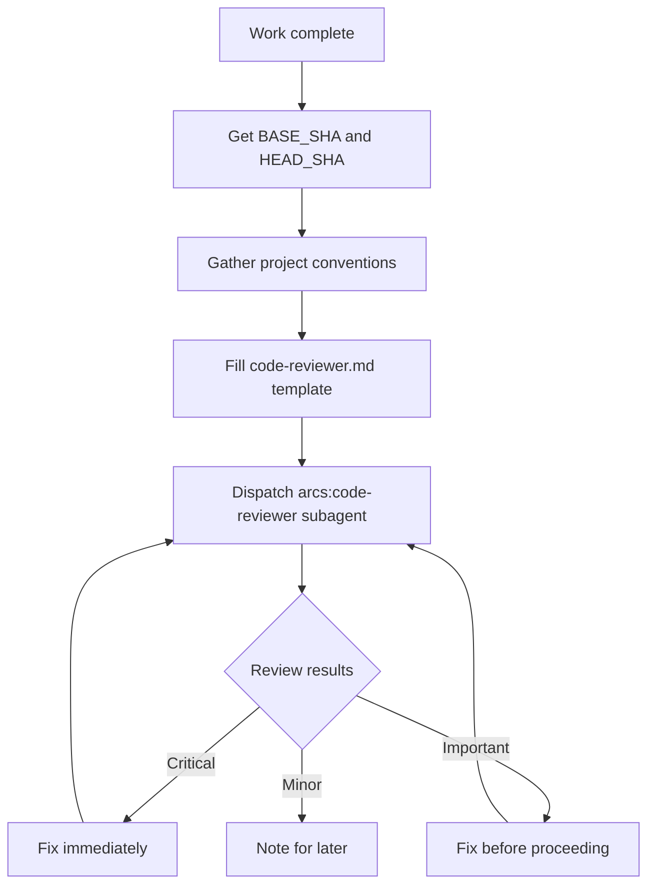

# Skill: requesting-code-review

## When

After completing a task, major feature, or before merge. Dispatch `arcs:code-reviewer` subagent.

## Flow

## Template Placeholders

- `{WHAT_WAS_IMPLEMENTED}` — what you built
- `{PLAN_OR_REQUIREMENTS}` — what it should do
- `{BASE_SHA}` / `{HEAD_SHA}` — commit range
- `{PROJECT_CONVENTIONS}` — CLAUDE.md / linter configs / style guides

## When to Request

**Mandatory:** after each subagent task, after major features, before merge to main.
**Optional:** when stuck, before refactoring, after complex bugfix.

## Red Flags

- Never skip because "it's simple"
- Never ignore Critical issues
- Never proceed with unfixed Important issues
- Always include project conventions in reviewer context

See template at: `requesting-code-review/code-reviewer.md`
