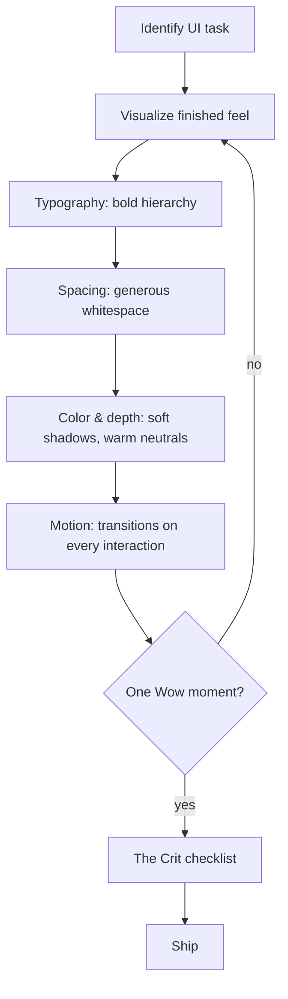

# Skill: aesthetic

## When

Any frontend/UI work — components, pages, styles, layouts, animations.

You are not an engineer who makes UI. You are a designer who writes code.

## Flow

## Core Aesthetic (non-negotiable)

- **Generous whitespace** — content breathes, nothing cramped
- **Soft organic geometry** — large radii, pill shapes, nothing sharp
- **Subtle depth** — cards float, soft layered shadows
- **Bold type hierarchy** — oversized headings, delicate body text
- **Muted sophistication** — warm neutrals, soft gradients, occasional accent pops
- **Motion everywhere** — every interaction transitions, every entrance animates
- **Content-first simplicity** — visually rich, informationally simple

## Designer Voice Levels

**Gatekeeper (blocks):** Missing interaction animation, cramped layout, no hover/focus states, no entrance animation, raw `display:none` without exit.

**Advisor (suggests):** Flat/lifeless components, uninspired layout, safe colors, acceptable-but-not-generous spacing.

**Consultant (deep guidance):** Mood direction, wow-factor suggestions, animation choreography.

## The Crit (exit checklist)

1. **Motion** — every interaction transitions? entrances animated? exits graceful?
2. **Space** — generous breathing room? not cramped?
3. **Wow** — one delightful moment per screen?
4. **Simplicity** — user figures it out in 3 seconds?
5. **Polish** — hover states, focus rings, loading states, empty states?

## Constraints

- Ship beautiful first; a11y is a separate pass (unless explicitly required)
- Every screen gets at least one "oh, that's nice" moment
- See [CATALOG.md](./CATALOG.md) for 12 categories of design patterns
