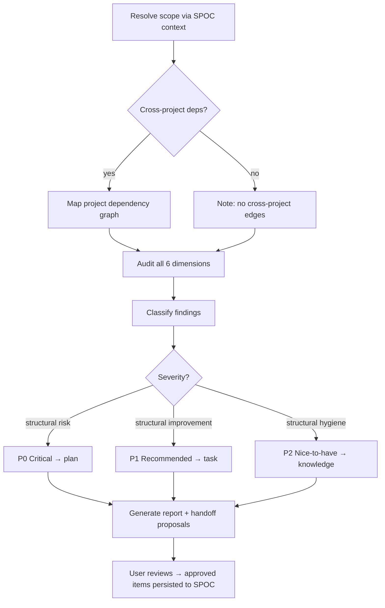
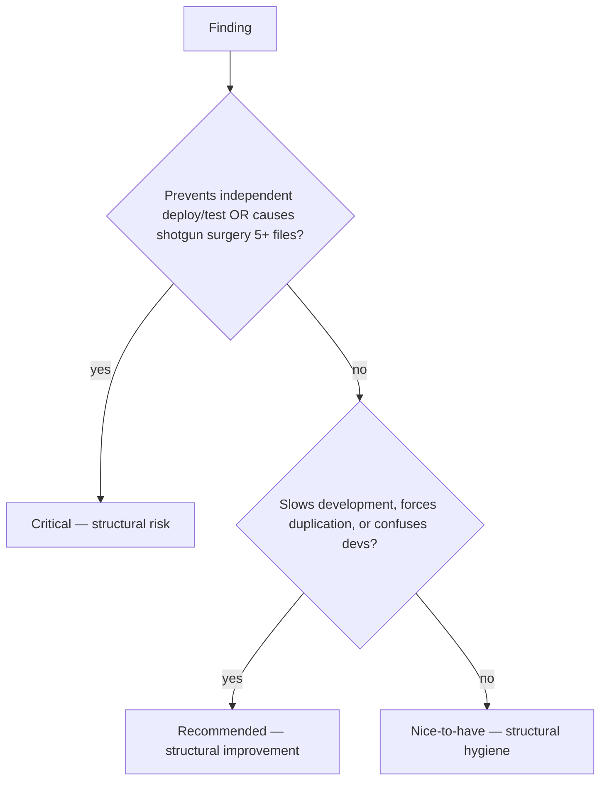

# Skill: architecture-review

## When

Evaluating structural fitness of a system/subsystem — module boundaries, coupling, dependency direction, API cohesion, layering.

> CLI: `spoc --commands --json` for discovery. Mutating commands run directly — no token.

## Flow



## The Iron Law

**READ ONLY. NEVER EDIT CODE DURING AN ARCHITECTURE REVIEW.**

The review produces a report. Execution happens in a separate session under `code-agent` / `writing-plans` / `test-driven-development`.

## Scope Resolution (First Step)

1. `spoc context <slug> --audience=designer --lean --json` — get project overview, knowledge (kind `architecture`/`module`), plans
2. `spoc project list --json` — identify cross-project dependency edges
3. Fall back to user-specified boundaries if SPOC has nothing
4. State final scope: modules audited, depth (full vs focused), exclusions

## Audit Dimensions

| # | Dimension | What to look for |
|---|-----------|------------------|
| 1 | **Module Boundaries** | Domain alignment, data ownership, god modules, boundary leaks (internal types exported) |
| 2 | **Dependency Direction** | High→low flow, circular deps (direct/transitive), skipped layers, fan-out excess |
| 3 | **API Surface Cohesion** | Minimal coherent contracts, kitchen-sink modules, inconsistent naming, unnecessary public surface |
| 4 | **Coupling Analysis** | Fan-in/fan-out, instability metric (Ce/(Ca+Ce)), shared mutable state, temporal coupling |
| 5 | **Layering Violations** | Cross-layer imports, framework types leaking, utilities depending on domain |
| 6 | **Evolution Fitness** | Change vectors vs structure support, extension vs modification points, feature isolation |

Every dimension reports `findings` or `cleared` (with evidence). "Didn't check" is never acceptable.

## Severity Classification



## Handoff Tags

- `[task]` — Single bounded structural change → `spoc task create`
- `[knowledge]` — Durable architectural observation (kind: `architecture`) → `spoc knowledge create`
- `[plan]` — Multi-step restructuring → `spoc plan create`

## Report Structure

```
# Architecture Review: <name>
## Scope (modules, cross-project edges, intended arch, depth, exclusions)
## Severity Summary (table: severity | count | handoff type)
## Dimension Details (1–6, each with findings or cleared + evidence)
## Cross-Project Analysis (if applicable)
## SPOC Handoff Proposal (tasks, knowledge, plans)
## Confidence & Gaps
```

## Constraints

- Never edit code — not even "trivial re-export cleanup"
- All 6 dimensions checked every time; subsystem being small = review is fast, not skippable
- Trace actual imports for dependency findings; check actual exports for boundary findings
- Cleared dimensions must show what was inspected and why result is clean
- Never write to SPOC during review — only propose after user reviews report
- If graphify-out/graph.json exists, use fan-in/fan-out to cross-check (don't substitute for audit)
- Pairs with `auditing-a-feature`: arch review = between modules; feature audit = within a module
