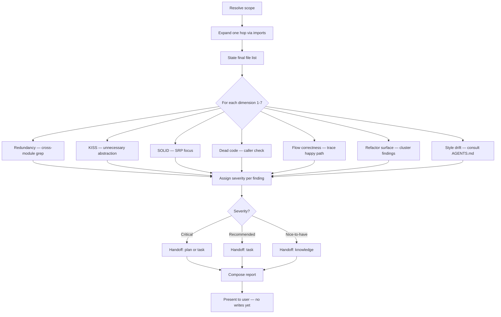

# Skill: auditing-a-feature

## When

Read-only guardrail audit for a feature/module/flow — produces structured findings with SPOC handoff tags.

> CLI: `spoc --commands --json` for discovery. Mutating commands run directly — no token.

## Flow



## Audit Dimensions

| # | Dimension | What to look for |
|---|-----------|------------------|
| 1 | **Redundancy** | Duplicated logic across modules. Cross-module grep mandatory before flagging. |
| 2 | **KISS** | Premature generalization, dead flexibility, over-engineered indirection |
| 3 | **SOLID** | SRP violations (modules doing too much). Skip LSP/ISP/DIP unless they bite. |
| 4 | **Dead code** | Unused exports (check callers), unreachable branches, orphaned helpers |
| 5 | **Flow correctness** | Trace happy path end-to-end. Flag masked failures, swallowed errors. |
| 6 | **Refactor surface** | Cluster findings into concrete proposed actions |
| 7 | **Style drift** | Check AGENTS.md, pattern docs, SPOC knowledge entries of kind `pattern` |

## Severity Rubric

| Severity | Criteria | Handoff |
|----------|----------|---------|
| **Critical** | Correctness bugs, data loss risk, masked failures, security-adjacent | `[plan]` or `[task]` |
| **Recommended** | Redundancy, SOLID/KISS violations, non-trivial dead code | `[task]` |
| **Nice-to-have** | Style drift, minor dead code, cosmetic consistency | `[knowledge]` |

## Iron Law

**READ ONLY. NEVER EDIT CODE DURING AN AUDIT.** Not for "trivial unused imports," not for "while I'm here." Every finding → report → SPOC artifact in a separate session.

## Scope Resolution

1. Prefer SPOC `sourceFiles` from plan/knowledge entries matching the slice
2. Fall back to user-specified files
3. Expand one hop via imports — no further
4. State final scope in report; justify any skipped files

## Cleared Dimensions

A "cleared" dimension must show: what was searched, what inspection was performed, why the result is clean. One-word "cleared" is not acceptable.

## Report Structure

```
# Audit: <slice>
## Scope — starting set, expanded, excluded
## Severity Summary — table: severity | count | handoff type
## Findings by Severity — Critical → Recommended → Nice-to-have
## Dimension Details — each dimension: findings or cleared (with evidence)
## SPOC Handoff Proposal — [task], [knowledge], [plan] lists
## Confidence & Gaps
```

## Constraints

- All 7 dimensions checked every time — no skipping
- Cross-module redundancy grep mandatory before flagging duplication
- Consult AGENTS.md / pattern docs before reporting style findings
- Never write to SPOC during audit — only propose
- Expanding scope past one hop → stop and restart
- Straddle finding → pick higher severity, justify in one sentence
