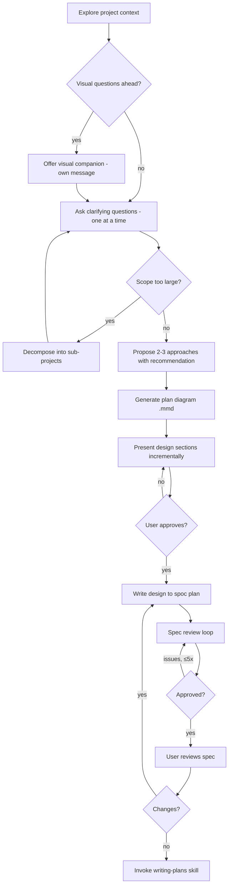
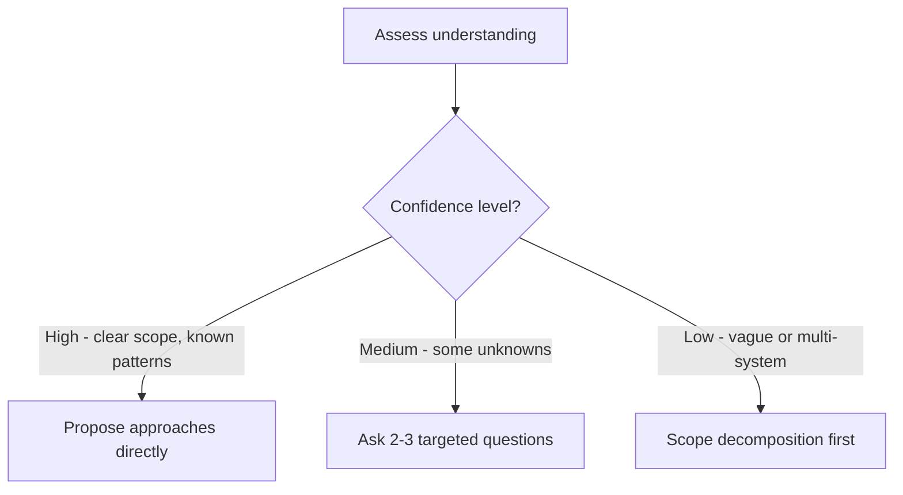

# Skill: brainstorming

## When

Any creative work — creating features, building components, adding functionality, or modifying behavior. Design before implementation, always.

> CLI Primer: `spoc --commands --json` for discovery. All writes: `spoc write propose` → token → command with `--token`.

<HARD-GATE>
Do NOT invoke any implementation skill, write any code, or take any implementation action until you have presented a design and the user has approved it. Every project, regardless of perceived simplicity.
</HARD-GATE>

## Flow



## Confidence Check



## Q&A Rhythm

- **One question per message** — if a topic needs more, break into multiple
- **Multiple choice preferred** when options are enumerable
- **Scope check early**: if request describes multiple independent subsystems, flag immediately — decompose before refining details
- Each sub-project gets its own spec → plan → implementation cycle

## Design Presentation

- Scale each section to its complexity (few sentences → 300 words max)
- Ask after each section if it looks right
- Cover: architecture, components, data flow, error handling, testing
- Design for isolation: one purpose per unit, well-defined interfaces, independently testable

## Diagram Creation

<HARD-GATE>
A plan diagram MUST be generated and presented before proceeding to storage. Draft in memory or `/tmp` — never write to DAG before write-gate confirmation.
</HARD-GATE>

- Load `to-diagram` skill silently (don't narrate conventions to user)
- Use `flowchart TD` for task/dependency graphs; `stateDiagram-v2` for lifecycles
- All nodes start `:::backlog`, stable IDs (`T001`, `T002`, ...)
- Persist to `~/.spoc/projects/<slug>/plans/<plan-id>.diagram.mmd` only after write-gate
- This diagram becomes the design-phase `.mmd` that `writing-plans` will EXTEND

## Storage

```bash
TOKEN=$(spoc write propose "Create design spec" --ops=plan-create --slug=<slug> --json | jq -r .data.token)
spoc plan create <slug> --title="YYYY-MM-DD <topic> Design" --summary="..." --status=proposed --keywords='["spec","design"]' --body="<markdown>" --token=$TOKEN --json
```

After storage: _"Spec saved to plan `<planId>` in project `<slug>`. Please review and let me know if changes needed before implementation planning."_

## Visual Companion

Browser-based companion for mockups/diagrams. Offer once when visual questions are anticipated:

> "Some of what we're working on might be easier to show in a browser. Want to try it?"

- This offer MUST be its own message (no other content)
- Per-question: use browser only when **seeing** beats **reading**
- If accepted, read `skills/brainstorming/visual-companion.md`

## Constraints

- The ONLY next skill after brainstorming is `writing-plans` — never implementation skills
- Every project needs a design, no matter how "simple"
- One question per message, multiple choice when possible
- YAGNI ruthlessly — remove unnecessary features from all designs
- Existing codebases: explore first, follow patterns, don't propose unrelated refactoring
