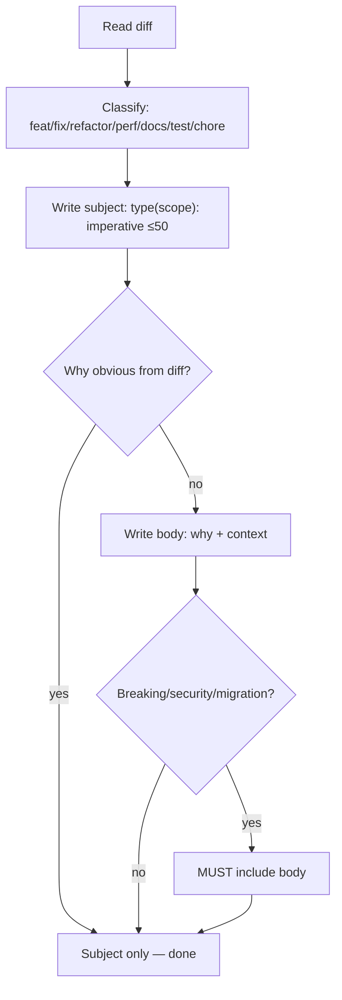

# Skill: caveman-commit

## When

Writing git commit messages. Terse, exact, Conventional Commits. Why over what.

## Flow

## Format Rules

| Element | Rule |
|---------|------|
| Subject | `<type>(<scope>): <imperative>` ≤50 chars (hard cap 72) |
| Types | feat, fix, refactor, perf, docs, test, chore, build, ci, style, revert |
| Mood | Imperative: "add", "fix", "remove" — not past/present tense |
| Body | Wrap 72 chars, bullets `-`, skip if subject self-explanatory |
| Issues | End of body: `Closes #42`, `Refs #17` |

## Never Include

- "This commit does X", "I", "we", "now" — diff says what
- AI attribution (unless explicitly requested)
- Emoji (unless project history uses them)
- Trailing period on subject

## Always Include Body For

- Breaking changes, security fixes (cite CVE), data migrations, reverts (name SHA)

## Constraints

- Output message as code block only — do not run `git commit`
- "Stop caveman-commit" or "normal mode" → revert to verbose style
