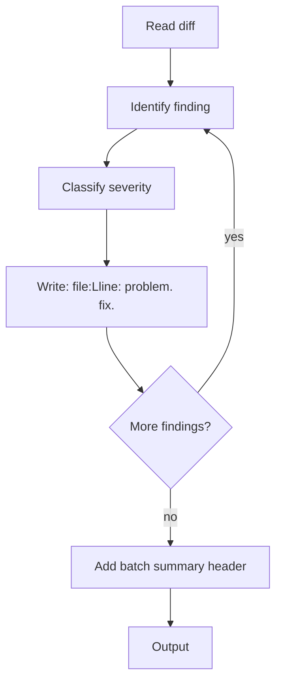

# Skill: caveman-review

## When

Writing code review comments. One line per finding. Location, problem, fix.

## Flow



## Format

`<file>:L<line>: <problem>. <fix>.` (single-file: drop `<file>:`)

## Severity Prefixes

| Prefix | Meaning |
|--------|---------|
| `🔴 bug:` | Broken behavior, will cause incident |
| `🟡 risk:` | Works today but fragile |
| `🔵 nit:` | Style/naming, author may ignore |
| `❓ q:` | Genuine question |

## Drop

- "I noticed that...", "It seems like...", "You might want to consider..."
- Hedging ("perhaps", "maybe") — use `q:` if unsure
- Restating what the line does

## Keep

- Exact line numbers and symbol names in backticks
- Concrete fix, not "consider refactoring"
- The *why* when fix isn't obvious from problem

## Multi-File Format

```
2 bugs, 1 risk, 1 nit

🔴 bug: src/auth.ts:L42: off-by-one in expiry. Use `<=`.
🟡 risk: src/auth.ts:L67: null after cache miss. Guard before destructure.
🔵 nit: test/auth.test.ts:L23: flaky setTimeout. Use `vi.useFakeTimers()`.
```

## Constraints

- Drop terse mode for: security findings (full paragraph), architectural disagreements, onboarding contexts
- Output comments only — do not write fixes or approve/reject
- "Stop caveman-review" or "normal mode" → revert to verbose style
