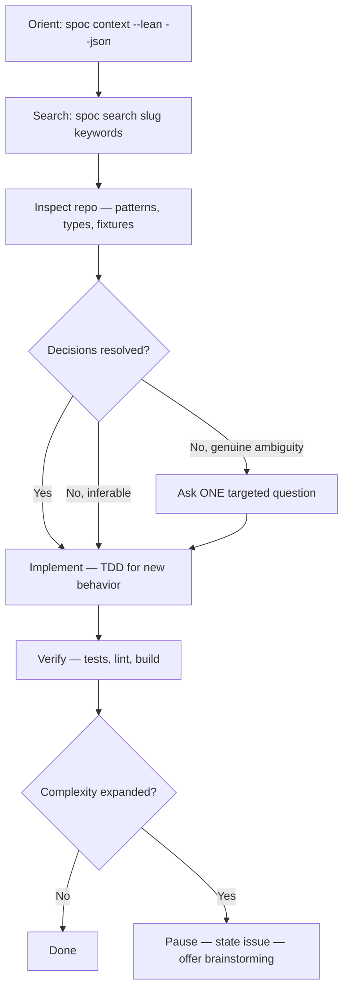

# Skill: code-agent

## When

Task is mostly clear (50-90%) but 1-2 decisions remain open — resolvable by inspecting the repo.

## Flow

## Behaviour

- Inspect repo before asking anything
- Proceed on inferred defaults when repo makes it clear
- Ask at most one targeted question (product direction, naming, breaking trade-off)
- TDD for new non-trivial behavior; skip for structural changes covered by existing tests
- Lightweight bullet plan only when 3+ files and sequencing matters

## NOT for

- Fully bounded, no decisions → `quick-dev`
- Unclear/creative/design-shaping → `brainstorming`
