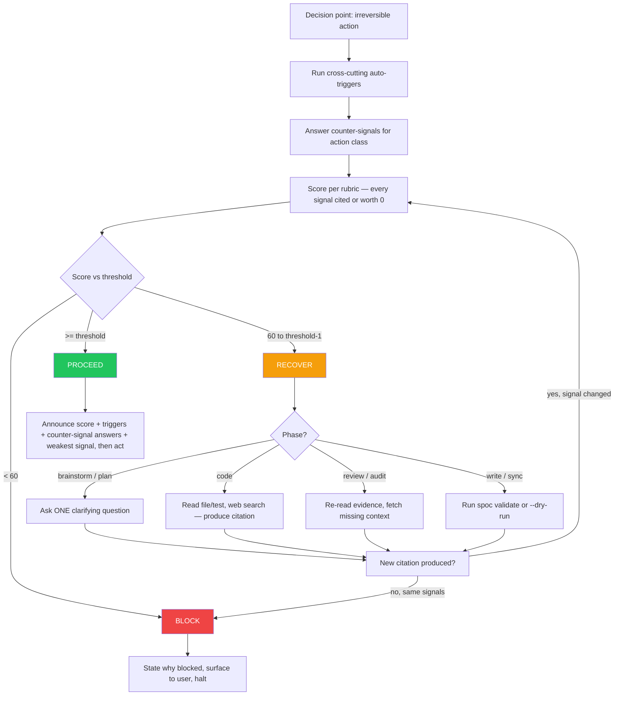

# Skill: confidence-gate

## When

About to take an **irreversible action** — gate fires before:

- DAG writes (`spoc plan create/update`, `spoc task create/transition`, `spoc knowledge create/update`)
- Code edits (any file mutation in the workspace)
- Plan creation or plan-status transitions
- Review or audit delivery (posting findings, marking review complete)
- PR creation, branch merges, deploys
- Bundle deploy (`spoc deploy-superpowers`)

The gate does **NOT** fire for: T0 orientation, repo reads, file inspection, `spoc <get/list/search>` calls, exploration, or skill loading.

## Threshold

| Action class | Threshold |
|--------------|-----------|
| Standard irreversible action | **≥ 80%** to proceed |
| Cross-cutting (any auto-trigger below fires) | **≥ 85%** to proceed |
| Anything below 60 | **BLOCK** — surface to user, halt |
| Between 60 and threshold | **RECOVER** with new evidence (loop back through scoring) |

## Cross-Cutting Auto-Triggers (mechanical, non-overridable)

If **any** trigger fires for the pending action, threshold becomes **85%**. Run these checks before scoring — they are not subjective.

| Trigger | Detection |
|---------|-----------|
| Edit touches ≥3 files in ≥2 directories | count by `git status --short` or planned edit list |
| Edit modifies an exported symbol with ≥3 callers | `rg "<symbol>" --type <lang>` across repo |
| Edit modifies a test fixture or shared mock | path matches `test/**/fixtures/`, `test/**/helpers/`, or has `.fixture.` |
| Edit touches AGENTS.md, manifest.json, bundle-runtime.json, package.json, tsconfig.json | path-match |
| Edit modifies a database migration, schema, or public API contract | path-match or symbol-match |
| Plan creation with ≥10 tasks | task count |
| Code edit with no covering test | `rg "<symbol>" test/` returns 0 |

State which triggers fired (or "none fired") in the announcement preamble.

## Flow



## Counter-Signals (MANDATORY)

Before scoring, answer all 3 counter-questions for the action class. **Each "no" caps your score at 79% regardless of rubric.** State the answers verbatim in the preamble.

| Action class | Counter-questions |
|---|---|
| **Code edit** | (1) Have I read the file I'm modifying end-to-end? (2) Is there a test pinning the current behavior I'm changing? (3) Have I checked the call sites of any symbol I'm modifying? |
| **DAG write** | (1) Did I `--dry-run` or `spoc validate`? (2) Does this duplicate an existing plan/task/knowledge entry? (3) Do all `sourceFiles` resolve to existing paths? |
| **Plan creation** | (1) Have I checked existing plans for overlap? (2) Has the user confirmed the scope? (3) Are tasks decomposed below ~1-day each? |
| **Review / audit delivery** | (1) Have I read every changed file? (2) Have I run the verification commands? (3) Have I checked AGENTS.md conventions? |

## Scoring Rubric

Start at 50. Adjust per signal. **Every positive signal must cite specific evidence** (file path + line range, command + output, verbatim user text, DAG entry ID). **Uncited claims are worth 0.**

| Signal | Δ | Required citation |
|--------|---|-------------------|
| Read the file containing the symbol I'm modifying, end-to-end | +20 | `path:Lstart-Lend` |
| Read related/sibling files in scope | +5 each (cap +15) | `path:line` |
| Verified an assumption with command/test output | +15 | command + first/last line of output |
| Pattern matches existing codebase convention | +10 | reference file + line |
| User confirmed the key decision | +20 | verbatim user message |
| Existing tests cover the change surface | +10 | test path + name |
| Reviewed related DAG knowledge entries | +5 | entry ID |
| Open decision unresolved | −20 | name the decision |
| Acting on second-hand summary only (no source read) | −15 | — |
| Unverified assumption in plan | −10 | name the assumption |
| Conflicting signals between sources | −15 | name both |
| Repeated verification failure (≥2) on this action | force RECOVER | — |

**Hard cap:** signal weights flatten by relevance. "Read 3 files" only earns +20 once for the modified file; siblings cap at +15 total. Reading unrelated files does not raise score.

## Phase-Specific Recovery (with citation receipts)

When `60% ≤ score < threshold`, recover by phase. **Recovery is invalid unless it produces a new citation.** "Looked harder" without a receipt does not change the score.

| Phase | Recovery action | Required receipt |
|-------|-----------------|------------------|
| **brainstorm** | Ask ONE targeted question with 2–4 numbered options | quote user's answer |
| **plan** | Ask user OR re-read related plans/knowledge | DAG entry ID(s) re-read |
| **code** | Read referenced files, run tests, or web-search best practices | new `path:line` quote, command output, or URL |
| **review / audit** | Re-read diff, fetch missing context, check AGENTS.md | section quoted from AGENTS.md or diff |
| **write / sync** | Run `spoc validate <slug> --json` or `--dry-run` | command output |

Same signals + new score = **BLOCK**. The mechanism does not permit silently rounding up.

## Announcing the Score

Before any irreversible action, the agent's "Before acting" preamble MUST include this block:

```
Confidence: NN%  (threshold: 80%/85% — triggers: <none | list>)
Counter-signals (action: code edit):
  (1) Read file end-to-end? yes — src/cli/spoc-orchestrate.ts:1-562
  (2) Test pinning behavior? yes — test/orchestrate-prompt-policy.test.ts:178
  (3) Checked call sites? yes — `rg ORCHESTRATE_PROMPT_TEXT` shows 4 callers
Evidence:
  +20 read source: src/cli/spoc-orchestrate.ts:68 ("Before acting, state...")
  +15 verified: ran `npm test`, "620 passed"
  +20 user confirmed: "do c, action only on 2"
  −10 untested: bundle-runtime.json fixture pre-deploy
Weakest signal: bundle-runtime fixture (resolved by T016 verify step).
Decision: Proceed.
```

Recovering:

```
Confidence: 72% (threshold: 80% — triggers: none)
Counter-signals: (1) yes (2) NO — no test pins this behavior (3) yes
Decision: Recovering — writing failing test first to add +10 covering-test signal.
```

Blocking:

```
Confidence: 45% (threshold: 85% — triggers: multi-file edit, modifies AGENTS.md)
Counter-signals: (1) NO — haven't read full file (2) NO — no covering test (3) yes
Decision: BLOCKING. Surfacing to user: I haven't read src/cli/index.ts end-to-end and there is no test for the registry-routing path I'm about to change.
```

## Anti-Patterns

| Excuse | Reality |
|--------|---------|
| "Round up to 80, close enough" | Threshold inflation. RECOVER or BLOCK. |
| "I feel confident" without citations | Self-report without evidence is worth 0. |
| Citing files not read end-to-end | Read what you cite, end-to-end, or don't claim the +20. |
| Counter-question silently skipped | Skipping = "no" = score capped at 79%. |
| Cross-cutting reframed as "small" to dodge 85% | Triggers are mechanical. You don't get to label. |
| Recovery without a new citation | Same signals + new score = BLOCK. |
| Score every micro-step | Gate fires at the irreversible-action boundary, not per token. |
| Skipping the announce | If you proceed without announcing, you skipped the gate. |

## Calibration (Optional but Recommended)

When a gated action is later disagreed-with by review, tests, or user, capture a SPOC knowledge entry:

```bash
spoc knowledge create <slug> "<title>" --kind=lesson \
  --summary="Confidence gate scored NN%; reality was <outcome>" \
  --body="<what signal misled, what counter-signal was missed>"
```

Over time these entries form a calibration corpus. The agent should `spoc knowledge search <slug> "confidence calibration"` during T0 if recent calibration entries exist.

## Constraints

- Gate fires only before **irreversible** actions. Reads, T0, exploration, skill loading: never gated.
- Augments existing exit gates (`MANDATORY EXIT GATE`, `<HARD-GATE>`); does not replace them.
- Every positive signal requires a citation; uncited signals are worth 0.
- Counter-signals must be answered verbatim; silently skipping caps score at 79%.
- Cross-cutting auto-triggers are mechanical and non-overridable; the agent does not get to label "not cross-cutting."
- Recovery loops must produce a new citation; same signals + new score → BLOCK.
- Below 60%: stop and ask the user. Do not improvise past a block.
- Phase-specific recovery is exhaustive — pick the matching row, do not invent alternatives.
- The 85% requirement when any auto-trigger fires is non-negotiable.
- Score must be announced in the preamble; silent scoring counts as skipping the gate.
- When verification or review later disagrees with a gate decision, file a calibration knowledge entry.
