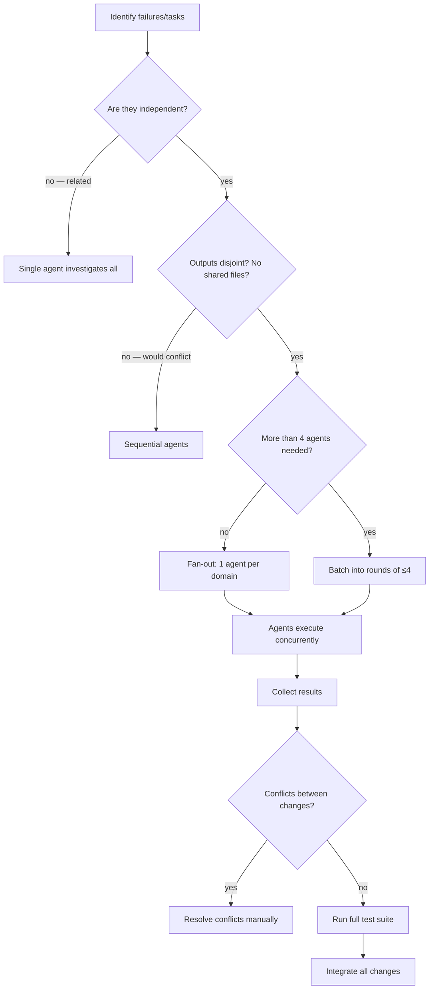

# Skill: dispatching-parallel-agents

## When

2+ independent tasks with no shared state that can run concurrently.

> CLI: `spoc --commands --json` for discovery. Mutating commands run directly — no token.

## Flow

## Agent Prompt Construction

Each agent gets exactly:

| Element | Required | Example |
|---------|----------|---------|
| **Scope** | ✓ | "Fix `agent-tool-abort.test.ts`" |
| **Goal** | ✓ | "Make these 3 tests pass" |
| **Context** | ✓ | Paste error messages, test names |
| **Constraints** | ✓ | "Don't change production code" |
| **Output format** | ✓ | "Return summary of root cause + changes" |

## Constraints

- Never dispatch agents that would edit the same files
- Each agent must be self-contained — no inherited session context
- Always run full test suite after integrating all agent results
- If failures are related (fix one might fix others), investigate together first
- Spot-check agent work — they can make systematic errors
- For exploratory debugging where you don't know what's broken, don't parallelize yet
