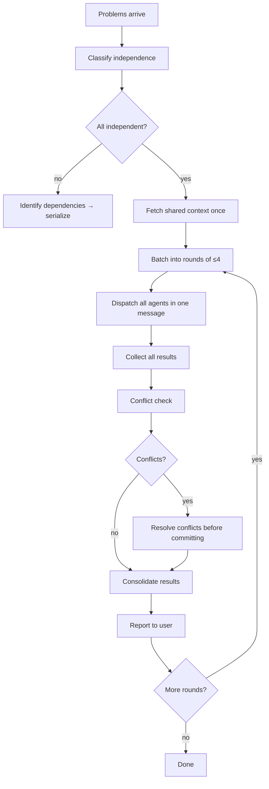

# Skill: dispatching-parallel-agents

## When

Use this skill when you have **2+ independent top-level problems** that can be worked on simultaneously with no shared state or sequential dependencies between them.

**This skill is for multi-problem fan-out.** It is DISTINCT from `subagent-driven-development`, which handles plan-internal task parallelism within a sequential execution loop.

Do NOT use this skill for:
- Plan-internal parallelism → use `subagent-driven-development`
- Sequential chains where B needs A's output → they are not independent
- Single sub-agent delegations → no fan-out needed

## Independence Check (REQUIRED before dispatch)

Before dispatching in parallel, verify each pair of tasks is truly independent:

| Check | Question | If yes → |
|-------|----------|----------|
| Shared files | Do any two tasks touch the same source files? | Serialize them |
| Sequential dependency | Does task B need output from task A? | Serialize them |
| Shared DAG write | Do both tasks write to the same DAG entity? | Serialize them |
| Shared state | Would concurrent execution produce a race condition? | Serialize them |

Only dispatch in parallel if ALL checks pass for ALL pairs.

## Flow



## Rules

**Max 4 concurrent agents per round.** If you have more than 4 independent tasks, batch them into rounds of ≤4. Start the next round only after the current round completes.

**Fetch shared context once.** If multiple agents need the same T0 brief, knowledge entries, or codebase read — fetch it yourself and inject the result into each agent's prompt. Do not make each agent independently re-fetch the same data.

**Dispatch all agents in a single message.** All agents in a round go out together — this is what makes it parallel. Sequential dispatch defeats the purpose.

**Collect before committing.** Receive all results before writing to shared state (DAG, codebase). Evaluate conflicts before any write.

## Conflict Detection

After all agents return results, check:
- Do any two agents propose edits to the same file or DAG entity?
- Do any results contradict each other (conflicting conclusions, incompatible changes)?
- Does any result invalidate another agent's assumptions?

If conflicts are found: resolve before committing. Do NOT write conflicting results to DAG.

## Shared Context Injection Pattern

```
# Context (pre-fetched, inject into all agent prompts):
spoc brief --lean --json → {summary}
spoc knowledge search slug "keywords" --lean --json → {relevant entries}

# Agent 1 prompt:
Given this context: {summary}
Your specific task: [task 1 only]

# Agent 2 prompt:
Given this context: {summary}
Your specific task: [task 2 only]
```

## When to Collapse to Sequential

If at any point during fan-out you discover:
- A result from agent A changes the scope of agent B's task
- Two agents edited the same file
- A task took longer and the others are waiting on it

→ Collapse to sequential for the remaining work.

## NOT This Skill

| Scenario | Use instead |
|----------|-------------|
| Executing tasks from a plan diagram | `subagent-driven-development` |
| Multi-step implementation of a single feature | `subagent-driven-development` |
| Sequential pipeline A → B → C | No parallelism skill — just chain |
| Single complex task needing one agent | `code-agent` or `quick-dev` |
