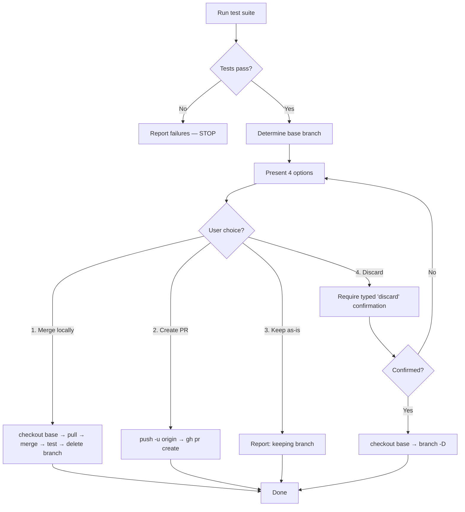

# Skill: finishing-a-development-branch

## When

Implementation complete, ready to integrate — verify tests, present options, execute choice, clean up.

> CLI: `spoc --commands --json` for discovery. Mutating commands run directly — no token.

## Flow



## Strategy Quick Reference

| Option | Merge | Push | Cleanup Branch |
|--------|-------|------|----------------|
| 1. Merge locally | yes | - | yes |
| 2. Create PR | - | yes | - |
| 3. Keep as-is | - | - | - |
| 4. Discard | - | - | yes (force) |

## When to Choose Each Strategy

- **Merge locally** — Solo work, small feature, no review needed, fast-forward preferred
- **Create PR** — Team collaboration, needs review, CI required, want discussion record
- **Keep as-is** — Work-in-progress, waiting on dependency, want to revisit later
- **Discard** — Experimental spike that proved the wrong approach, superseded by different solution

## DAG Closure (Required Post-Merge)

After merge is confirmed, close the DAG loop:

```bash
# Transition each completed task
spoc task transition <slug> <taskId> done --planId=<planId> --diagramNodeId=<nodeId> --json

# If all plan tasks are done, close the plan
spoc plan update-meta <slug> <planId> --status=done --json
```

Never skip DAG closure — it's the most common source of plan/task drift.

## Constraints

- Never proceed with failing tests
- Never merge without verifying tests on the merged result
- Never delete work without typed "discard" confirmation
- Never force-push without explicit request
- Present exactly 4 options — no open-ended questions
- Always verify tests before offering options
