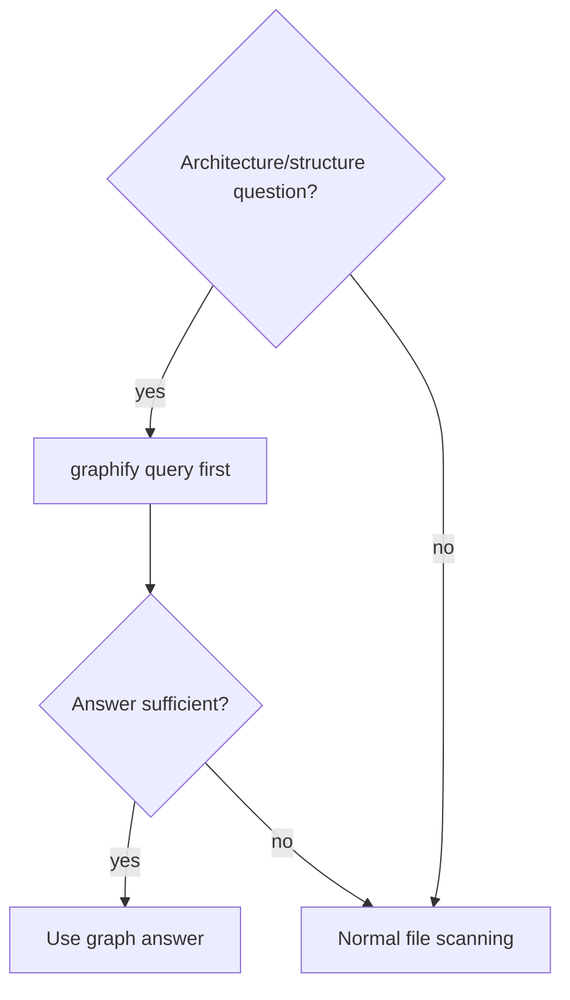
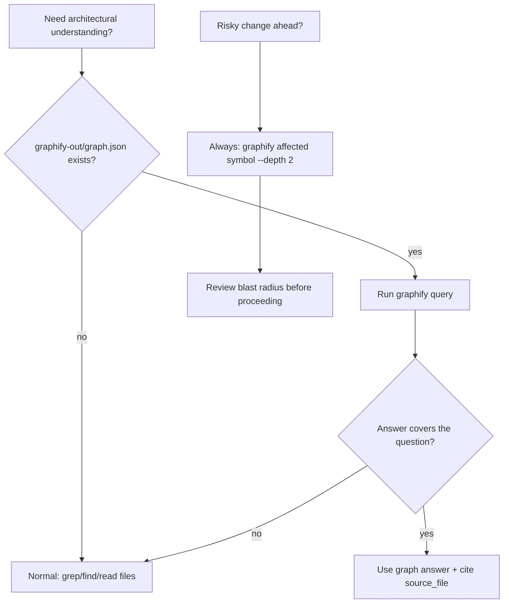

# Skill: graphify-aware

## When

Auto-layered when `graphify-out/graph.json` is detected in the workspace. Provides structural code intelligence without file scanning.

## Flow

## Query Vocabulary

| Need | Command |
|------|---------|
| Broad context | `graphify query "<question>" --graph graphify-out/graph.json --budget 2000` |
| Trace dependency path | `graphify path "<A>" "<B>" --graph graphify-out/graph.json` |
| Impact/blast radius | `graphify affected "<symbol>" --graph graphify-out/graph.json --depth 2` |
| Explain a node | `graphify explain "<node>" --graph graphify-out/graph.json` |

All commands are **local graph traversal** — no API key, no network, sub-second response.

## Confidence Tagging

Graphify edges carry confidence levels:

| Tag | Meaning | Action |
|-----|---------|--------|
| **EXTRACTED** | Explicit in source (import, call, citation) | Trust fully |
| **INFERRED** | Reasonable inference (shared data, implied dep) | Verify if critical path |
| **AMBIGUOUS** | Uncertain relationship | Do not rely on without code verification |

## Decision Logic

1. Before `grep`/`find` for architecture questions, check if `graphify-out/graph.json` exists
2. If yes, run `graphify query` first (faster, gives structural context including god nodes and community boundaries)
3. If answer is insufficient or graph is missing, fall through to normal file scanning
4. For impact analysis before risky changes, always run `graphify affected`
5. For understanding module boundaries, `graphify explain` gives plain-language node summaries

## When NOT to Use

- Implementation detail questions (function bodies, variable values) — read the file
- Questions about runtime behavior (what happens when X is called) — read the code
- Questions about test coverage — read test files directly
- If graph.json mtime > 14 days and major refactors landed — graph may be stale, verify answers

## Constraints

- **Read-only** — never modify `graphify-out/`
- **Budget flag** (`--budget 2000`) prevents token overflow on large graphs
- **Staleness awareness** — check `graph.json` mtime if answer contradicts what you see in code
- **Not a replacement for reading code** — use for navigation and architecture, not implementation detail
- **Falls through gracefully** — if graphify is not installed or graph.json missing, proceed normally
