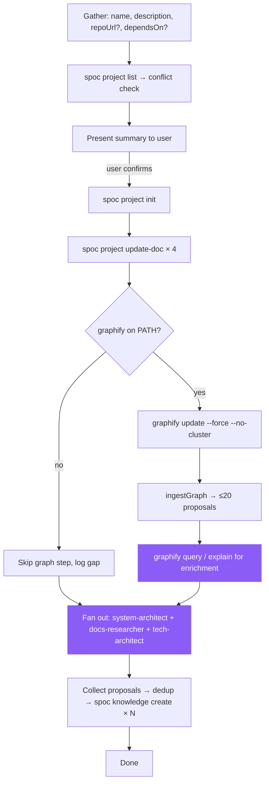

# Skill: init-project

## When

User wants to track a new project, bootstrap documentation, or connect a repo to the SPOC DAG. Triggers: "new project", "track this repo", "add project X", "init <repo>".

> **Canonical orchestrator workflow:** `src/cli/spoc-orchestrate.ts` under `### INIT Workflow` — this skill mirrors that flow with full operational detail. If the two diverge, the orchestrator prompt wins.

## Flow



## CLI Primer

```bash
spoc project init "Foo" --description="..." --path="$(pwd)" --json
```
Discovery: `spoc --commands --json`. Mutating commands run directly — no token.

## Constraints

- Do NOT read repo to infer name/description — gather from user
- Verify `dependsOn` targets exist via `spoc project list --json`
- `spoc project init` creates empty `plans/`, `knowledge/`, `tasks/` indexes — don't pre-populate
- Repo analysis is **fan-out across typed agents**, never a generic "analysis sub-agent" (see Agent Dispatch below)
- Never block INIT on graphify — it's optional. Skip cleanly if missing.

## Graphify Sub-Flow (DEFAULT: ON when binary present)

The orchestrator runs graphify directly during INIT to seed knowledge entries with structural evidence before any sub-agent reads code. This is the default path when `graphify` is on PATH; skip cleanly otherwise.

1. **Detect:** call `detectGraphify()` from `src/utils/graphify.ts`. If unavailable, log "graphify not on PATH; proceeding without graph signal" and skip steps 3–5.
2. **Trust the gitignore guarantee:** `runExtraction()` already auto-appends `graphify-out/` to `.gitignore` via `ensureGitignoreEntry`. Do NOT redundantly check or modify `.gitignore` from agents — running extraction is sufficient.
3. **Extract** (AST-only, no LLM API key required):
   ```bash
   graphify update <workspacePath> --force --no-cluster
   ```
   Produces `<workspacePath>/graphify-out/graph.json`.
4. **Ingest:** call internal `ingestGraph(graphJsonPath, slug)` → up to 20 `KnowledgeProposal` records (test files filtered):
   - 8 god nodes (`kind=module`, top 5% degree)
   - 8 architecture clusters (`kind=architecture`, by community or directory grouping)
   - 5 cross-module couplings (`kind=gotcha`, high-degree links across top-level dirs)
5. **Enrich** with read-only graph queries (sub-agents may run these):
   - `graphify query "entry points and main commands" --graph graphify-out/graph.json --budget 2000` → seeds for "key files" reference entries
   - `graphify query "core data flow" --graph graphify-out/graph.json --budget 2000` → seeds for "core modules" entries
   - `graphify explain "<godNodeLabel>" --graph graphify-out/graph.json` → plain-language summary for module entry bodies
   - `graphify affected "<critical-symbol>" --graph graphify-out/graph.json --depth 2` → reverse-impact map for high-risk modules
   - `graphify path "<A>" "<B>" --graph graphify-out/graph.json` → shortest dependency path for architecture entries
6. **Hand to typed agents:** the proposals + query results go to the sub-agents listed in **Agent Dispatch** below; they merge graph evidence with code reading and return finalized knowledge entries.
7. **Write** the entries directly: `spoc batch --file=ops.json` for one batched invocation, or repeated `spoc knowledge create` per entry.

## Content Guidelines

| Doc | Format |
|-----|--------|
| `overview.md` | 2-3 sentence summary + goals |
| `tasks.md` | `[ ]` backlog / `[/]` in-progress / `[x]` done |
| `dependencies.md` | Upstream + downstream sections |
| `knowledge.md` | High-level context + pointers to structured entries |

Update via `spoc project update-doc <slug> <doc> --content="..."`.

## Agent Dispatch (named typed agents — DO NOT default to a generic analysis agent)

| Sub-agent | Owns | Knowledge kinds it produces |
|-----------|------|----------------------------|
| `system-architect` | Module boundaries, clusters, dependency direction | `architecture`, `module` |
| `docs-researcher` | Tech stack, third-party libraries, key files, features | `reference`, `feature` |
| `tech-architect` | Cross-module couplings, structural gotchas, lessons | `gotcha`, `lesson` |
| `qa-analyst` (optional) | Coding-style + convention scan from existing code | `pattern` |

Dispatch in parallel — load `dispatching-parallel-agents`. Each agent receives:
- The relevant `KnowledgeProposal` records from `ingestGraph` (so they don't rediscover what graphify already found)
- Targeted graphify queries for evidence (e.g., `graphify explain` output for the modules they own)
- Explicit scope (which files / which kinds to produce)

Each agent returns finalized proposals: `{title, kind, summary, keywords, sourceFiles, body}`. The orchestrator dedups, then writes the entries directly via `spoc knowledge create` (or `spoc batch`).

## Knowledge Categories for Analysis Sub-Agents

| Category | Kind | What to discover | Primary agent |
|----------|------|------------------|---------------|
| tech stack | `architecture` | Languages, frameworks, runtimes, build tools, versions | `docs-researcher` |
| key files | `reference` | Entry points, config files, main modules, purposes | `docs-researcher` (use `graphify query "entry points"`) |
| code patterns | `pattern` | Recurring design patterns, abstractions, error handling | `qa-analyst` or `system-architect` |
| coding style | `pattern` | Formatting, linting, import ordering, file organization | `qa-analyst` |
| core modules | `module` | Core modules / shared functions — what, where, interconnections | `system-architect` (god nodes from graphify) |
| external services | `module` | APIs, databases, message queues the project interacts with | `docs-researcher` |
| third-party libraries | `reference` | Key dependencies and why they are used | `docs-researcher` |
| features | `feature` | Major user-facing or system-facing features | `docs-researcher` |
| cross-module couplings | `gotcha` | Hot edges between modules surfaced by graphify | `tech-architect` (auto from `ingestGraph`) |
| architecture clusters | `architecture` | Community / directory groupings from graphify | `system-architect` (auto from `ingestGraph`) |

## Worked Example

```bash
# 1. Conflict check
spoc project list --json

# 2. Present summary to user; on confirmation, init
spoc project init "Foo" --description="Foo CLI tool" --path="$(pwd)" --json

# 3. Update docs
spoc project update-doc foo overview --content="..." --json
# ... repeat for tasks, dependencies, knowledge

# 4. Graphify (if available)
graphify update . --force --no-cluster
# ingestGraph produces proposals; enrich with graphify query/explain

# 5. Fan out typed agents (parallel)
#    system-architect → architecture/module entries
#    docs-researcher  → reference/feature entries
#    tech-architect   → gotcha/lesson entries

# 6. Write knowledge entries directly
spoc knowledge create foo "Tech stack: TypeScript + Node 20" --kind=architecture --summary="..." --body="..." --json
# ... repeat per entry, or use spoc batch
```

## Exit Conditions

| Condition | Action |
|-----------|--------|
| Project already in DAG (slug collision) | Stop. Surface conflict; ask user to rename or use existing |
| User declines summary | Stop. No mutations performed |
| `graphify` missing | Continue without graph signal; sub-agents run with code reading only |
| `dependsOn` target missing | Stop. Ask user to init dependencies first or remove the link |
| Init succeeds but knowledge fan-out fails | Project exists in DAG; rerun knowledge phase later via SYNC |
