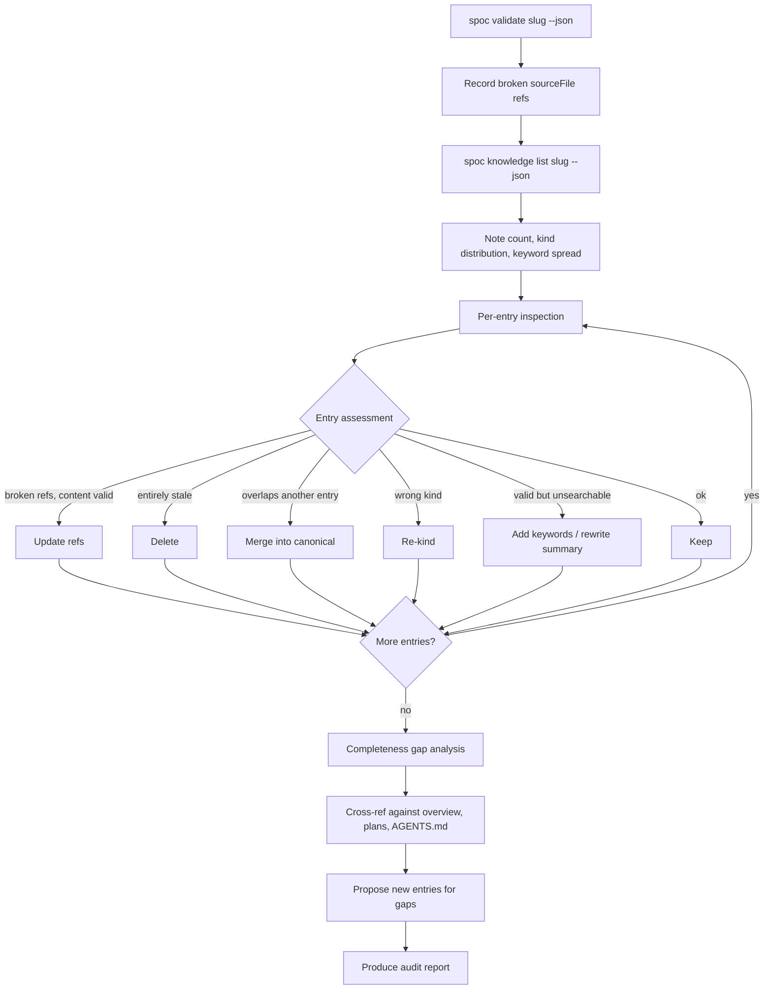
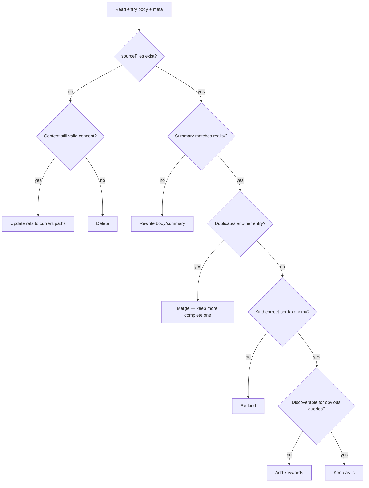

# Skill: Knowledge Curation

## When

Periodic audit of a project's knowledge base, after major refactors, or when agents report duplicates/conflicts.

> CLI Primer: `spoc --commands --json` for discovery. Mutating commands run directly — no token.

## Flow

## Per-Entry Decision

## Staleness Heuristics

**Time-based:**
- Entry older than 3 months + no linked task activity → suspect
- sourceFiles modified since entry's `updatedAt` → content may be outdated

**Content-based:**
- References deleted files, renamed functions, or removed modules
- Describes patterns contradicted by current code
- Uses terminology the project has since abandoned

**Graphify-derived entries** (keywords contain `graphify`, `architecture-cluster`, `god-node`):
- Validate sourceFiles against current codebase
- If graphify available: re-run `graphify extract` and compare

## Merge vs Archive Decision

| Signal | Action |
|--------|--------|
| Two entries same concept, one more complete | Merge keywords into complete one, delete other |
| Two entries same concept, different angles both valuable | Consolidate into single entry with both perspectives |
| Entry outdated but historically interesting | Delete — knowledge base is for current state, not history |
| Entry partially stale (some refs broken, some valid) | Update: fix refs, trim stale sections, keep valid content |

## Taxonomy Reference

| Kind | Use for | NOT for |
|------|---------|---------|
| `lesson` | Hard-won insight from mistakes | General docs |
| `gotcha` | Non-obvious recurring trap | One-time bugs |
| `pattern` | Recurring code pattern (the "how") | Architectural decisions |
| `architecture` | System-level design decisions (the "why") | Implementation details |
| `module` | Module boundaries and API surface | Internal implementation |
| `feature` | User-facing behavior and integration | Technical implementation |
| `reference` | Factual lookup (config, API shapes, env vars) | Opinions or guidelines |

## Audit Dimensions (check ALL five)

| # | Dimension | Signal |
|---|-----------|--------|
| 1 | Staleness | Broken refs, contradicted content |
| 2 | Duplication | Overlapping scope, similar titles/keywords |
| 3 | Taxonomy | Wrong kind assignment |
| 4 | Discoverability | Missing keywords, vague titles |
| 5 | Completeness | Important concepts with no entry |

## Constraints

- Always run `spoc validate` first — never skip automated staleness check
- Never delete without checking if the concept (not just the ref) is still valid
- Never merge without reading both bodies
- Never report "cleared" without stating what was checked
- Delete confidently: empty + trusted > full + unreliable
- Group related mutations into a single `spoc batch` invocation
- Two modes: direct execution (run mutating commands) or recommendation-only (CLI commands in report)
- Taxonomy disputes → escalate to human, document decision as `lesson`
