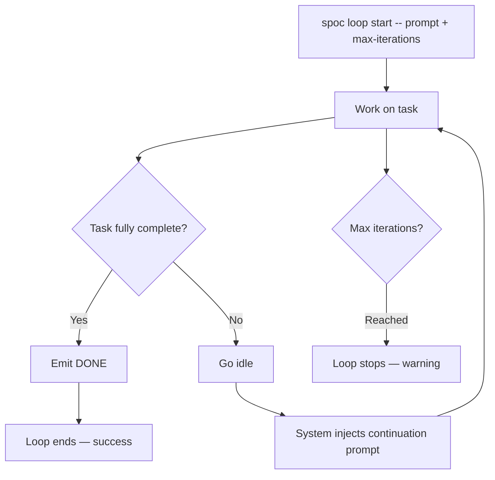

# Skill: loop

## When

Running iterative work that should auto-continue until a task is fully complete.

## Flow



## Starting

```bash
TOKEN=$(spoc write propose "Start loop" --ops=loop-start --slug=<slug> --json | jq -r .data.token)
spoc loop start <slug> --prompt="<task>" --max-iterations=50 --strategy=continue --token=$TOKEN --json
```

**Parameters:** `--prompt` (required), `--max-iterations` (default 100), `--strategy` (`continue`|`reset`), `--completion-promise` (default "DONE")

## Completion Protocol

Emit `<promise>DONE</promise>` in your response text when — and only when — the task is truly complete. Do not emit early.

## Each Iteration

1. Review progress from previous iterations
2. Identify remaining work
3. Make meaningful progress (don't repeat)
4. Track via SPOC tasks

## Exit Conditions

| Condition | Result |
|-----------|--------|
| `<promise>DONE</promise>` emitted | Success |
| Max iterations reached | Warning — loop stops |
| User cancels (`spoc loop cancel <slug>`) | Cleared |

## State

Lives at `~/.spoc/projects/{slug}/loop-state.json`. One active loop per project. Persists across reconnects.
