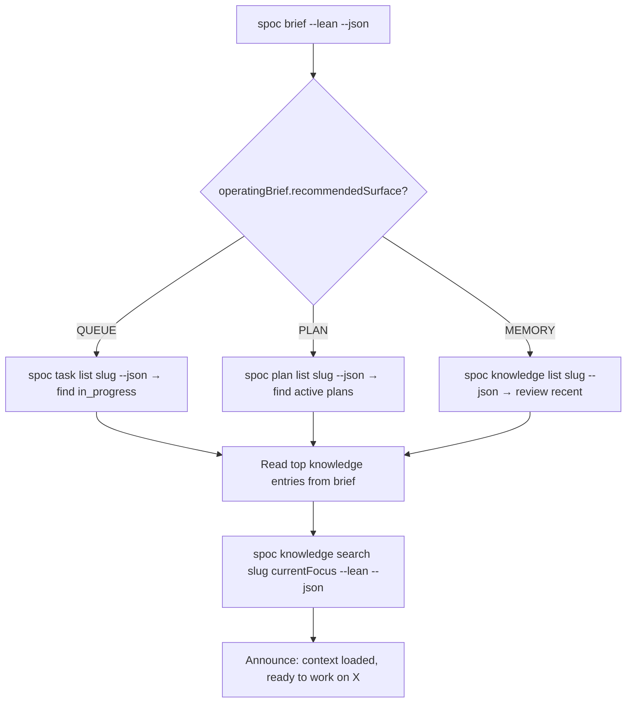

# Skill: onboarding-session

## When

Starting a new session on a project already tracked in SPOC. Triggered at session start when the project exists in DAG but the agent needs to orient quickly. This is the "returning to work" flow.

**NOT for:**
- Brand new projects → use `init-project`
- Mid-session reorientation → just run `spoc brief`

## Flow

## Orient Checklist

1. **T0 brief** — get slug, current focus, recommended surface, next action
2. **Follow recommended surface** — QUEUE means check tasks; PLAN means review plans; MEMORY means check knowledge
3. **Load relevant knowledge** — read top entries from brief's `topKnowledge` list
4. **Search for focus context** — `spoc knowledge search` with current focus keywords
5. **Announce readiness** — state what you know and what you're about to do

## What to Read First

| Brief field | What to do |
|-------------|-----------|
| `topOpenTasks` with `in_progress` | This is your immediate work — read its details |
| `activePlanTitles` | Active plans guide priority — check diagram if present |
| `topKnowledge` | These are the most relevant entries — scan for patterns/gotchas |
| `operatingBrief.nextAction` | This is the system's recommendation — follow unless you have reason not to |

## Constraints

- Never skip the brief — it's the cheapest way to orient
- Don't read every knowledge entry — use the brief's selection
- If `nextAction` is clear, follow it. Don't over-analyze.
- If the brief shows stale data (>7 days since sync), flag it but proceed
