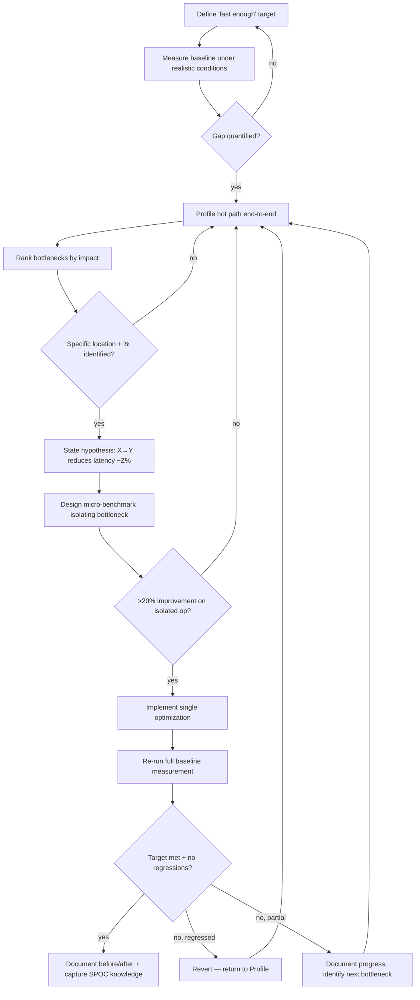
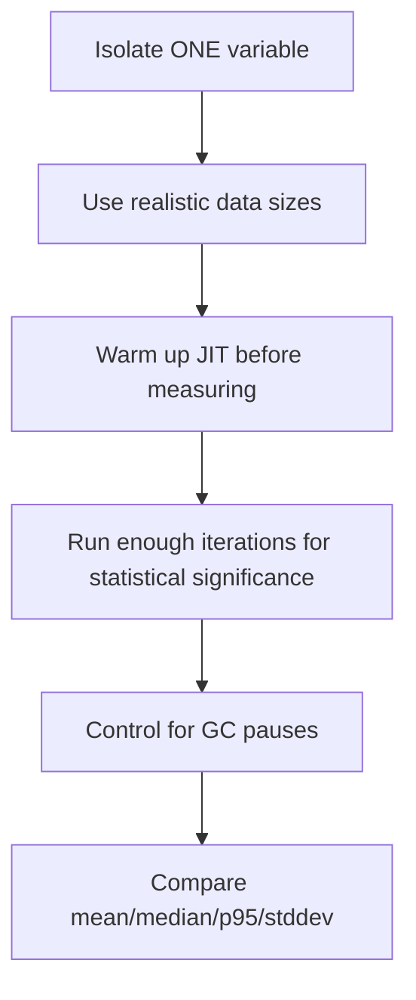

# Skill: performance-diagnosis

## When

Any performance concern — slow responses, high memory, CPU blocking, query latency, rendering jank, throughput degradation.

> CLI: `spoc --commands --json`. Writes: `spoc write propose` → token → `--token`.

## Flow

## The Iron Law

**MEASURE BEFORE OPTIMIZING.** If you can't show a measurement proving the bottleneck, the optimization is premature.

## Phase Details

| Phase | Key Activities | Success Criteria |
|-------|---------------|------------------|
| **1. Baseline** | Measure time/memory/CPU/I/O, define target, record environment, run multiple times | Numbers exist, gap quantified |
| **2. Bottleneck** | Profile, interpret flame graphs/heap/queries, rank by impact | Specific location + % contribution |
| **3. Hypothesis** | State theory, micro-benchmark one variable, warm JIT, control GC | Proven or disproven with data |
| **4. Optimization** | Implement, re-measure end-to-end, run test suite | Target met, no regressions |

## Benchmark Design

## Optimization Decision Matrix

| Improvement | Hot Path? | Adds Complexity? | Decision |
|-------------|-----------|-------------------|----------|
| >50% | Yes | Any | Do it |
| 20-50% | Yes | Low | Do it |
| 20-50% | Yes | High | Consider, document tradeoff |
| 10-20% | Yes | Low | Do it if easy |
| 10-20% | Yes | High | Probably skip |
| <10% | Any | Any | Skip unless p99 at massive scale |
| Any | No (cold) | Any | Skip |

## Profiling Tools

- **CPU:** `node --inspect` + DevTools, `clinic flame/doctor`, `perf_hooks`
- **Memory:** Heap snapshots, `clinic heap`, `--max-old-space-size` experiments
- **Event loop:** `clinic bubbleprof`, `blocked-at`, `monitorEventLoopDelay()`
- **DB:** `EXPLAIN ANALYZE`, slow query log, `.explain()`
- **Load:** k6, autocannon, wrk
- **Browser:** Lighthouse, Web Vitals, Performance API

## Constraints

- Complete each phase before proceeding — no skipping to "obvious" fixes
- "Feels slow" is not a metric — get numbers first
- Never stack optimizations hoping they compound; if one didn't help, re-profile
- If improvement <10% end-to-end, question whether complexity is worth it
- Capture non-obvious bottlenecks as SPOC knowledge (kind: `lesson` or `gotcha`)
- Authority ≠ data — even if someone senior suggested the optimization, measure first
