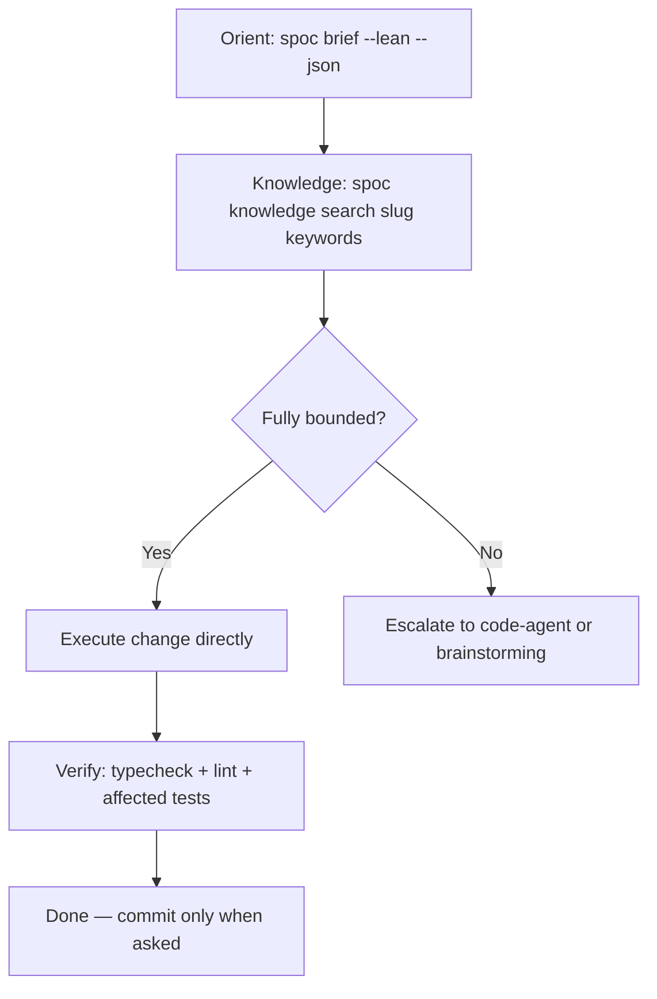

# Skill: quick-dev

## When

Task is fully bounded — no open decisions, success criteria derivable without asking.

## Flow



## Phase 0: Knowledge Check

```bash
spoc knowledge search <slug> "<keywords>" --lean --json
```

Check for patterns, gotchas, and lessons before implementing. Skip only if the change is purely mechanical (rename, config nudge).

## Behaviour

1. Orient with SPOC context + search if pattern-related
2. Execute directly — no planning doc, no brainstorming, no TDD ritual
3. Run focused verification (not full suite unless pervasive)

## Escalation

If hidden complexity surfaces mid-task — **pause immediately**, state the issue, offer to switch to `code-agent` or `brainstorming`. Do not silently expand scope.

If self-confidence drops below 80% per `confidence-gate` (open decision, unverified assumption, sibling pattern unclear), escalate to `code-agent` — `quick-dev` does not permit exploration loops; `code-agent` does.

## NOT for

- Tasks with open design decisions → `code-agent`
- New behaviour or UX changes → `brainstorming`
