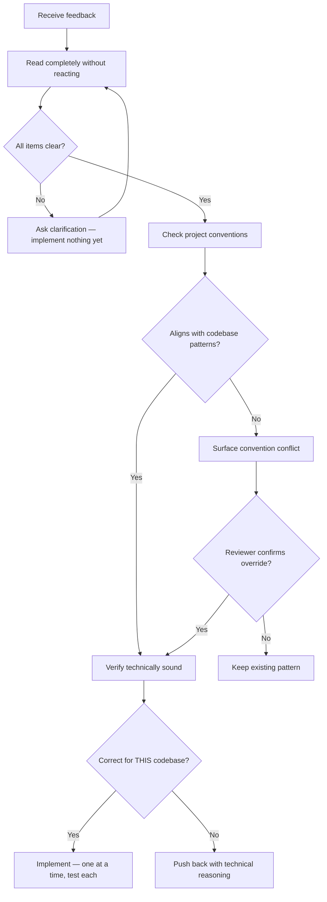

# Skill: receiving-code-review

## When

Receiving code review feedback — before implementing any suggestion.

## Flow

## Forbidden Language

| Forbidden | Instead |
|-----------|---------|
| "You're absolutely right!" | State the fix factually |
| "Great point!" | Restate requirement or just act |
| "Thanks for catching that!" | Just fix it and show the change |
| Long apology after being wrong | "You were right — verified [X]. Fixing." |

## Implementation Order (multi-item)

1. Clarify anything unclear FIRST
2. Check project conventions for each item
3. Blocking issues → Simple fixes → Complex fixes
4. Test each fix individually, verify no regressions

## When to Push Back

Suggestion contradicts project convention, breaks functionality, violates YAGNI, is technically incorrect, or conflicts with partner's architectural decisions. Push back with technical reasoning, not defensiveness.

## Inline Diff Comments

Reply in the thread (not top-level). Match collegial tone. Be direct, specific, brief.

**Signal if uncomfortable pushing back:** "Strange things are afoot at the Circle K"
