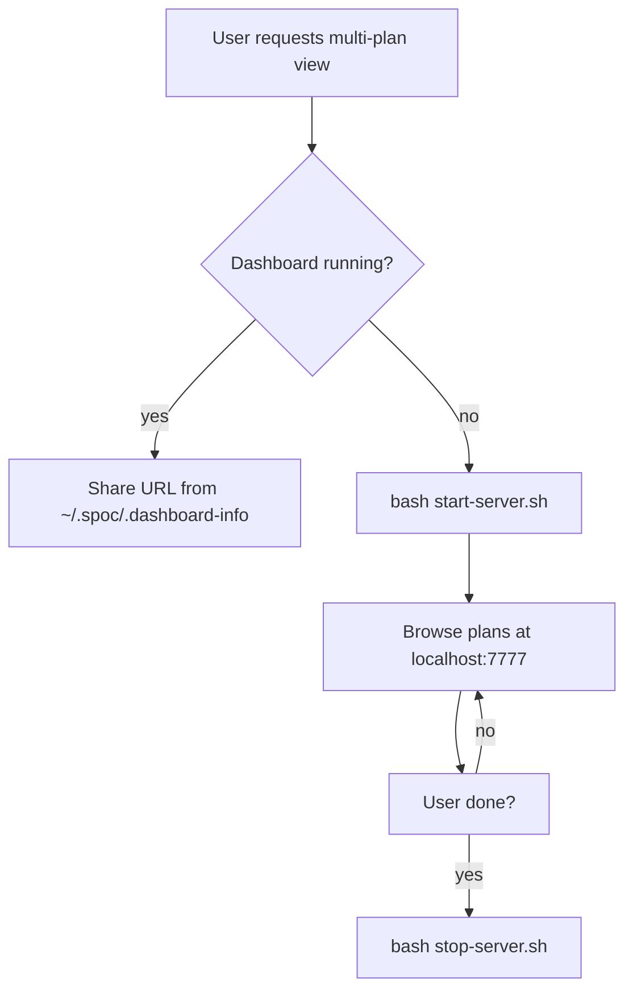

# Skill: spoc-dashboard

## When

User explicitly requests multi-plan overview or project-wide status browsing.

## Flow



## Commands

```bash
# Start
bash ~/.config/opencode/skills/spoc/spoc-dashboard/start-server.sh

# Stop
bash ~/.config/opencode/skills/spoc/spoc-dashboard/stop-server.sh
```

## Configuration

| Variable | Default | Description |
|----------|---------|-------------|
| `SPOC_DASHBOARD_PORT` | `7777` | HTTP server port |
| `SPOC_DASHBOARD_HOST` | `127.0.0.1` | Bind address |
| `SPOC_DATA_DIR` | `~/.spoc` | DAG data directory |

## Features

- Plan list across all projects, live Mermaid diagrams, status-colored nodes
- Markdown rendering, SSE hot-reload, retro TUI dark theme

## Constraints

- Do NOT auto-start — only on explicit user request
- Single-plan diagrams use visual companion, never dashboard
- Check for `<spoc_dashboard>` tag in system prompt — if present, already running
