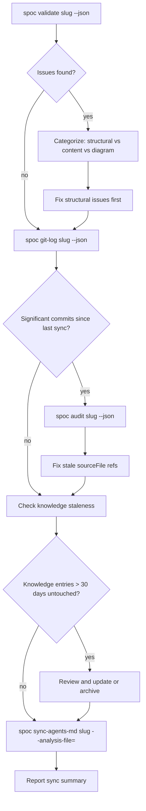

# Skill: spoc-sync

## When

DAG may be stale and needs reconciliation. Triggered by: staleness >7 days, completing a major feature, before a demo/review, or when `spoc validate` shows issues.

**NOT for:**
- Routine task transitions → just use `spoc task transition`
- Single knowledge updates → just use `spoc knowledge update-meta`

## Flow



## Sync Checklist

1. **Validate** — `spoc validate <slug> --json` — fix any DAG invariant violations
2. **Git log** — `spoc git-log <slug> --json` — identify commits since last sync
3. **Audit** — `spoc audit <slug> --json` — find stale sourceFile references
4. **Knowledge review** — check entries for accuracy against current code
5. **AGENTS.md** — `spoc sync-agents-md <slug> --analysis-file=<path> --json` — regenerate if code changed
6. **Report** — summarize what was found and fixed

## Sync Report Format

```
Staleness: N days (M commits since last sync)
Validate: X issues found, Y fixed
Audit: Z stale refs updated
Knowledge: A reviewed, B updated, C archived
AGENTS.md: regenerated / unchanged
Remaining gaps: [anything needing human attention]
```

## Constraints

- Always validate FIRST — fix structural issues before content review
- Don't create new knowledge during sync — only update/archive existing
- AGENTS.md regeneration is the LAST step (depends on all other fixes)
- If graphify is available and stale >7 days, re-extract: `graphify update <path> --force --no-cluster`
