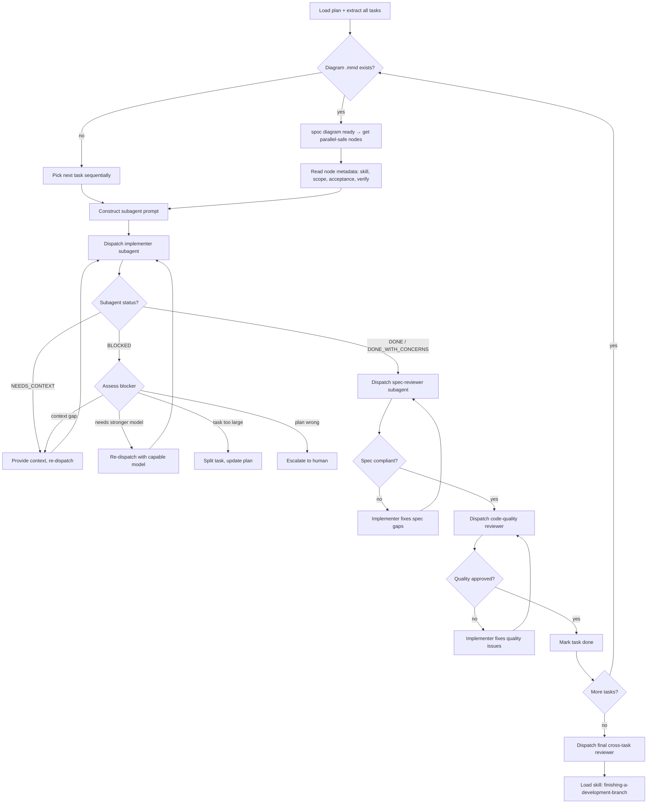
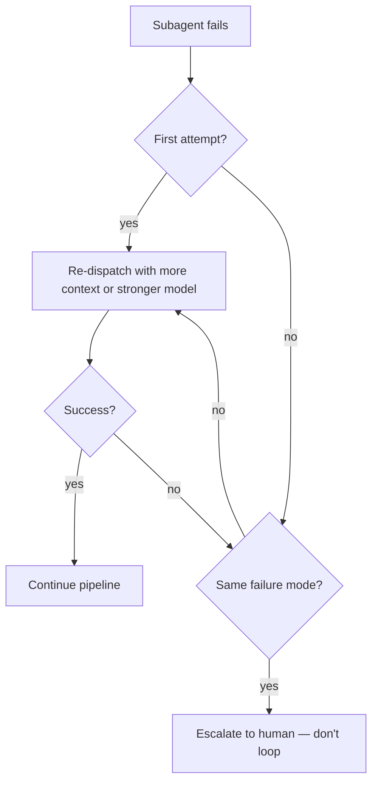

# Skill: Subagent-Driven Development

## When

You have an implementation plan with mostly-independent tasks and want to execute them in-session via fresh subagents with two-stage review.

> CLI Primer: `spoc --commands --json` for discovery. Mutating commands run directly — no token.

## Flow

## Retry & Escalation

## Diagram-First Dispatch

When the plan has a `.mmd` file:

1. `spoc diagram ready <slug> <planId>` → all returned nodes are dispatch-safe in parallel
2. Use per-node `%%` metadata (`skill`, `scope`, `files`, `acceptance`, `verify`) to construct prompts
3. After completion: `spoc task transition <slug> <taskId> done --diagramNodeId=T001 --planId=<planId>`
4. Re-run `diagram ready` to discover newly-unblocked nodes
5. If node metadata is incomplete, fall back to reading the plan body for that task

**Ownership:** Dispatcher owns `.mmd` updates. Implementer subagents MUST NOT edit diagrams.

## Sub-Agent Prompt Construction

Every implementer subagent prompt MUST include:

| Section | Content |
|---------|---------|
| **Goal** | Exact task description from plan (full text, not summary) |
| **Context** | Where this task fits in the plan; what came before |
| **Scope** | File boundaries — what to touch, what NOT to touch |
| **Acceptance** | Done criteria copied verbatim from plan/diagram |
| **Verify** | Exact command to run before claiming done |
| **Skill** | Which work-mode skill to load (from diagram metadata or inferred) |

Do NOT make the subagent read the plan file. Provide full text in the prompt.

## Model Selection

| Task complexity | Model tier |
|----------------|-----------|
| 1-2 files, clear spec, mechanical | Fast/cheap |
| Multi-file integration, pattern matching | Standard |
| Architecture, design, review | Most capable |

## Prompt Templates

- `./implementer-prompt.md`
- `./spec-reviewer-prompt.md`
- `./code-quality-reviewer-prompt.md`

## Constraints

- Fresh subagent per task — never reuse session context
- Spec review BEFORE code quality review (never reverse)
- Never dispatch parallel implementers (conflicts)
- Never skip re-review after fixes
- Never ignore BLOCKED/NEEDS_CONTEXT status — something must change
- Never start on main/master without explicit user consent
- If reviewer finds issues → implementer fixes → reviewer re-reviews → repeat until approved
- DONE_WITH_CONCERNS: read concerns before proceeding; address if correctness/scope related
- Scope changes discovered by subagents: report in summary, dispatcher handles diagram regeneration
