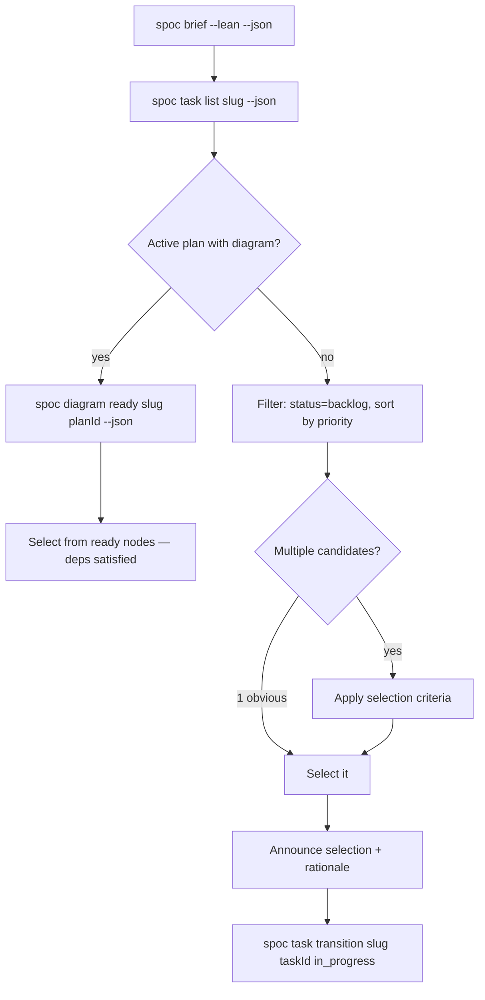

# Skill: task-triage

## When

You have a backlog of tasks and need to decide what to work on next. Triggered by "what should I work on?", "prioritize tasks", "triage backlog", or when an agent completes work and needs to pick the next task.

**NOT for:**
- If you have a structured plan with a diagram → use `spoc diagram ready` directly
- If you're mid-execution of a known task → continue without triage

## Flow

## Selection Criteria (when multiple candidates)

| Priority | Criterion |
|----------|-----------|
| 1 | Unblocks other tasks (highest downstream impact) |
| 2 | Matches current focus from operating brief |
| 3 | Higher priority level (critical > high > medium > low) |
| 4 | Smaller scope (quick wins build momentum) |
| 5 | Freshest context (recently discussed or related to last task) |

## Constraints

- Always check `spoc diagram ready` first if a plan has a diagram — topology trumps manual priority
- Never start a task without transitioning it to `in_progress`
- If all tasks are blocked, report blockers instead of picking arbitrarily
- If backlog is empty, report "no tasks available" — don't invent work
