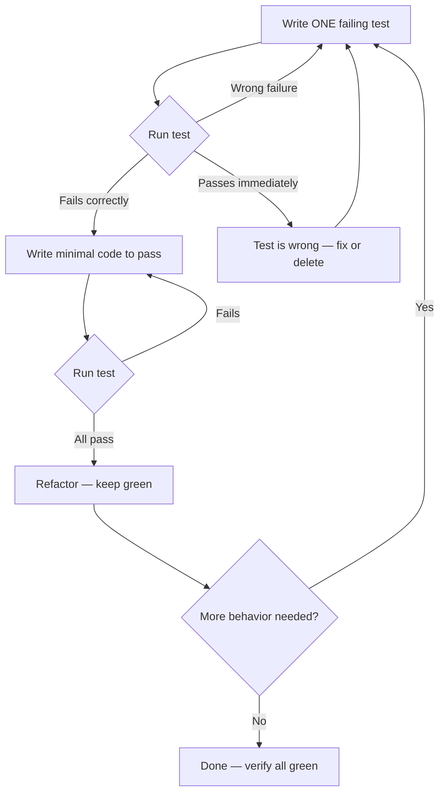

# Skill: test-driven-development

## When

Implementing any feature, bugfix, or behavior change. No production code without a failing test first.

## Flow

## Iron Law

Code written before a test? **Delete it.** No "reference", no "adapting". Start fresh from tests.

## RED — Write Failing Test

- One behavior per test, clear name, real code (no mocks unless unavoidable)
- Run: `npm test path/to/test.test.ts` — confirm fails for the right reason

## GREEN — Minimal Code

- Simplest code to pass. Nothing beyond what the test requires.
- Run: confirm all tests pass, output pristine

## REFACTOR — Clean Up

- Remove duplication, improve names, extract helpers
- Keep tests green. Don't add behavior.

## Common Rationalizations

| Excuse | Reality |
|--------|---------|
| "Too simple to test" | Simple code breaks. Test takes 30 seconds. |
| "I'll test after" | Tests passing immediately prove nothing. |
| "Need to explore first" | Fine. Throw away exploration, then TDD. |
| "Test hard = design unclear" | Hard to test = hard to use. Listen to the test. |
| "TDD will slow me down" | TDD faster than debugging. |

## When Stuck

| Problem | Solution |
|---------|----------|
| Don't know how to test | Write wished-for API. Assertion first. |
| Test too complicated | Design too complicated. Simplify interface. |
| Must mock everything | Code too coupled. Use dependency injection. |

## Red Flags — Delete and Start Over

Code before test, test passes immediately, can't explain why test failed, rationalizing "just this once".

See `tdd-rationalizations-and-examples.md` for expanded examples and rebuttals.
