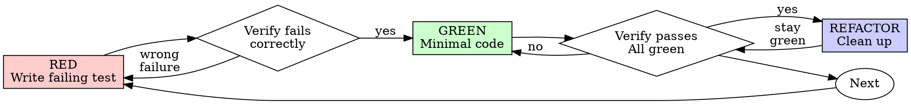

# Test-Driven Development (TDD)

## Overview

Write the test first. Watch it fail. Write minimal code to pass.

**Core principle:** If you didn't watch the test fail, you don't know if it tests the right thing.

**Violating the letter of the rules is violating the spirit of the rules.**

## When to Use

**Always:**
- New features
- Bug fixes
- Refactoring
- Behavior changes

**Exceptions (ask your human partner):**
- Throwaway prototypes
- Generated code
- Configuration files

Thinking "skip TDD just this once"? Stop. That's rationalization.

## The Iron Law

```
NO PRODUCTION CODE WITHOUT A FAILING TEST FIRST
```

Write code before the test? Delete it. Start over.

**No exceptions:**
- Don't keep it as "reference"
- Don't "adapt" it while writing tests
- Don't look at it
- Delete means delete

Implement fresh from tests. Period.

## Red-Green-Refactor



### RED - Write Failing Test

Write one minimal test showing what should happen.

**Requirements:**
- One behavior
- Clear name
- Real code (no mocks unless unavoidable)

For good-vs-bad RED test examples, see **`tdd-rationalizations-and-examples.md`**.

### Verify RED - Watch It Fail

**MANDATORY. Never skip.**

```bash
npm test path/to/test.test.ts
```

Confirm:
- Test fails (not errors)
- Failure message is expected
- Fails because feature missing (not typos)

**Test passes?** You're testing existing behavior. Fix test.

**Test errors?** Fix error, re-run until it fails correctly.

### GREEN - Minimal Code

Write simplest code to pass the test. Just enough to satisfy the test — no added features, no refactoring other code, no "improvements" beyond what the test requires.

For good-vs-bad GREEN implementation examples, see **`tdd-rationalizations-and-examples.md`**.

### Verify GREEN - Watch It Pass

**MANDATORY.**

```bash
npm test path/to/test.test.ts
```

Confirm:
- Test passes
- Other tests still pass
- Output pristine (no errors, warnings)

**Test fails?** Fix code, not test.

**Other tests fail?** Fix now.

### REFACTOR - Clean Up

After green only:
- Remove duplication
- Improve names
- Extract helpers

Keep tests green. Don't add behavior. Then write the next failing test for the next feature.

## Why Order Matters

Tests written after code pass immediately — and passing immediately proves nothing. Test-first forces you to see the test fail, proving it actually tests something. Manual testing is ad-hoc; automated tests run the same way every time. Sunk cost arguments ("I already spent X hours") are fallacies — unverified code is technical debt. "Tests after achieve the same goals" is false: tests-after answer "what does this do?"; tests-first answer "what should this do?"

For expanded rebuttals to each of these arguments — with concrete reasoning for why they fail under pressure — see **`tdd-rationalizations-and-examples.md`** in this directory. Load it when you or a reviewer is actively arguing for skipping tests-first.

## Common Rationalizations

| Excuse | Reality |
|--------|---------|
| "Too simple to test" | Simple code breaks. Test takes 30 seconds. |
| "I'll test after" | Tests passing immediately prove nothing. |
| "Tests after achieve same goals" | Tests-after = "what does this do?" Tests-first = "what should this do?" |
| "Already manually tested" | Ad-hoc ≠ systematic. No record, can't re-run. |
| "Deleting X hours is wasteful" | Sunk cost fallacy. Keeping unverified code is technical debt. |
| "Keep as reference, write tests first" | You'll adapt it. That's testing after. Delete means delete. |
| "Need to explore first" | Fine. Throw away exploration, start with TDD. |
| "Test hard = design unclear" | Listen to test. Hard to test = hard to use. |
| "TDD will slow me down" | TDD faster than debugging. Pragmatic = test-first. |
| "Manual test faster" | Manual doesn't prove edge cases. You'll re-test every change. |
| "Existing code has no tests" | You're improving it. Add tests for existing code. |

## Red Flags - STOP and Start Over

- Code before test
- Test after implementation
- Test passes immediately
- Can't explain why test failed
- Tests added "later"
- Rationalizing "just this once"
- "I already manually tested it"
- "Tests after achieve the same purpose"
- "It's about spirit not ritual"
- "Keep as reference" or "adapt existing code"
- "Already spent X hours, deleting is wasteful"
- "TDD is dogmatic, I'm being pragmatic"
- "This is different because..."

**All of these mean: Delete code. Start over with TDD.**

## Example: Bug Fix

For a worked end-to-end example (RED → Verify RED → GREEN → Verify GREEN → REFACTOR) — and for good-vs-bad RED/GREEN examples — see **`tdd-rationalizations-and-examples.md`** in this directory. Bug fixes follow the same cycle: write failing test reproducing the bug, then follow RED → GREEN → REFACTOR. Never fix bugs without a test.

## Verification Checklist

Before marking work complete: every new function/method has a test, you watched each test fail for the expected reason before implementing, you wrote minimal code to pass each test, all tests pass, output is pristine (no errors/warnings), tests use real code (mocks only if unavoidable), and edge cases and errors are covered. Can't check all boxes? You skipped TDD. Start over.

## When Stuck

| Problem | Solution |
|---------|----------|
| Don't know how to test | Write wished-for API. Write assertion first. Ask your human partner. |
| Test too complicated | Design too complicated. Simplify interface. |
| Must mock everything | Code too coupled. Use dependency injection. |
| Test setup huge | Extract helpers. Still complex? Simplify design. |

## Testing Anti-Patterns

When adding mocks or test utilities, read `testing-anti-patterns.md` to avoid common pitfalls: testing mock behavior instead of real behavior, adding test-only methods to production classes, mocking without understanding dependencies.

## Final Rule

```
Production code → test exists and failed first
Otherwise → not TDD
```

No exceptions without your human partner's permission.
