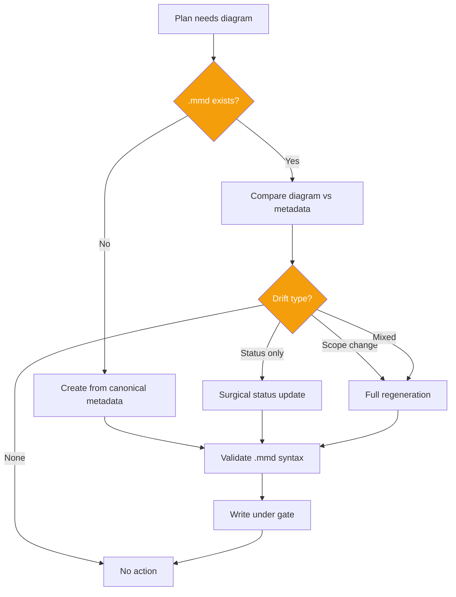
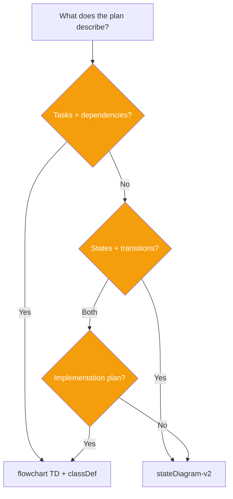
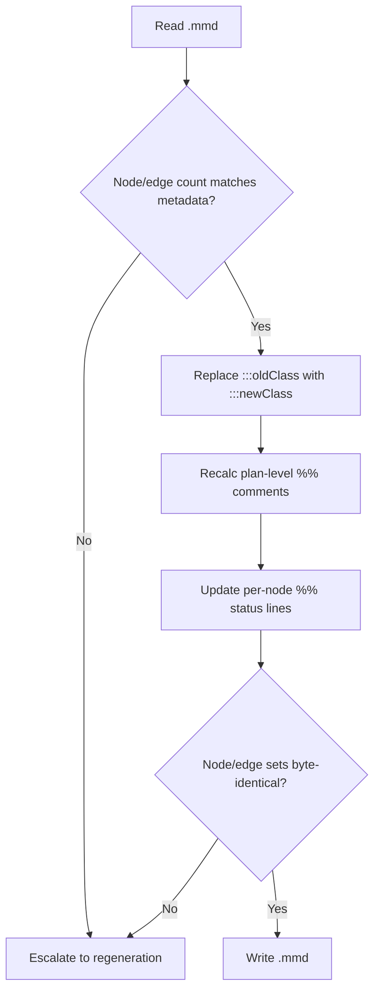
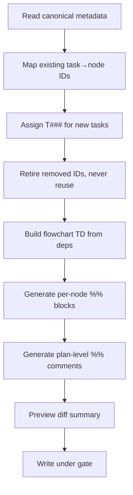

# Skill: to-diagram

## When

Creating, updating, or auditing a Mermaid `.mmd` diagram for a SPOC plan.

> Follows SPOC CLI Primer: `spoc --commands --json` for discovery, `--json --lean` on all calls.

## Flow



## Dialect Selection



## Status-Only Update



## Scope-Change Regeneration



## Canonical Source of Truth (Priority Order)

1. **Structured task metadata** (SPOC tasks) — always wins
2. **Plan body checkboxes** (`- [ ]`/`- [x]`) — fallback if no structured tasks
3. **`%%` comments in .mmd** — cache only, never authoritative

Metadata always wins. Diagram is regenerated from metadata on drift, never the reverse.

## Drift Types

| # | Type | Symptom |
|---|------|---------|
| 1 | classDef mismatch | Node has wrong :::class vs metadata status |
| 2 | Phantom node | Diagram node has no corresponding task |
| 3 | Missing node | Task exists but no diagram node |
| 4 | Topology mismatch | Edges don't match dependency metadata |
| 5 | Stale plan-level comments | %% status/ready/blocked inconsistent |
| 6 | Incomplete node metadata | Missing %% block or stale fields |

**Resolution for all 6:** Regenerate from metadata. Never patch metadata to match diagram.

## classDef Conventions

Always declare at top of every `flowchart TD`:

```
classDef done fill:#22c55e,color:#fff
classDef inProgress fill:#f59e0b,color:#fff
classDef blocked fill:#ef4444,color:#fff
classDef backlog fill:#94a3b8,color:#fff
```

Assign via `:::className` suffix. At plan creation, all nodes start `:::backlog`.

## Node ID Rules

- Format: `T001`, `T002`, ... (zero-padded 3+ digits)
- If SPOC structured tasks exist, use their canonical IDs
- IDs are stable — never change on rename/reorder
- Removed IDs are retired, never reused
- New tasks get next unused sequential ID

## Per-Node Metadata Format

Between plan-level header and `flowchart TD` declaration:

```
%% node: T003
%% title: Build order management UI
%% status: backlog
%% skill: code-agent
%% scope: src/components/orders/, src/pages/orders/
%% files: src/components/orders/OrderList.tsx (optional)
%% acceptance: Order list renders with pagination
%% verify: npm test -- --testPathPattern=orders
%% blocked-by: T002 (optional)
%% delegate: yes (optional)
```

**Required:** node, title, status, skill, scope, acceptance. **Optional:** files, verify, blocked-by, delegate.

## Plan-Level Header Comments

```
%% plan: <plan-id>
%% status: T001=done, T002=inProgress, T003=backlog
%% ready: T003 (all deps done)
%% blocked: T005 (waiting on T003)
%% next-action: Start T003
```

## manage-diagram.mjs Commands

| Command | Purpose |
|---------|---------|
| `inspect <file>` | Structured JSON of nodes/edges/metadata |
| `ready <file>` | Compute executable nodes from topology |
| `validate <file> [--metadata f.json]` | Check integrity (+ drift detection) |
| `status <file> <nodeId> <status>` | Update single node status atomically |
| `sort-metadata <file>` | Order metadata blocks by node ID |
| `regenerate <file> --metadata f.json` | Full regeneration from canonical data |

Preferred: `spoc diagram ready <slug> <planId>` for ready detection. Script is fallback for file-level ops.

## File Convention

- Path: `plans/<plan-id>.diagram.mmd`
- Pure Mermaid syntax (no markdown fences)
- First line: `%% plan: <plan-id>`
- One diagram per plan
- Plan body references: `> Diagram: plans/<plan-id>.diagram.mmd`

## Scalability

Plans with 15+ nodes: cluster into `subgraph` blocks by phase. If unreadable, split into sub-plans.

## Constraints

- **Ownership:** Only orchestrator/coordinator writes .mmd files. Sub-agents read only and report status back
- **Presentation:** Internal skill — never narrate conventions to user. Show rendered diagram or URL only
- **Determinism:** Same metadata must produce byte-identical .mmd output (nodes ordered by ID, edges by source→target, fields in fixed order)
- **Write-gate required** for any .mmd write to DAG path
- **Validation before write:** unique IDs, valid edges, all 4 classDef present, valid :::class suffixes
- **Backward compat:** Plans without .mmd remain valid; diagrams without rich metadata upgraded during SYNC

## Reference Example

```
%% plan: order-system
%% status: T001=done, T002=inProgress, T003=backlog, T004=backlog, T005=blocked
%% ready: T003 (T001 done)
%% blocked: T005 (waiting on T003 and T004)
%% next-action: Start T003

%% node: T001
%% title: Design database schema for orders
%% status: done
%% skill: quick-dev
%% scope: db/migrations/
%% acceptance: Migration runs; orders table has all required columns
%% verify: npm run db:migrate

%% node: T002
%% title: Build REST API endpoints
%% status: inProgress
%% skill: test-driven-development
%% scope: src/api/orders/
%% acceptance: CRUD endpoints return correct status codes
%% verify: npm test -- --testPathPattern=api/orders
%% blocked-by: T001

flowchart TD
    classDef done fill:#22c55e,color:#fff
    classDef inProgress fill:#f59e0b,color:#fff
    classDef blocked fill:#ef4444,color:#fff
    classDef backlog fill:#94a3b8,color:#fff

    T001[Design database schema]:::done --> T002[Build REST API]:::inProgress
    T001 --> T003[Write integration tests]:::backlog
    T002 --> T004[Build order UI]:::backlog
    T003 --> T005[Deploy to staging]:::blocked
    T004 --> T005
```

```
%% plan: feature-lifecycle
stateDiagram-v2
    [*] --> Draft
    Draft --> Spec
    Spec --> Build
    Build --> Review
    Review --> Shipped
    Review --> Build : revisions
```
