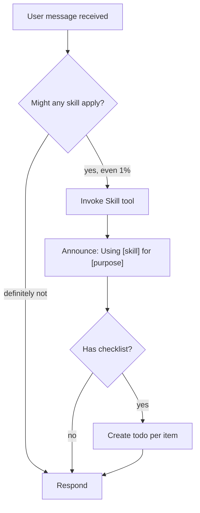

# Skill: using-superpowers

## When

Session start — boot protocol for skill-aware agents.

<SUBAGENT-STOP>
If you were dispatched as a subagent to execute a specific task, skip this skill.
</SUBAGENT-STOP>

<EXTREMELY-IMPORTANT>
If there is even a 1% chance a skill applies, you MUST invoke it. Not negotiable.
</EXTREMELY-IMPORTANT>

## Flow

## Priority

1. **User instructions** (AGENTS.md, direct requests) — highest
2. **Superpowers skills** — override defaults
3. **Default system prompt** — lowest

## Work-Mode Routing

| Task characteristics | Skill |
|---------------------|-------|
| Fully bounded, no open decisions | `quick-dev` |
| Mostly clear, 1-2 open decisions resolvable from repo | `code-agent` |
| New feature/bugfix, test-first worthwhile | `test-driven-development` |
| Design/architecture genuinely open | `brainstorming` |

Support skills (`aesthetic`, `systematic-debugging`, etc.) layer on top.

## Red Flags — You're Rationalizing

| Thought | Reality |
|---------|---------|
| "Just a simple question" | Questions are tasks. Check skills. |
| "I need more context first" | Skill check comes BEFORE clarifying. |
| "Let me explore first" | Skills tell you HOW to explore. |
| "Doesn't need a formal skill" | If a skill exists, use it. |
| "I remember this skill" | Skills evolve. Read current version. |
| "The skill is overkill" | Simple things become complex. Use it. |

## Constraints

- Invoke skills BEFORE any response or action
- Rigid skills (TDD, debugging): follow exactly
- Flexible skills (patterns): adapt to context
- User instructions say WHAT, not HOW — "Add X" doesn't mean skip workflows
