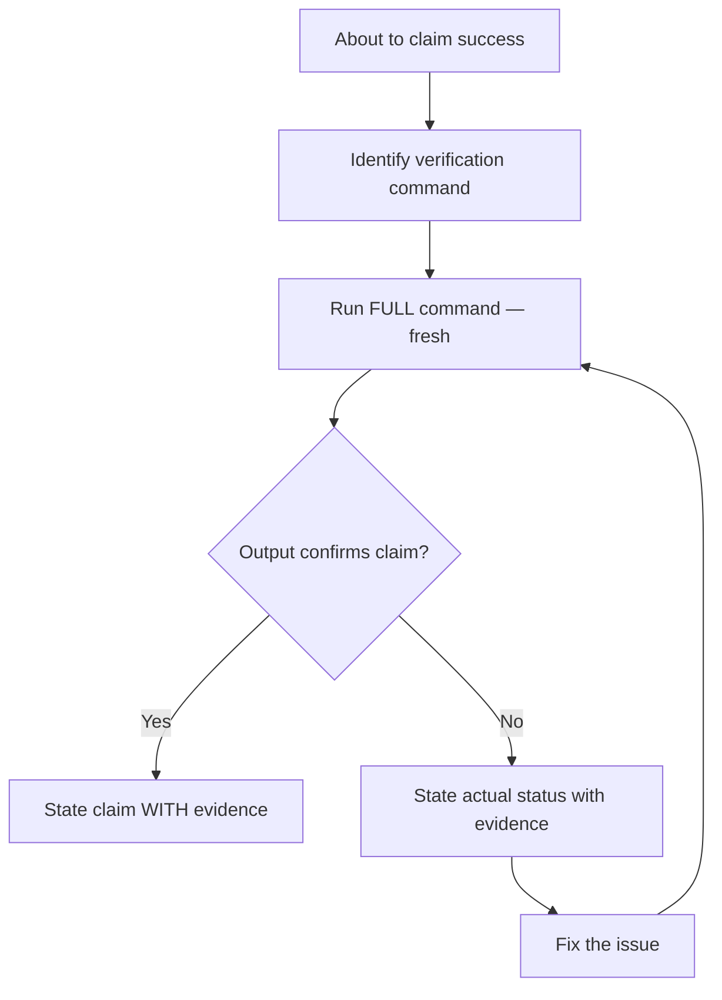

# Skill: verification-before-completion

## When

About to claim anything is complete, fixed, passing, or working — before committing, PRs, or task transitions.

## Flow

## Iron Law

No completion claims without fresh verification evidence in this message. "Should work" is not evidence.

## Evidence Requirements

| Claim | Requires | NOT Sufficient |
|-------|----------|----------------|
| Tests pass | Test output: 0 failures | Previous run, "should pass" |
| Linter clean | Linter output: 0 errors | Partial check |
| Build succeeds | Build command: exit 0 | Linter passing |
| Bug fixed | Test original symptom passes | "Code changed" |
| Requirements met | Line-by-line checklist | Tests passing alone |

## Red Flags — STOP

Using "should", "probably", "seems to". Expressing satisfaction before running commands. Trusting agent success reports. Thinking "just this once".

## Rationalization Prevention

| Excuse | Reality |
|--------|---------|
| "Should work now" | RUN the verification |
| "I'm confident" | Confidence ≠ evidence |
| "Linter passed" | Linter ≠ compiler |
| "Agent said success" | Verify independently |

## Bottom Line

Run the command. Read the output. THEN claim the result. Non-negotiable.
