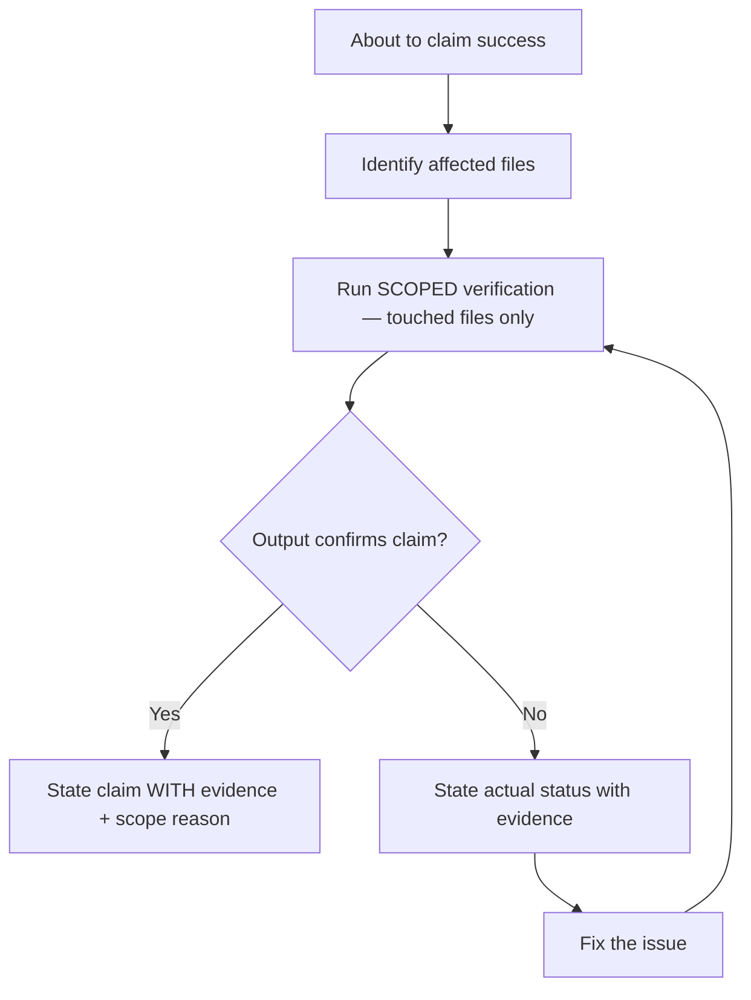

# Skill: verification-before-completion

## When

About to claim anything is complete, fixed, passing, or working — before committing, PRs, or task transitions.

## Flow

## Iron Law

No completion claims without fresh verification evidence in this message. "Should work" is not evidence.

## Verification Scoping

Run lint and test **only on files you touched**. Never bare `npm test` or `lint .` unless justified.

| Change scope | Verification command | Example |
|-------------|---------------------|---------|
| 1-3 files changed | Lint + test those files directly | `biome check src/foo.ts && vitest run test/foo.test.ts` |
| Shared utility (imported by many) | Lint changed file + tests that import it | `vitest run --testPathPattern="foo|bar|baz"` |
| Config / types / build system | Full suite justified — state why | `vitest run` (reason: tsconfig changed) |
| Unsure of blast radius | `git diff --name-only` → find matching tests | Run those, not everything |

**Decision tree:**
1. What files did I change? → lint those
2. What tests cover those files? → run those
3. Is the change pervasive (shared types, config, build)? → only then full suite
4. State your scope reason: "Ran X tests because Y"

**Type checking** (`tsc --noEmit`) is whole-project by nature — this is the one exception. But lint and test MUST be scoped.

## Evidence Requirements

| Claim | Requires | NOT Sufficient |
|-------|----------|----------------|
| Tests pass | Scoped test output: 0 failures + scope reason | Full suite "all green" without stating scope |
| Linter clean | Lint output on changed files: 0 errors | `lint .` with no explanation |
| Build succeeds | Build command: exit 0 | Linter passing |
| Bug fixed | Test original symptom passes | "Code changed" |
| Requirements met | Line-by-line checklist | Tests passing alone |

## Red Flags — STOP

Using "should", "probably", "seems to". Expressing satisfaction before running commands. Trusting agent success reports. Thinking "just this once".

## Rationalization Prevention

| Excuse | Reality |
|--------|---------|
| "Should work now" | RUN the verification |
| "I'm confident" | Confidence ≠ evidence |
| "Linter passed" | Linter ≠ compiler |
| "Agent said success" | Verify independently |

## Bottom Line

Run the command. Read the output. THEN claim the result. Non-negotiable.
