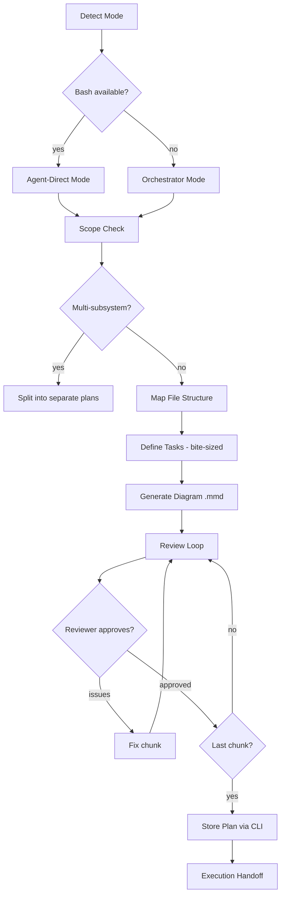
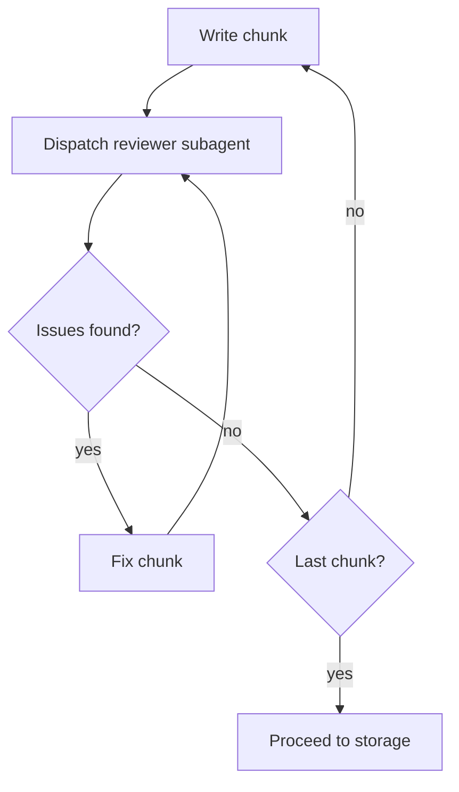

# Skill: writing-plans

## When

You have a spec or requirements for a multi-step task and need to create a detailed implementation plan before touching code.

> CLI Primer: `spoc --commands --json` for discovery. Mutating commands run directly — no token.

## Flow



## Mode Detection

- Bash available (`spoc --commands --json` works) → **agent-direct**: write plan + diagram + tasks via CLI
- No bash → **orchestrator mode**: return structured artifact:

```
---plan-artifact---
title: <plan title>
summary: <one-line summary>
keywords: ["implementation-plan", ...]
sourceFiles: [{path: "...", anchor: "..."}]
---body---
<full plan markdown body>
---diagram---
<full .mmd file content>
---tasks---
- title: <task 1>
  priority: high|medium|low
  sourceFiles: [{path: "..."}]
---end---
```

## File Structure

Before defining tasks, map which files will be created/modified:

- One clear responsibility per file. Files that change together live together.
- Follow existing codebase patterns. Split only when a file has grown unwieldy.
- This structure informs task decomposition — each task produces self-contained changes.

## Bite-Sized Task Granularity

Each step is one action (2-5 minutes):

````markdown
### Task N: [Component Name]

**Files:**
- Create: `exact/path/to/file.py`
- Modify: `exact/path/to/existing.py:123-145`
- Test: `tests/exact/path/to/test.py`

- [ ] **Step 1: Write the failing test**

```python
def test_specific_behavior():
    result = function(input)
    assert result == expected
```

- [ ] **Step 2: Run test to verify it fails**

Run: `pytest tests/path/test.py::test_name -v`
Expected: FAIL with "function not defined"

- [ ] **Step 3: Write minimal implementation**

```python
def function(input):
    return expected
```

- [ ] **Step 4: Run test to verify it passes**

Run: `pytest tests/path/test.py::test_name -v`
Expected: PASS

- [ ] **Step 5: Commit**
````

## Plan Document Header

```markdown
# [Feature Name] Implementation Plan

> **For agentic workers:** REQUIRED: Use spoc:subagent-driven-development (if subagents available) or spoc:executing-plans to implement this plan.

**Goal:** [One sentence]

**Architecture:** [2-3 sentences]

**Tech Stack:** [Key technologies]

---

> Diagram: plans/<plan-id>.diagram.mmd
```

## Diagram Section

Diagrams are **agentic execution maps** in separate `.mmd` files — never embedded in plan body. Load `to-diagram` skill for conventions.

- File: `plans/<plan-id>.diagram.mmd`
- Draft the plan in memory or `/tmp` first; persist only after user confirms
- Node IDs: `T001`, `T002`, ... (stable, never change)
- If design-phase `.mmd` exists (from brainstorming): EXTEND it, don't regenerate
- If no prior diagram: generate fresh per `to-diagram` conventions

**Required per-node metadata** (in `%%` comment block before `flowchart TD`):
`node`, `title`, `status`, `skill`, `scope`, `files`, `acceptance`, `verify`, `blocked-by`, `delegate`

All nodes start `:::backlog` but metadata must be fully populated at creation time for diagram-first execution.

## Plan Review Loop



- Chunk boundaries: `## Chunk N: <name>`, ≤1000 lines each
- Same agent fixes (preserves context). Max 5 iterations, then surface to human.
- Reviewer must announce confidence score per `confidence-gate`. Score <80% loops back to "Fix chunk" — never proceed past a sub-threshold review.

## Storage

```bash
spoc plan create <slug> --title="YYYY-MM-DD <feature> Implementation Plan" --summary="..." --status=planned --keywords='["implementation-plan"]' --body="<markdown>" --json
```

## Execution Handoff

> "Plan complete and saved to spoc project plan `<planId>` in project `<slug>`. Ready to execute?"

- **Subagents available** → REQUIRED: use `spoc:subagent-driven-development`
- **No subagents** → use `spoc:executing-plans`

## Constraints

- Exact file paths always — never vague references
- Complete code in plan (not "add validation")
- Exact commands with expected output
- DRY, YAGNI, TDD, frequent commits
- Announce mode and skill at start
- Scope check: multi-subsystem → split into separate plans
- Implementation sub-agents NEVER edit `.mmd` files
