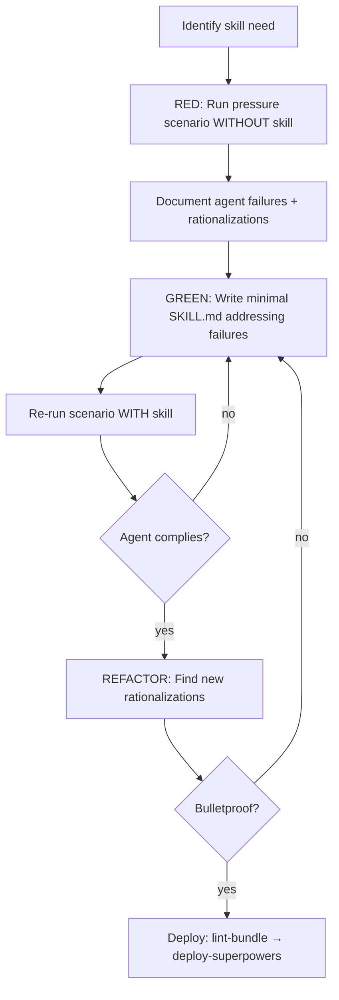

# Skill: writing-skills

## When

Creating, editing, or verifying skills — TDD applied to process documentation.

## Flow

## TDD Mapping

| TDD Concept | Skill Creation |
|-------------|----------------|
| Test case | Pressure scenario with subagent |
| Production code | SKILL.md |
| RED | Agent violates rule without skill |
| GREEN | Agent complies with skill present |
| Refactor | Close loopholes, re-verify |

## When to Create

**Create:** Technique not obvious, reusable across projects, others would benefit.
**Don't:** One-off solutions, standard practices, project-specific conventions (use AGENTS.md).

## Skill Types

- **Technique:** Concrete method with steps
- **Pattern:** Way of thinking about problems
- **Reference:** API docs, syntax guides

## Iron Law

No skill without a failing test first. No edits without re-testing. Write before test? Delete. Start over.

## Constraints

- One skill at a time — deploy before starting next
- Run `spoc lint-bundle` then `spoc deploy-superpowers` after each skill
- See `skill-structure-reference.md` for directory layout and SKILL.md template
- See `cso-and-naming.md` for naming conventions
- See `testing-skills-with-subagents.md` for pressure testing methodology
- See `anthropic-best-practices.md` for official guidance
