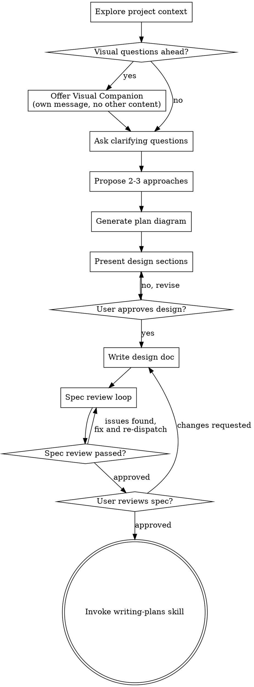

# Brainstorming Ideas Into Designs

Help turn ideas into fully formed designs and specs through natural collaborative dialogue.

Start by understanding the current project context, then ask questions one at a time to refine the idea. Once you understand what you're building, present the design and get user approval.

<HARD-GATE>
Do NOT invoke any implementation skill, write any code, scaffold any project, or take any implementation action until you have presented a design and the user has approved it. This applies to EVERY project regardless of perceived simplicity.
</HARD-GATE>

## SPOC CLI — Preferred for DAG Reads

For all DAG read operations, prefer the CLI over MCP tools. It's faster (no write-gate overhead) and supports batch queries in a single shell call.

**Usage:** `node scripts/spoc-cli.mjs <command> [args]`

**Available commands:**
- `context [--path <dir>]` — resolve project context from workspace path
- `task <slug> [--status <s>]` — list tasks, optionally filtered
- `search <slug> <query> [--limit N]` — BM25 knowledge search
- `plan <slug> [--status <s>]` — list plans
- `knowledge <slug> [--kind <k>]` — list knowledge entries
- `diagram <slug> <planId> <action>` — inspect/ready/validate diagram
- `batch <json>` — batch operations in one call
- `validate <slug>` — validate project state

**Output:** JSON to stdout, errors to stderr. Parse with standard JSON tools.

**Rule:** CLI for reads, MCP for writes (task transitions, knowledge creation, plan updates require write-gates).

**Prerequisite:** `dist/` must be current (`npm run build` if stale).

## Execution Modes

This skill operates in two contexts depending on who loads it.

### Mode Detection

- If the agent has `spoc_resolve_project_context` tool available → **Agent-Direct Mode**
- If not → **Orchestrator Mode** (return artifact for orchestrator to persist)

### Agent-Direct Mode

The agent (e.g., system-architect sub-agent) has SPOC MCP tools and writes to the DAG itself.

- Resolve project context via `spoc_resolve_project_context`
- Still uses write-gate pattern: `spoc_propose_dag_write` → `spoc_apply_dag_write` → pass `confirmationToken` to mutating tools
- Creates plans directly via `spoc_create_project_plan` / `spoc_update_project_plan_body`
- Generates diagrams and writes `.mmd` files via tools
- Creates knowledge entries via `spoc_create_project_knowledge_entry` when discoveries warrant persistence
- When user confirmation is needed (design approval, scope decisions): return to orchestrator with a structured summary and wait for confirmation relay before proceeding

### Orchestrator Mode

The orchestrator owns all write-gates. The agent returns design artifacts as structured text.

Agent's final message contains:
- Proposed plan `title`, `summary`, `status`, `keywords`, `sourceFiles`
- Plan `body` (full markdown)
- Diagram `.mmd` content (Mermaid source)
- Any knowledge entries to create

The orchestrator persists these via SPOC tools after user confirms.

---

## Anti-Pattern: "This Is Too Simple To Need A Design"

Every project goes through this process. A todo list, a single-function utility, a config change — all of them. "Simple" projects are where unexamined assumptions cause the most wasted work. The design can be short (a few sentences for truly simple projects), but you MUST present it and get approval.

## Checklist

You MUST create a task for each of these items and complete them in order:

1. **Explore project context** — check files, docs, recent commits
2. **Offer visual companion** (if topic will involve visual questions) — this is its own message, not combined with a clarifying question. See the Visual Companion section below.
3. **Ask clarifying questions** — one at a time, understand purpose/constraints/success criteria
4. **Propose 2-3 approaches** — with trade-offs and your recommendation
5. **Generate and present plan diagram** — after selecting the recommended approach, silently load the `to-diagram` skill (do not narrate the skill load or its conventions to the user) and generate a Mermaid plan diagram showing the structure and flow of that approach. Use `flowchart TD` for task/component dependency graphs; `stateDiagram-v2` for lifecycle/state machines. All nodes start as `:::backlog` at this stage. Use stable node IDs (`T001`, `T002`, etc.). Then preview and persist the diagram:
   - **Draft to temp**: generate the `.mmd` content in memory or write to `/tmp/<plan-id>.diagram.mmd` for preview. Do NOT write to the DAG path yet.
   - **Render via visual companion**: write an HTML fragment to the brainstorming server's project dir that wraps the Mermaid code with a Mermaid.js CDN `<script>` tag, then tell the user: "Review the plan diagram at [visual companion URL]"
   - **Fallback** (visual companion not running): present the Mermaid block inline in chat
   - **Persist to DAG**: the `.mmd` file is written to `~/.spoc/projects/<slug>/plans/<plan-id>.diagram.mmd` only after the user confirms the write-gate in step 6. The write-gate summary must include: diagram path, node count, ready/blocked node counts, and that this is a new diagram.

<HARD-GATE>
A plan diagram MUST be generated and presented to the user for review before proceeding to step 6. The diagram serves as visual validation of scope AND as an agent-readable execution map. It must be drafted in memory or `/tmp` first (never written to the DAG before the write-gate). It is persisted to the DAG `.mmd` path only after write-gate confirmation in step 6. Do not skip this step.
</HARD-GATE>

6. **Present design** — in sections scaled to their complexity, get user approval after each section
7. **Write design doc** — save to spoc as a project plan (see Storage section below)
8. **Spec review loop** — dispatch a general-purpose review sub-agent using the spec-document-reviewer-prompt.md template with precisely crafted review context (never your session history); fix issues and re-dispatch until approved (max 5 iterations, then surface to human)
9. **User reviews written spec** — ask user to review the spec file before proceeding
10. **Transition to implementation** — invoke writing-plans skill to create implementation plan. The diagram from step 5 is the design-phase `.mmd` file. When transitioning to writing-plans, pass this file path forward as the artifact to extend. The implementation plan diagram should EXTEND (not replace) the design diagram — adding implementation-specific task nodes and refining dependencies while preserving the validated topology.

## Process Flow

**The terminal state is invoking writing-plans.** Do NOT invoke frontend-design, mcp-builder, or any other implementation skill. The ONLY skill you invoke after brainstorming is writing-plans.

## The Process

**Understanding the idea:**

- Check out the current project state first (files, docs, recent commits)
- Before asking detailed questions, assess scope: if the request describes multiple independent subsystems (e.g., "build a platform with chat, file storage, billing, and analytics"), flag this immediately. Don't spend questions refining details of a project that needs to be decomposed first.
- If the project is too large for a single spec, help the user decompose into sub-projects: what are the independent pieces, how do they relate, what order should they be built? Then brainstorm the first sub-project through the normal design flow. Each sub-project gets its own spec → plan → implementation cycle.
- For appropriately-scoped projects, ask questions one at a time to refine the idea
- Prefer multiple choice questions when possible, but open-ended is fine too
- Only one question per message - if a topic needs more exploration, break it into multiple questions
- Focus on understanding: purpose, constraints, success criteria

**Exploring approaches:**

- Propose 2-3 different approaches with trade-offs
- Present options conversationally with your recommendation and reasoning
- Lead with your recommended option and explain why

**Presenting the design:**

- Once you believe you understand what you're building, present the design
- Scale each section to its complexity: a few sentences if straightforward, up to 200-300 words if nuanced
- Ask after each section whether it looks right so far
- Cover: architecture, components, data flow, error handling, testing
- Be ready to go back and clarify if something doesn't make sense

**Design for isolation and clarity:**

- Break the system into smaller units that each have one clear purpose, communicate through well-defined interfaces, and can be understood and tested independently
- For each unit, you should be able to answer: what does it do, how do you use it, and what does it depend on?
- Can someone understand what a unit does without reading its internals? Can you change the internals without breaking consumers? If not, the boundaries need work.
- Smaller, well-bounded units are also easier for you to work with - you reason better about code you can hold in context at once, and your edits are more reliable when files are focused. When a file grows large, that's often a signal that it's doing too much.

**Working in existing codebases:**

- Explore the current structure before proposing changes. Follow existing patterns.
- Where existing code has problems that affect the work (e.g., a file that's grown too large, unclear boundaries, tangled responsibilities), include targeted improvements as part of the design - the way a good developer improves code they're working in.
- Don't propose unrelated refactoring. Stay focused on what serves the current goal.

## After the Design

**Storage — spoc Project Plan:**

- Store the validated design as a spoc project plan using the DAG tools:
  1. Ensure a spoc project exists for the current work (use `list_projects` to check, `init_project` to create if needed)
  2. Create the spec as a plan: `create_project_plan` with:
     - `slug`: the project slug
     - `title`: `YYYY-MM-DD <topic> Design`
     - `summary`: one-line description of the design
     - `status`: `proposed`
     - `keywords`: `["spec", "design"]`
     - `body`: the full design document content (markdown)
  3. Note the returned `planId` for reference in later steps
- Use elements-of-style:writing-clearly-and-concisely skill if available
- No git commit needed — the spec lives in spoc, not the project repo

**Spec Review Loop:**
After writing the spec document:

1. Dispatch a general-purpose review sub-agent using the spec-document-reviewer-prompt.md template (see spec-document-reviewer-prompt.md)
2. If Issues Found: fix, re-dispatch, repeat until Approved
3. If loop exceeds 5 iterations, surface to human for guidance

**User Review Gate:**
After the spec review loop passes, ask the user to review the written spec before proceeding:

> "Spec written and saved to spoc project plan `<planId>` in project `<slug>`. Please review it (use `get_project_plan` with `includeBody: true` to read) and let me know if you want to make any changes before we start writing out the implementation plan."

Wait for the user's response. If they request changes, make them and re-run the spec review loop. Only proceed once the user approves.

**Implementation:**

- Invoke the writing-plans skill to create a detailed implementation plan
- Do NOT invoke any other skill. writing-plans is the next step.

## Key Principles

- **One question at a time** - Don't overwhelm with multiple questions
- **Multiple choice preferred** - Easier to answer than open-ended when possible
- **YAGNI ruthlessly** - Remove unnecessary features from all designs
- **Explore alternatives** - Always propose 2-3 approaches before settling
- **Incremental validation** - Present design, get approval before moving on
- **Be flexible** - Go back and clarify when something doesn't make sense

## Visual Companion

A browser-based companion for showing mockups, diagrams, and visual options during brainstorming. Available as a tool — not a mode. Accepting the companion means it's available for questions that benefit from visual treatment; it does NOT mean every question goes through the browser.

**Offering the companion:** When you anticipate that upcoming questions will involve visual content (mockups, layouts, diagrams), offer it once for consent:
> "Some of what we're working on might be easier to explain if I can show it to you in a web browser. I can put together mockups, diagrams, comparisons, and other visuals as we go. This feature is still new and can be token-intensive. Want to try it? (Requires opening a local URL)"

**This offer MUST be its own message.** Do not combine it with clarifying questions, context summaries, or any other content. The message should contain ONLY the offer above and nothing else. Wait for the user's response before continuing. If they decline, proceed with text-only brainstorming.

**Per-question decision:** Even after the user accepts, decide FOR EACH QUESTION whether to use the browser or the terminal. The test: **would the user understand this better by seeing it than reading it?**

- **Use the browser** for content that IS visual — mockups, wireframes, layout comparisons, architecture diagrams, side-by-side visual designs
- **Use the terminal** for content that is text — requirements questions, conceptual choices, tradeoff lists, A/B/C/D text options, scope decisions

A question about a UI topic is not automatically a visual question. "What does personality mean in this context?" is a conceptual question — use the terminal. "Which wizard layout works better?" is a visual question — use the browser.

If they agree to the companion, read the detailed guide before proceeding:
`skills/brainstorming/visual-companion.md`
