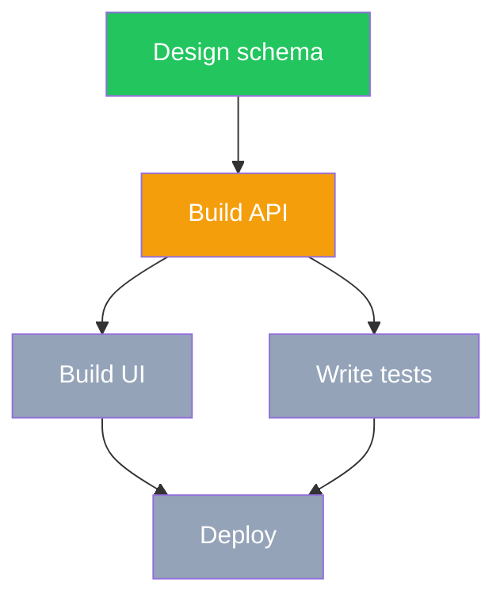
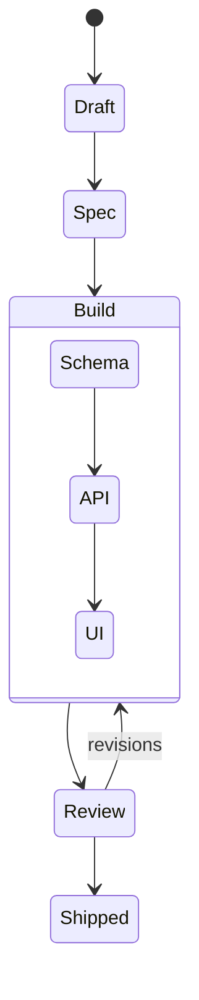
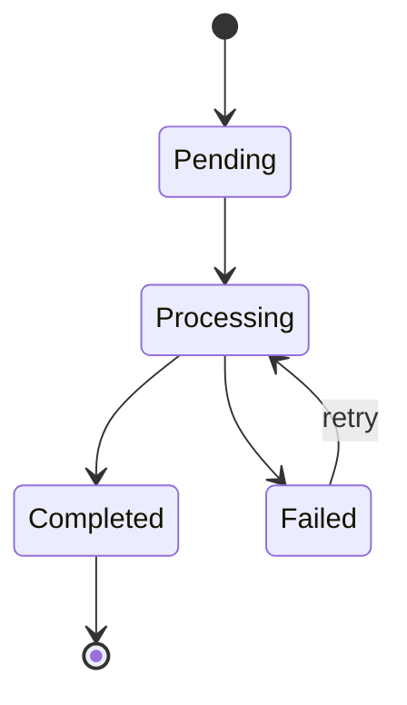

# To-Diagram

## Overview

Generate and maintain Mermaid diagrams as supplementary visual companions to SPOC plan bodies. The diagram communicates plan structure and task status at a glance. Prose, metadata, and task status remain authoritative — the diagram is always derived from them.

## When to Use

- Creating a new SPOC plan body (called from writing-plans skill)
- Adding a visual layer to an existing plan
- Updating diagram node status after task status changes in metadata
- Auditing diagram vs metadata drift during SYNC workflow

## Dialect Selection

Pick dialect based on the primary structure of the plan:

| Use case | Dialect |
|----------|---------|
| Task dependency graph (what to build, in what order) | `flowchart TD` + classDef |
| Feature lifecycle phases (macro: Draft → Spec → Build → Shipped) | `stateDiagram-v2` |
| Entity/data lifecycle inside a feature (state machines, order states) | `stateDiagram-v2` |

**Rule of thumb:** If the diagram is primarily about tasks and their dependencies, use `flowchart TD`. If it is primarily about states and transitions, use `stateDiagram-v2`.

## classDef Status Conventions (flowchart TD only)

Always declare these four classes at the top of every `flowchart TD` diagram:

```
classDef done fill:#22c55e,color:#fff
classDef inProgress fill:#f59e0b,color:#fff
classDef blocked fill:#ef4444,color:#fff
classDef backlog fill:#94a3b8,color:#fff
```

Assign status to nodes via `:::className` suffix:

```
A[Design schema]:::done --> B[Build API]:::inProgress
B --> C[Build UI]:::backlog
B --> D[Write tests]:::backlog
D --> E[Deploy]:::blocked
```

**At plan creation time, all nodes start as `:::backlog`.** The diagram is a structural sketch — status encoding activates as work progresses.

## Placement Rule

The `## Diagram` section goes immediately after `## Overview` in the plan body:

```
## Overview
[1-2 sentence plan summary]

## Diagram
[mermaid block]

## Phases / Tasks
[detailed task breakdown]
```

One diagram per plan. Do not add per-phase diagrams.

## Update vs Regenerate

| Trigger | Action |
|---------|--------|
| Task status changes | Update `:::className` assignments only — topology unchanged |
| New tasks added | Regenerate full diagram from current plan structure |
| Tasks removed | Regenerate full diagram from current plan structure |
| Dependencies reordered | Regenerate full diagram from current plan structure |
| Scope change | Regenerate full diagram from current plan structure |

**Surgical update (status only):** Change `:::backlog` to `:::inProgress` on the relevant node. Nothing else changes.

**Regeneration:** Rebuild the full `flowchart TD` or `stateDiagram-v2` block from scratch based on current plan task list and dependencies.

## Drift Detection and Resolution

**Drift:** A diagram node has `:::done` but the corresponding task metadata shows `in_progress` (or vice versa).

**Resolution rule:** Metadata wins. Always regenerate the diagram from metadata — never patch metadata to match the diagram.

**During SYNC workflow:** Check every `:::className` against task metadata. Flag any mismatch as drift. Regenerate the diagram block and update the plan body via `update_project_plan_body`.

## Examples

### flowchart TD — Task Dependency Graph



### stateDiagram-v2 — Feature Lifecycle (macro)



### stateDiagram-v2 — Entity Lifecycle (micro)


