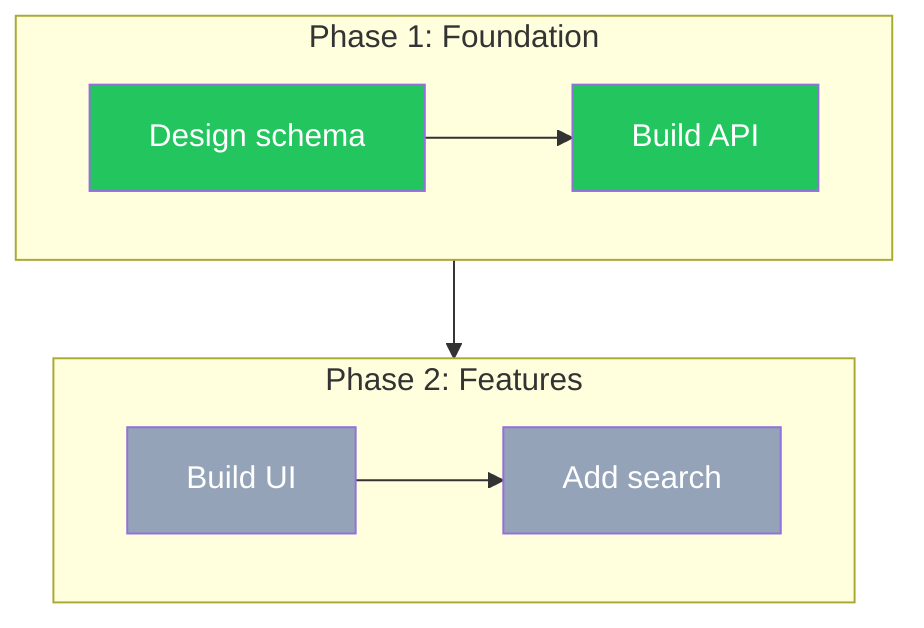
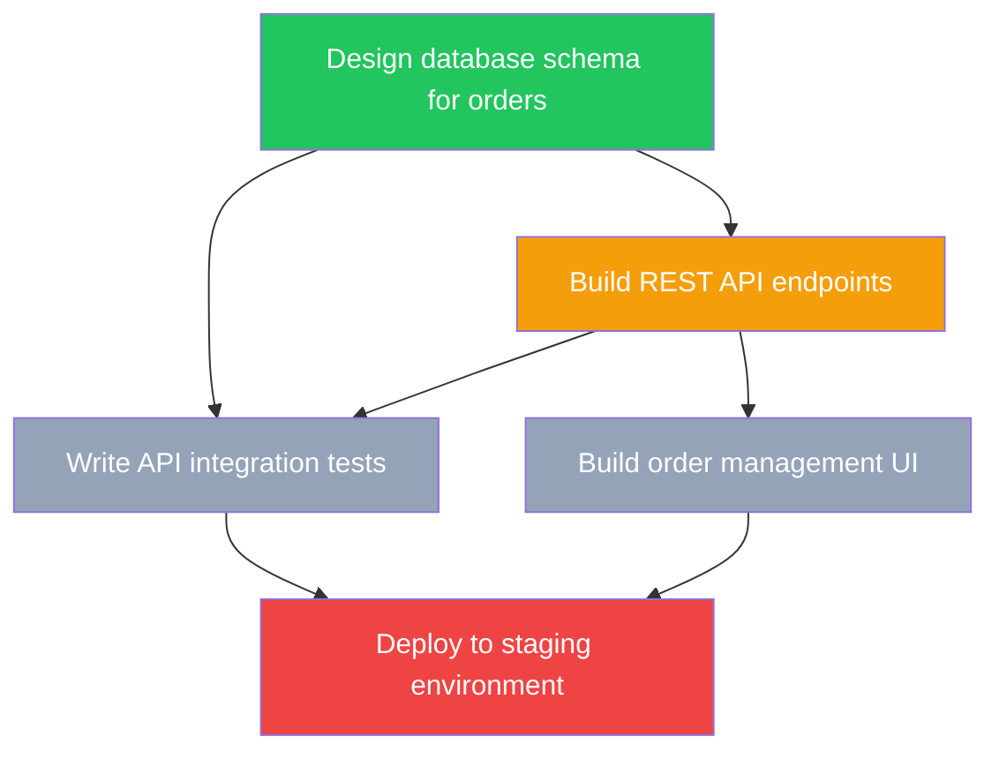
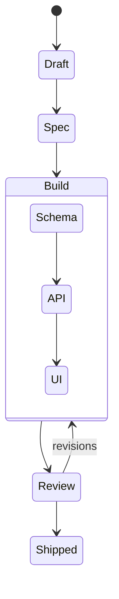
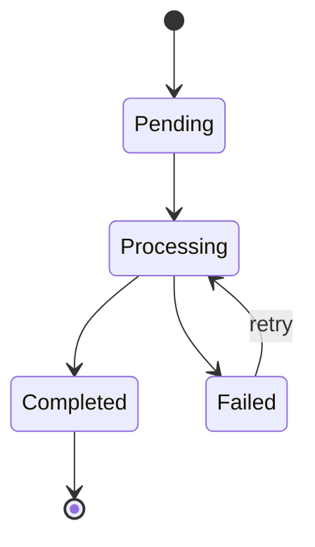

# To-Diagram

## Overview

Generate and maintain Mermaid diagrams as dual-format plan representations in SPOC plan bodies. Diagrams serve two audiences:

1. **Users** — visual plan structure, status at a glance, progress tracking on the SPOC Dashboard
2. **Agents** — quick plan orientation without reading full prose. Agents scan diagrams to understand structure, dependencies, current execution state, and what's ready to execute next

Prose and task metadata remain the authoritative source of truth. Diagrams are derived from them and regenerated on drift. But diagrams must be **rich and contextual enough** that an agent can make task-selection and sequencing decisions from the diagram alone.

## When to Use

- Creating a new SPOC plan body (called from brainstorming or writing-plans skill)
- Adding a visual layer to an existing plan
- Updating diagram node status after task status changes in metadata
- Auditing diagram vs metadata drift during SYNC workflow
- Agent entering a session needs quick orientation on plan state

## Agent Consumption

Agents read diagrams as structured plan summaries. When scanning a diagram:

1. **Status scan** — read `:::className` on each node to determine execution state (done/inProgress/blocked/backlog)
2. **Ready-to-execute detection** — identify `:::backlog` nodes whose ALL incoming edges come from `:::done` nodes. These are the next candidates for execution
3. **Parallelism inference** — nodes with no shared dependency edges can run concurrently
4. **Blocked identification** — `:::blocked` nodes or `:::backlog` nodes with `:::inProgress`/`:::backlog` predecessors cannot start yet
5. **Scope understanding** — node labels encode task scope. Read them to understand what each task involves without consulting prose

When updating diagrams, maintain `%%` comments (see Mermaid Comments section) so future agents can parse status summaries without re-analyzing the full graph.

## Presentation

`to-diagram` is an INTERNAL skill — its conventions guide diagram generation but are never narrated to the user. Follow these rules:

- Do not explain dialect selection, classDef conventions, or node labeling rules to the user
- The user sees the final diagram (via dashboard URL or inline Mermaid block), not the generation process
- When presenting a new diagram: "I've created a plan diagram showing [brief description]. Review it at [dashboard URL]" — or present the Mermaid block inline if no dashboard is available
- When presenting an update: "I've updated the plan diagram — [what changed]. Check [dashboard URL]"
- The skill load itself should be silent — no "Loading to-diagram skill..." messages

## Dialect Selection

Pick dialect based on the primary structure of the plan:

| Use case | Dialect |
|----------|---------|
| Task dependency graph (what to build, in what order) | `flowchart TD` + classDef |
| Feature lifecycle phases (macro: Draft → Spec → Build → Shipped) | `stateDiagram-v2` |
| Entity/data lifecycle inside a feature (state machines, order states) | `stateDiagram-v2` |

**Rule of thumb:** If the diagram is primarily about tasks and their dependencies, use `flowchart TD`. If it is primarily about states and transitions, use `stateDiagram-v2`.

**Tiebreaker:** When a plan has both task dependencies AND lifecycle phases, prefer `flowchart TD` for work/implementation plans and `stateDiagram-v2` for entity/order state machines. Default to `flowchart TD` when uncertain.

## classDef Status Conventions (flowchart TD only)

Always declare these four classes at the top of every `flowchart TD` diagram:

```
classDef done fill:#22c55e,color:#fff
classDef inProgress fill:#f59e0b,color:#fff
classDef blocked fill:#ef4444,color:#fff
classDef backlog fill:#94a3b8,color:#fff
```

Assign status to nodes via `:::className` suffix:

```
A[Design schema]:::done --> B[Build API]:::inProgress
B --> C[Build UI]:::backlog
B --> D[Write tests]:::backlog
D --> E[Deploy]:::blocked
```

**At plan creation time, all nodes start as `:::backlog`.** The diagram is a structural sketch — status encoding activates as work progresses.

### Node Labeling

- Node labels MUST be descriptive enough for agent comprehension — an agent reading only the diagram should understand what each task involves
- Use full task titles from the plan (e.g., "Build REST API endpoints" not "API", "Write unit tests for auth module" not "Tests")
- Include scope hints when the title alone is ambiguous (e.g., "Design database schema for orders" not "Design schema")
- If label exceeds ~50 characters, shorten to a readable form that preserves scope and intent
- Use consistent style within a diagram (all verb phrases or all noun phrases)
- For `stateDiagram-v2`, state names should be PascalCase descriptors

### Color Compatibility

These hex colors are from the Tailwind CSS palette. They render correctly on GitHub, GitLab, and standard Mermaid renderers. If colors fail on a specific renderer, substitute Mermaid's standard color names.

## Placement Rule

The `## Diagram` section goes immediately after `## Overview` in the plan body:

```
## Overview
[1-2 sentence plan summary]

## Diagram
[mermaid block]

## Phases / Tasks
[detailed task breakdown]
```

One diagram per plan. Do not add per-phase diagrams.

## Mermaid Comments for Agent Context

Mermaid supports `%%` line comments. Use them to embed agent-readable status summaries that don't render visually:

```
%% status: A=done, B=done, C=inProgress, D=backlog, E=blocked
%% ready: D (all deps done)
%% blocked: E (waiting on C)
%% next-action: Start D; C still in progress
```

**Rules:**
- Include `%% status:` line listing all nodes and their current status
- Include `%% ready:` line listing backlog nodes whose dependencies are all done
- Include `%% blocked:` line listing nodes that cannot start and why
- Include `%% next-action:` line with a recommended next step
- Update comments on every surgical status update, not just regeneration
- Optional for plans with fewer than 6 nodes; recommended for 6+ nodes

## Syntax Validation

After writing or updating a diagram, validate:

1. All node IDs are unique within the diagram
2. All edges reference existing node IDs
3. All four `classDef` declarations are present (done, inProgress, blocked, backlog)
4. No unclosed brackets, quotes, or parentheses
5. `:::className` suffixes match one of the four declared classes

Invalid diagrams break dashboard rendering and agent parsing. If a Mermaid renderer is available, verify the diagram renders before committing to the plan body.

## Update vs Regenerate

Decision tree:

1. **Status-only update:** Task metadata shows different status, but all task names, counts, and dependencies unchanged → surgical update (`:::className` only)
2. **Scope change:** Task added, removed, or renamed; any dependency edge added/removed → full regeneration from current plan structure, then apply current status classes
3. **Mixed update:** If ANY scope change happened alongside status changes → treat as regeneration (scope takes priority)

| Trigger | Action |
|---------|--------|
| Task status changes | Update `:::className` assignments only — topology unchanged |
| New tasks added | Regenerate full diagram from current plan structure |
| Tasks removed | Regenerate full diagram from current plan structure |
| Dependencies reordered | Regenerate full diagram from current plan structure |
| Scope change | Regenerate full diagram from current plan structure |
| Status + scope together | Regenerate (scope takes priority) |

**Surgical update (status only):** Change `:::backlog` to `:::inProgress` on the relevant node. Nothing else changes.

**Regeneration:** Rebuild the full `flowchart TD` or `stateDiagram-v2` block from scratch based on current plan task list and dependencies.

## Drift Detection and Resolution

Four types of drift:

1. **classDef mismatch** — node has wrong status class vs metadata
2. **Phantom node** — diagram has a node with no corresponding task in metadata
3. **Missing node** — metadata has a task with no corresponding diagram node
4. **Topology mismatch** — diagram edges don't match task dependency metadata

All four types → regenerate from metadata. Never patch metadata to match the diagram.

**During SYNC workflow:** Check every node and edge against task metadata. Flag any of the four drift types. Regenerate the diagram block and update the plan body via `update_project_plan_body`.

## Scalability

- Plans with 15+ nodes: consider clustering into `subgraph` blocks by phase
- If diagram becomes unreadable, the plan may need splitting into sub-plans



## Examples

### flowchart TD — Task Dependency Graph



### stateDiagram-v2 — Feature Lifecycle (macro)



### stateDiagram-v2 — Entity Lifecycle (micro)


