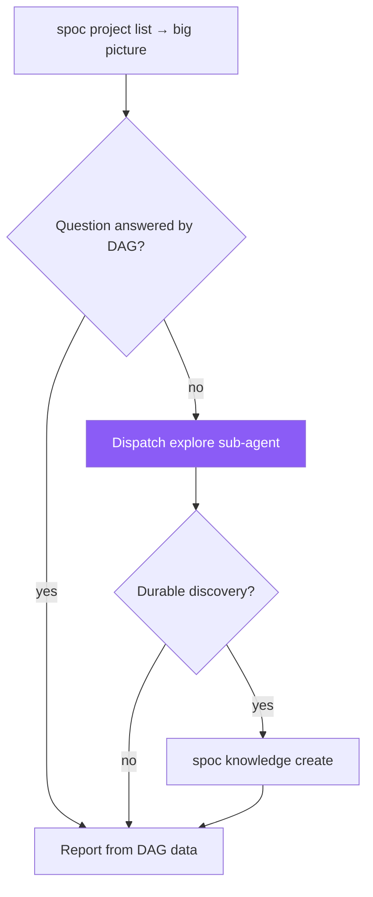

> **Canonical source:** `src/cli/spoc-orchestrate.ts` under `### EXPLORE Workflow`.

## When

Need to understand project relationships, find context, inspect plan and knowledge indexes, or traverse dependencies.

## Flow



## CLI Primer

```bash
TOKEN=$(spoc write propose "summary" --ops=<op> --slug=<slug> --json | jq -r .data.token)
spoc <command> --token=$TOKEN --json
```
Discovery: `spoc --commands --json`

## Key Commands

| Operation | Command |
|-----------|---------|
| All projects | `spoc project list --json` |
| Project meta | `spoc project get <slug> --json` |
| Project doc | `spoc project get <slug> --doc=<doc> --json` |
| Plan and knowledge indexes | `spoc plan list <slug> --json` / `spoc knowledge list <slug> --json` |
| Full body | `spoc plan get <slug> <id> --body --json` / `spoc knowledge get <slug> <id> --body --json` |
| Search | `spoc search <slug> "<query>" --json` |

## Traversal Pattern

1. `spoc project list --json` → get all projects + `dependsOn[]`
2. Filter for dependencies of interest
3. `spoc project get <slug> --json` per dependency for meta/docs
4. Build dependency chain

## Tips

- Start with `spoc project list` for the big picture
- Use `knowledge` docs to quickly understand unfamiliar codebases
- Check `status` to know if a dependency is still actively maintained
- Persist durable discoveries via `spoc knowledge create`
