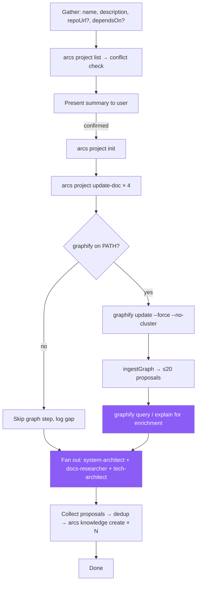

> **Canonical source:** `src/cli/arcs-orchestrate.ts` under `### INIT Workflow`.

## When

User wants to track a new project, bootstrap documentation, or connect a repo to the DAG.

## Flow



## CLI Primer

```bash
arcs <command> --json
```
Discovery: `arcs --commands --json`

## Constraints

- Do NOT read repo to infer name/description — gather from user
- Verify `dependsOn` targets exist via `arcs project list --json`
- Init creates empty plans/ and knowledge/ indexes
- Repo analysis is **fan-out across typed agents**, not a generic "analysis sub-agent" (see Agent Dispatch table below)

## Graphify Sub-Flow (DEFAULT: ON when binary present)

The orchestrator runs graphify directly during INIT to seed knowledge entries with structural evidence before any sub-agent reads code.

1. **Detect:** `detectGraphify()` from `src/utils/graphify.ts`. If unavailable, skip cleanly — never block INIT on graphify.
2. **Trust the gitignore guarantee:** `runExtraction()` already auto-appends `graphify-out/` to `.gitignore` (`ensureGitignoreEntry`). Don't redundantly check or modify `.gitignore` from agents — running extraction is sufficient.
3. **Extract (AST-only, no LLM key required):**
   ```bash
   graphify update <workspacePath> --force --no-cluster
   ```
   Produces `graphify-out/graph.json`.
4. **Ingest:** call internal `ingestGraph(graphJsonPath, slug)` → up to 20 `KnowledgeProposal` records:
   - 8 god nodes (`kind=module`, top 5% degree, test files filtered)
   - 8 architecture clusters (`kind=architecture`, by community or directory grouping)
   - 5 cross-module couplings (`kind=gotcha`, high-degree links across top-level dirs)
5. **Enrich** with read-only graph queries (sub-agents may run these):
   - `graphify query "entry points and main commands" --graph graphify-out/graph.json --budget 2000` → seeds for "key files" reference entries
   - `graphify query "core data flow" --graph graphify-out/graph.json --budget 2000` → seeds for "core modules" entries
   - `graphify explain "<godNodeLabel>" --graph graphify-out/graph.json` → plain-language summary for module entry bodies
   - `graphify affected "<critical-symbol>" --graph graphify-out/graph.json --depth 2` → reverse-impact map for high-risk modules
   - `graphify path "<A>" "<B>" --graph graphify-out/graph.json` → shortest dependency path for architecture entries
6. **Hand to typed agents:** the proposals + query results go to the sub-agents listed in **Agent Dispatch** below; they merge graph evidence with code reading and return finalized knowledge entries.
7. **Write** the entries directly via `arcs batch --file=ops.json` (one batch invocation for all knowledge entries) or `arcs knowledge create` per entry.

If graphify is missing, log "graphify not on PATH; proceeding without graph signal" and skip steps 3–5. Sub-agents still run; they just lack the graph priors.

## Content Guidelines

| Doc | Format |
|-----|--------|
| overview.md | 2-3 sentence summary + goals |
| tasks.md | `[ ]` backlog / `[/]` in-progress / `[x]` done |
| dependencies.md | Upstream + downstream sections |
| knowledge.md | High-level context + pointers to structured entries |

## Agent Dispatch (named typed agents — DO NOT default to a generic analysis agent)

| Sub-agent | Owns | Knowledge kinds it produces |
|-----------|------|----------------------------|
| `system-architect` | Module boundaries, clusters, dependency direction | `architecture`, `module` |
| `docs-researcher` | Tech stack, third-party libraries, key files, features | `reference`, `feature` |
| `tech-architect` | Cross-module couplings, structural gotchas, lessons | `gotcha`, `lesson` |
| `qa-analyst` (optional) | Coding-style + convention scan from existing code | `pattern` |

Dispatch in parallel (load `dispatching-parallel-agents`). Each agent receives the relevant `KnowledgeProposal` records from `ingestGraph` plus targeted graphify queries for evidence. Each agent returns finalized proposals (title, kind, summary, keywords, sourceFiles, body) for the orchestrator to write directly via `arcs knowledge create` (or `arcs batch`).

## Knowledge Categories for Analysis Sub-Agents

| Category | Kind | What to discover | Primary agent |
|----------|------|------------------|---------------|
| tech stack | `architecture` | Languages, frameworks, runtimes, build tools, versions | `docs-researcher` |
| key files | `reference` | Entry points, config files, main modules, purposes | `docs-researcher` (graphify query "entry points") |
| code patterns | `pattern` | Recurring design patterns, abstractions, error handling | `qa-analyst` or `system-architect` |
| coding style | `pattern` | Formatting, linting, import ordering, file organization | `qa-analyst` |
| core modules | `module` | Core modules/shared functions — what, where, interconnections | `system-architect` (god nodes from graphify) |
| external services | `module` | APIs, databases, message queues the project interacts with | `docs-researcher` |
| third-party libraries | `reference` | Key dependencies and why they are used | `docs-researcher` |
| features | `feature` | Major user-facing or system-facing features | `docs-researcher` |
| cross-module couplings | `gotcha` | Hot edges between modules surfaced by graphify | `tech-architect` (auto from `ingestGraph`) |
| architecture clusters | `architecture` | Community/directory groupings from graphify | `system-architect` (auto from `ingestGraph`) |
