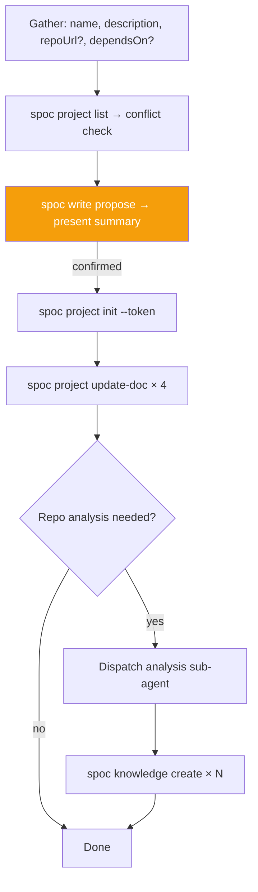

> **Canonical source:** `src/cli/spoc-orchestrate.ts` under `### INIT Workflow`.

## When

User wants to track a new project, bootstrap documentation, or connect a repo to the DAG.

## Flow



## CLI Primer

```bash
TOKEN=$(spoc write propose "summary" --ops=<op> --slug=<slug> --json | jq -r .data.token)
spoc <command> --token=$TOKEN --json
```
Discovery: `spoc --commands --json`

## Constraints

- Do NOT read repo to infer name/description — gather from user
- Verify `dependsOn` targets exist via `spoc project list --json`
- Init creates empty plans/ and knowledge/ indexes

## Content Guidelines

| Doc | Format |
|-----|--------|
| overview.md | 2-3 sentence summary + goals |
| tasks.md | `[ ]` backlog / `[/]` in-progress / `[x]` done |
| dependencies.md | Upstream + downstream sections |
| knowledge.md | High-level context + pointers to structured entries |

## Knowledge Categories for Analysis Sub-Agent

| Category | Kind | What to discover |
|----------|------|------------------|
| tech stack | `architecture` | Languages, frameworks, runtimes, build tools, versions |
| key files | `reference` | Entry points, config files, main modules, purposes |
| code patterns | `pattern` | Recurring design patterns, abstractions, error handling |
| coding style | `pattern` | Formatting, linting, import ordering, file organization |
| core modules | `module` | Core modules/shared functions — what, where, interconnections |
| external services | `module` | APIs, databases, message queues the project interacts with |
| third-party libraries | `reference` | Key dependencies and why they are used |
| features | `feature` | Major user-facing or system-facing features |
