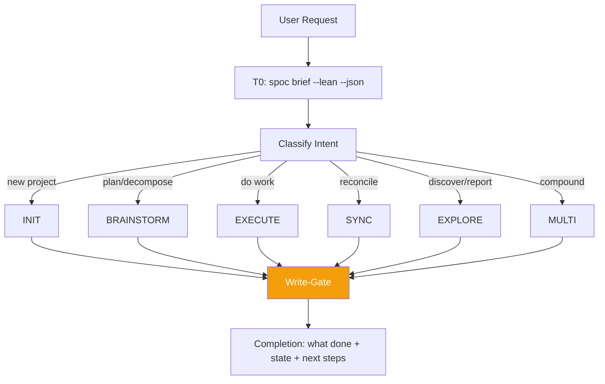

> **Canonical source:** `src/cli/spoc-orchestrate.ts` (`ORCHESTRATE_PROMPT_TEXT`).
> This is a condensed summary. TS prompt wins on disagreement.

## When

User request maps to multiple workflows, needs routing, or chains INIT → BRAINSTORM → EXECUTE.

## Flow



## Context Tiers

| Tier | What | Who |
|------|------|-----|
| **T0** | `spoc brief --lean --json` — routing surface, focus, next action | Orchestrator |
| **T1** | Single doc fetch | Sub-agent (default) |
| **T2** | Index listings | Sub-agent (default) |
| **T3** | Full body read | Sub-agent always |
| **T4** | Multi-doc / audit | Sub-agent always |

**Cardinal rule:** Orchestrator reads T0 + writes. Sub-agents read everything else.

### T0 envelope shape

`spoc brief --json` returns a tight ~1 KB envelope:

```json
{
  "slug": "...", "name": "...", "summary": "...",
  "operatingBrief": {
    "currentFocus":       "<task or plan title to anchor on>",
    "recommendedSurface": "QUEUE | PLAN | MEMORY",
    "why":                "<one-line rationale>",
    "nextAction":         "<concrete next step the orchestrator should take>"
  },
  "activePlansCount": N, "activePlanTitles": [...],
  "openTasksCount":   N, "topOpenTasks": [{ id, title, status }],
  "topKnowledge":     [{ id, title, kind }]
}
```

Use `recommendedSurface` to pick the routing branch:
- `QUEUE` → execute the active task (EXECUTE workflow)
- `PLAN`  → decompose or plan work (BRAINSTORM workflow)
- `MEMORY` → no active work; review knowledge or propose a new plan

## CLI Primer

All ops: `spoc <group> <action> [args] --json`. Writes need token:
```bash
TOKEN=$(spoc write propose "summary" --ops=<op> --slug=<slug> --json | jq -r .data.token)
spoc <command> --token=$TOKEN --json
```
Discovery: `spoc --commands --json`

## Skill Selection (EXECUTE)

| Task shape | Skill |
|-----------|-------|
| Fully bounded | `quick-dev` |
| Mostly clear, 1-2 open questions | `code-agent` |
| Non-trivial, test-first | `test-driven-development` |
| Design open | reclassify → BRAINSTORM |

## Loop Tools

- `spoc loop start <slug> --prompt="..." --max-iterations=50 --json` — self-referential dev loop
- `spoc loop cancel <slug> --json` — cancel active loop
- `spoc loop status <slug> --json` — inspect loop state

Pair with `loop` skill for iteration discipline.

## Completion

Every session ends with:
1. What was done
2. Current project state
3. Suggested next steps
